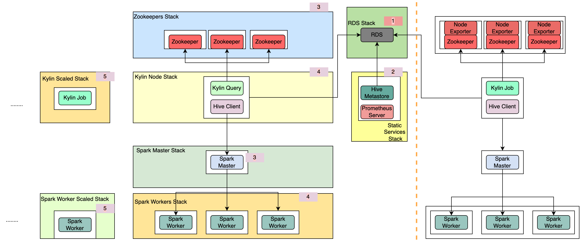

# How to deploy a Kylin4 Cluster on EC2

## Target

1. Deploy Kylin4 on Ec2 with Spark Standalone mode.
2. Removed the dependency of hadoop and start quickly.
3. Support to scale worker nodes for Spark Standalone Cluster quickly and conveniently.
4. Improve performance for query in using  `Local Cache + Soft Affinity` feature (`Experimental Feature`), please check the [details](https://mp.weixin.qq.com/s/jEPvWJwSClQcMLPm64s4fQ).
5. Support to monitor cluster status with prometheus server and granfana.
6. Create a Kylin4 cluster on EC2 in 10 minutes.

## Structure

When cluster was created, services and nodes will like below:



- Services are created as the number order from 1 to 4.
- Every machine node is presented by a white box. 
- `Kylin Node` and `Spark Worker` Node can be scaled.
- Whole cluster will has only one RDS and only one the machine node which contains `Prometheus Server` and `Hive MetaStore` service.

## Quick Start

1. Initialize aws account credential on local mac, please check [details](./readme/prerequisites.md#localaws).
   
2. Download the source code: 
   
   ```shell
   git clone https://github.com/Kyligence/kylin-tpch.git && cd kylin-tpch && git checkout deploy-kylin-on-aws
   ```
   
3. Modify the `kylin-tpch/kylin_config.yml`.
   
   1. Set the `AWS_REGION`.
   
   2. Set the `IAMRole`,please check [details](./readme/prerequisites.md#IAM).
   
   3. Set the `S3_URI`, please check [details](./readme/prerequisites.md#S3).
   
   4. Set the `KeyName`,please check [details](./readme/prerequisites.md#keypair).
   
   5. Set the `CIDR_IP`, make sure that the `CIDR_IP` match the pattern `xxx.xxx.xxx.xxx/16[|24|32]`.
   
      > Note: 
      >
      > 1. this `CIDR_IP` is the specified IPv4 or IPv6 CIDR address range which an inbound rule can permit instances to receive traffic from.
      >
      > 2. In one word, it will let your mac which ip is in the `CIDR_IP` to access instances.
   
4. Init local env.

```She
$KYLIN_TPCH_HOME/bin/init.sh
```

> Note: Following the information into a python virtual env and get the help messages. 

5. Execute commands to deploy a `default` cluster.

```shell
$ python ./deploy.py --type deploy
```

After `default` cluster is ready, you will see the message `Kylin Cluster already start successfully.` in the console. 

6. Execute commands to list nodes of cluster.

```shell
$ python ./deploy.py --type list
```

Then you can check the `public ip` of Kylin Node.

You can access `Kylin` web by `http://{kylin public ip}:7070/kylin`.

7. Destroy the `default` cluster.

```shell
$ python ./deploy.py --type destroy
```


## Quick Start For Multiple Clusters

> Pre-steps is same as Quick Start steps which is from 1 to 5.

1. Modify the config `CLUSTER_INDEXES` for multiple cluster.

   > Note:
   >
   > 1. `CLUSTER_INDEXES` means that cluster index is in the range of `CLUSTER_INDEXES`. 
   > 2. If user create multiple clusters, `default` cluster always be created. If `CLUSTER_INDEXES` is (1, 3), there will be 4 cluster which contains the cluster 1, 2, 3 and `default` will be created if user execute the commands.
   > 3. Configs for multiple clusters always are same as the `default` cluster to read from `kylin-tpch/kylin_configs.yaml`

2. Copy `kylin.properties.template` for expecting clusters to deploy, please check the [details](./readme/prerequisites.md#cluster). 

3. Execute commands to deploy `all` clusters.

   ```shell
   python ./deploy.py --type deploy --cluster all
   ```

4. Destroy all clusters.

   ```shell
   python ./deploy.py --type destroy --cluster all
   ```


## Notes

1. More details about `commands` of tool, see document [commands](./readme/commands.md).
2. More details about `prerequisites` of tool, see document [prerequisites](./readme/prerequisites.md).
3. More details about `advanced configs` of tool, see document [advanced configs](./readme/advanced_configs.md).
4. More details about `monitor services` supported by tool, see document [monitor](./readme/monitor.md).
1. Current tool already open the port for some services. You can access the service by `public ip` of related EC2 instance.
   1. `SSH`: 22
   2. `Granfana`:  3000
   3. `Prmetheus`:  9090, 9100
   4. `Kylin`: 7070
   5. `Spark`: 8080. 4040.
2. More about cloudformation syntax, please check [aws website](https://docs.aws.amazon.com/AWSCloudFormation/latest/UserGuide/Welcome.html).
3. Current Kylin version is 4.0.0.
4. Current Spark version is 3.1.1.
