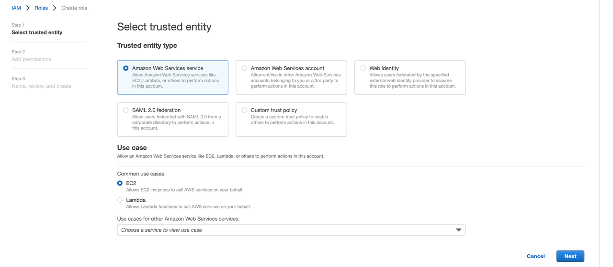

## Prerequisites

### I. Check user permission

Login AWS account and check whether the current user has sufficient permissions in AWS IAM service:


If the current user lacks some permissions listed below, you need to add the permissions to ensure that the current user can carry out subsequent operations smoothly:

| Services            | Access level                                           | Resources     | Request condition |
| ------------------- | ------------------------------------------------------ | ------------- | ----------------- |
| **Cloudformation**  | **Limited**: List, Read, Write                         | All Resources | None              |
| **EC2**             | **Limited**: Read                                      | All Resources | None              |
| **IAM**             | **Limited**: List, Read, Write, Permissions management | All Resources | None              |
| **RDS**             | **Limited**: List, Write, Tagging                      | All Resources | None              |
| **S3**              | **Limited**: Write, Permissions management, Tagging    | All Resources | None              |
| **SNS**             | **Limited**: List                                      | All Resources | None              |
| **STS**             | **Limited**: Write                                     | All Resources | None              |
| **Systems Manager** | **Limited**: Write                                     | All Resources | None              |

### II. Create key pair and Access Key<a name="keypair"></a>

> Note:
>
> ​	To deploy EC2 instances for Kylin4 Cluster need key pair and access key.

#### 1. Create a new `Key Pair` in the `EC2 -> Key pairs`


#### 2. Generate a new `Access Key` in the `My Security Credentials`

> Note:
>
> ​	Please download the generated CSV file of `Access Key` immediately. Get the `Access Key` and `Secret Key` to initialize local machine to access aws.


### III. Create an `IAM` role<a name="IAM"></a>

Create a role in AWS IAM service to provide temporary access credentials with specific permissions in EC2 nodes created later:



Add permissions policies `AmazonEC2RoleforSSM`, `AmazonSSMFullAccess,` and `AmazonS3FullAccess`, and `AWSGlueConsoleFullAccess` for this role:


>
> ​	This `IAM` Role will be used to initialize every ec2 instances which is for creating a kylin4 cluster on AWS. And it will configure in `Initialize Env of Local Machine` part.


> Q: Why should need an `IAM` role?
>
> A:  
>
> 	1. At first, the `IAM` role is an IAM identity that you can create in your account that has specific permissions. 
> 	2. An IAM role does not have standard long-term credentials such as a password or access keys associated with it.  Instead, when you assume a role, it provides you with temporary security credentials for your role session.
> 	3. The access will not cost money. The cost will depend on what you using on S3 and EC2 instances.
> 	4. For more details about `IAM`, please visit the [official website](https://docs.aws.amazon.com/IAM/latest/UserGuide/id_roles.html) by aws.


> Q: What's the relationship between the `User` and `IAM` role?
>
> A: 
>
> 	1. With `IAM` roles, you can establish trust relationships between your ***trusting*** account and other AWS ***trusted*** accounts.
> 	1. A `User` is an account.
> 	1. The establishment of the relationship will cost nothing. 
> 	1. The cost majorly depends on what you are using on S3 and EC2 instances. 


### (!!!Important)IV. Make sure current account has 32 vCpu at least

The current tool will deploy a cluster by EC2 instances, and `2 cores * 3(for zookeeper) + 2 cores(for monitor services) + 4 cores * 3(for spark slaves) + 4 cores(for spark master) + 4 cores (for kylin)=28  ` cpus to create instances in default.

> Note: **32 vCPUS is the limit of an default aws account.**

**User can check this quota limit in the limit of EC2 dashborad.**


For more details about user current limit, please check [View your current limits](https://docs.aws.amazon.com/AWSEC2/latest/UserGuide/ec2-resource-limits.html).

### V. Create a S3 direcotry<a name="S3"></a>

Create a S3 directory as the working directory for deploying kylin cluster:

> Note: 
>
> ​	This directory will store tars, scripts, and jars below. And it will also be the root path of working dir for kylin4.

Example: create a directory named `kylin4-aws-test`. You can also create a directory named what you like.


During deployment, the required jar packages and other files will be automatically downloaded to this S3 directory, and users do not need to operate by themselves.
If you want to prepare files in S3 directory manually, please check [Prepare files manually](./prepare_files_manually.md)


### VI. Initilize an aws account on local machine to access AWS<a name="localaws"></a>

> Use `Access Key` and `Secret Key` above to Initialize an AWS account on a local machine. 

```shell
$ aws configure
AWS Access Key ID : *************
AWS Secret Access Key : *************
Default region name : ${region_name}
Default output format : json
```

> Note:
>
> 1. If this command got the response `-bash: aws: command not found`, please check in  [Getting started with the AWS CLI](https://docs.aws.amazon.com/cli/latest/userguide/cli-chap-getting-started.html).
> 2. Region name can be in [Available Regions](https://docs.aws.amazon.com/AWSEC2/latest/UserGuide/using-regions-availability-zones.html#concepts-available-regions). The default output format is `json`.
