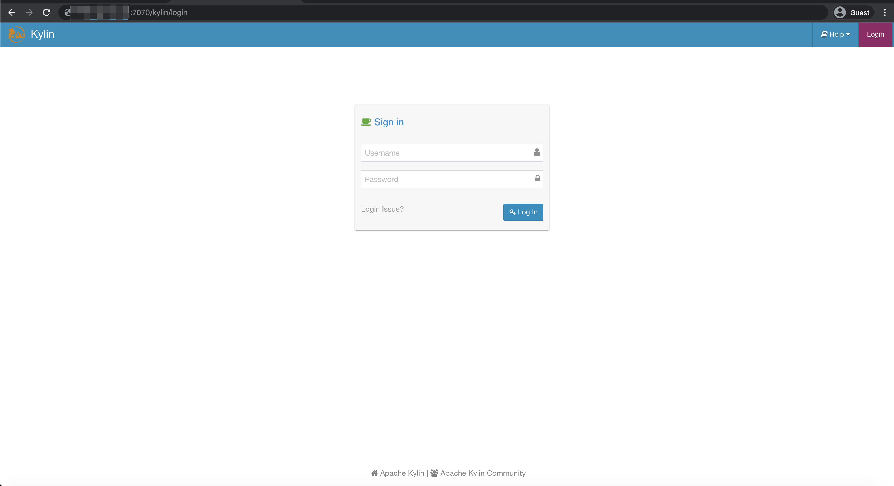

## Architecture In Quick Start


- **Services are created as the number order from 1 to 4.**


## Quick Start

1. Initialize aws account credential on the local machine according to [prerequisites](./prerequisites.md).

2. Download the source code: 

   ```shell
   git clone https://github.com/apache/kylin.git && cd kylin && git checkout kylin4_on_cloud
   ```

3. Configure the `kylin_config.yaml`.

   1. Set the `AWS_REGION`, such as `us-east-1`.

   2. Set the `IAMRole`, please check [create an IAM role](./prerequisites.md#IAM).

   3. Set the `S3_URI`, please check [create a S3 direcotry](./prerequisites.md#S3).

   4. Set the `KeyName`, please check [create a keypair](./prerequisites.md#keypair).

   5. Set the `CIDR_IP`, make sure that the `CIDR_IP` match the pattern `xxx.xxx.xxx.xxx/16[|24|32]`.

      > Note:
      >
      > 1. this `CIDR_IP` is the specified IPv4 or IPv6 CIDR address range which an inbound rule can permit instances to receive traffic from.
      >
      > 2. In one word, it will let your mac which IP is in the `CIDR_IP` to access instances.

   6. Set the `ENABLE_MDX`, if you want to use `MDX for Kylin`, you can set this parameter to `true`. For `MDX for Kylin`, please refer to: [The manual of MDX for Kylin](https://kyligence.github.io/mdx-kylin/).

4. Init python env.

> Note: You need to ensure that the local machine has installed Python above version 3.6.6.

```shell
$ bin/init.sh
$ source venv/bin/activate
```

Check the python version:

```shell
$ python --version
```

5. Execute commands to deploy a cluster quickly.

```shell
$ python deploy.py --type deploy
```

After this cluster is ready, you will see the message `Kylin Cluster already start successfully.` in the console. 

>  Note: 
>
> 1. By default, the mode of kylin node in the deployed cluster is `all`, supports both `job` and `query`. If you want to deploy a read-write separated cluster, you can use command `python deploy.py --type deploy --mode job` to deploy a `job` cluster, and use command `python deploy.py --type deploy --mode query` to deploy a `query` cluster. AWS Glue is supported by default in `job` cluster.
> 2. For more details about the properties of kylin4 in a cluster, please check [configure kylin.properties](./configuration.md#cluster).
> 3. For more details about the index of the clusters,  please check [Indexes of clusters](./configuration.md#indexofcluster).

6. Execute commands to list nodes of the cluster.

```shell
$ python deploy.py --type list
```

Then you can check the `public IP` of Kylin Node.

You can access `Kylin` web by `http://{kylin public ip}:7070/kylin`.



If you set `ENABLE_MDX` to true, you can access `MDX for Kylin` by `http://{kylin public ip}:7080/kylin`.

7. Destroy the cluster quickly.

```shell
$ python deploy.py --type destroy
```

> Note:
>
> 1. If you want to check about a quick start for multiple clusters, please referer to a [quick start for multiple clusters](./quick_start_for_multiple_clusters.md).
> 2. **Current destroy operation will remain some stack which contains `RDS` and so on**. So if user want to destroy clearly, please use `python deploy.py --type destroy-all`.

