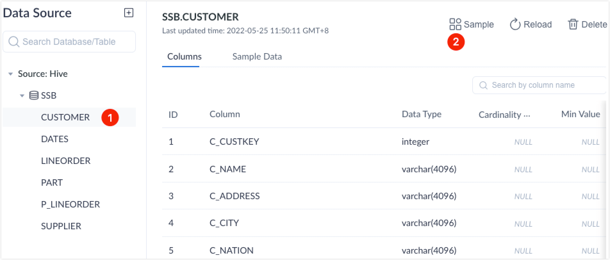
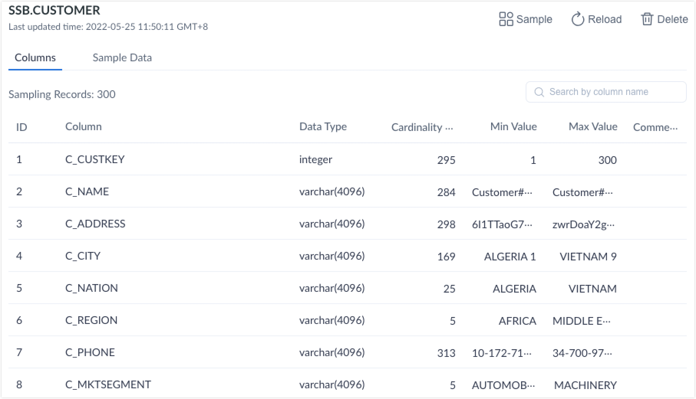
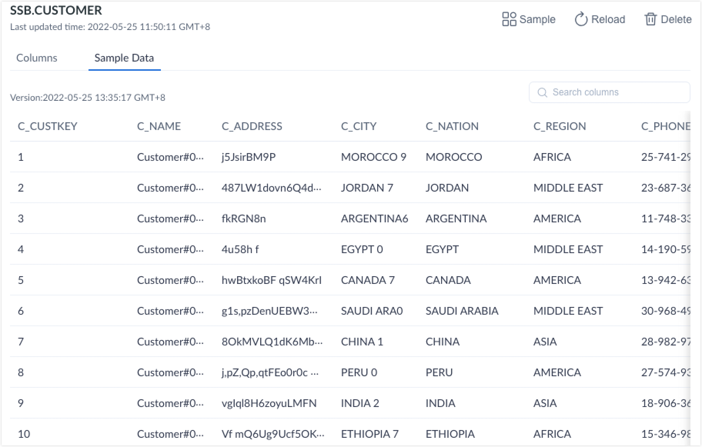

Kylin provides the data sampling function to facilitate table data analysis. With data sampling, you can collect table characteristics, such as cardinality, max value, and min value for each column, to improve [model designing](../modeling/intro.md). 

## Known limitations

Sampling on Kafka data source is currently not supported. 

## Operation steps

Kylin supports data sampling during data loading. If you want to manually sample data, follow the steps below: 

1. Log in to Kylin as any of the following roles:
   - System admin
   - Management of the target project or Admin

2. In the project list at the top of the page, select the target project. 

   Create a project if you have not created any projects yet. For more information, see [Create project](../operations/project-operation/project_management.md).

3. In the left navigation panel, click **Data Assets** > **Data Source**.

4. In the **Data Source** section, select the target table, and click  in the right corner of the page.

   

5. In the pop-up dialog box, enter the number of rows for sampling (from 10,000 to 20,000,000) and click **Submit**. 

   The accuracy of sampled results will depend on the number of rows that are sampled, but more rows will also request more resources and time. You can set the row number based on the actual requirements. To check the progress of the sampling job, click **Monitor** > **Batch Job** in the left navigation panel. 

6. (Optional) View sampled results.

   - Click the **Columns** tab to view statistical information, such as the number of sampled rows (estimated value), and the cardinality, min value and max value for each sampled column. 

     

   - Click the **Sample Data** tab to view the detailed information of the first 10 records. 

     

### FAQ

Question: Why are the Chinese comments garbled in the sampled results?

Answer: This issue is often caused by improper encoding settings. Please confirm whether any Chinese comments in the source Hive table are garbled via the Hive client. If yes, please modify the encoding in MySQL metabase. Below we use [Apache Hadoop](../deployment/on-premises/installation/platform/install_on_apache_hadoop.md) platform as an example to show how to modify encoding: 

1. Log in to the server. 
2. Run the `mysql -uroot -p` command and enter your password. 
3. Run the `use metastore;` command to enter the Metastore database. 
4. Modify the encoding of the following columns to utf8: 
   - Column COMMENT in COLUMNS_V2
   - Column PARAM_VALUE in TABLE_PARAMS
   - Column PKEY_COMMENT in PARTITION_KEYS

For more information about commands, see [ALTER TABLE Statement](https://dev.mysql.com/doc/refman/5.7/en/alter-table.html). 

### See also

[Model](../modeling/intro.md)

