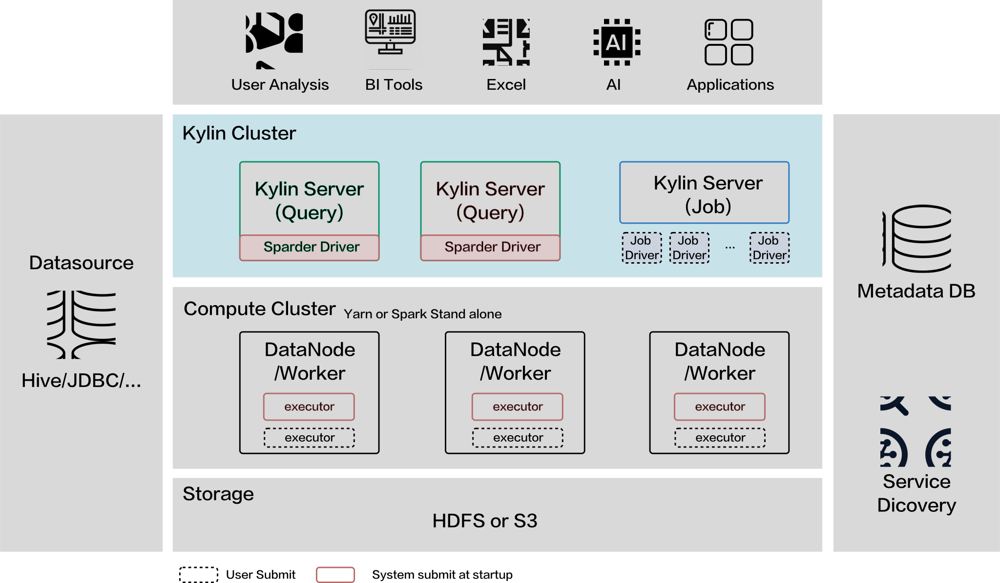

All Kylin state information instance is stored in a RDBMS database, so running Kylin on multiple nodes in a cluster is good practice for better load balance and higher availability.



In the above diagram, the components which require user deployment are below:

- Metadata DB（PostgreSQL/MySQL）
- Kylin Cluster

### Configure Metadata DB

Kylin uses RDBMS to store metadata, please refer to [Use RDBMS as Metastore](./intro.md).

### Kylin Server

Currently, Kylin supports multiple nodes deployment. Queries will be distributed through all nodes and jobs can be submitted by all types of nodes. However, the building jobs will be submitted to job engine node ( `all` node and `job` node).

- `query` node: You can submit queries or building jobs on `query` nodes but the jobs cannot be executed.
- `job` node: This node can execute jobs and metadata operations
- `all` node: `all` node can perform all the work of `query` and `job` node.

### Service Discovery {#sd}
Multiple Kylin instances can work together as a cluster. When a Kylin instance is started, stopped, or lost, other instances in the cluster will be updated automatically. Kylin has a new implementation based on Apache Curator framework, which is more convenient and more stable.

If you want to enable service discovery, please set the correct ZooKeeper address in the configuration file `$KYLIN_HOME/conf/kylin.properties`. For example:

```properties
kylin.env.zookeeper-connect-string=host1:2181,host2:2181,host3:2181
```

After the configuration, please restart Kylin. Each Kylin instance will register itself in ZooKeeper, and each one will discover other instances from ZooKeeper.

By default, Kylin will use hostname as the node name. If the cluster you run Kylin on cannot parse the host name to IP address through DNS and other services, you could set an additional configuration in  `$KYLIN_HOME/conf/kylin.properties` as below (this can avoid communication errors between Kylin servers). For example:

```properties
spring.cloud.zookeeper.discovery.instance-host=10.1.2.3
```

This config enforces Kylin to use IP address for service registry, making sure that other instances can find it by IP address instead of hostname. In case you use this config, please specify this config for **each of the Kylin instance** in `kylin.properties`.

:::note Note
Please replace the IP address with actual IP address on each server.
:::

### Multi-Active of Job Nodes

Kylin job node is used to execute data loading jobs, schedule jobs and metadata operations. Normally, users will configure one or more node as job engine in the cluster deployment.

Since Kylin 5.0, Kylin support Multi-Active of Job Nodes, which meanings every healthy `all` and `job` node can execute building tasks. When one job engine is stopped, the other job engines will take over the running task on it. That will ensure the high availability of Kylin services.

If you want to enable this function, add `kylin.server.mode=all` or `kylin.server.mode=job` into `$KYLIN_HOME/conf/kylin.properties` for more than one node.

The related config items are shown below:
```properties
kylin.server.leader-race.heart-beat-timeout=60
kylin.server.leader-race.heart-beat-interval=30
kylin.job.ssh-username=username
kylin.job.ssh-password=password
```
`kylin.server.leader-race.heart-beat-timeout` stands for heart beat timeout，default value is 60, in seconds. When an job engine node didn't send heartbeat for more than this value, this node will be marked as unavailable.
`kylin.server.leader-race.heart-beat-interval` stands for heart beating's time interval，default value is 30, in seconds, which means each job engine node will send heartbeat for every 30 seconds.
`kylin.job.ssh-username` stands for ssh login username between Kylin nodes, if passwordless is not configured.
`kylin.job.ssh-password` stands for ssh login password between Kylin nodes, if passwordless is not configured.

### Configure Gluten
   Apache Gluten is required by internal table feature, it's enable by default. Add the following config to your `${KYLIN_HOME}\conf\kylin.properties(.override)`
   :::info Example
   **gluten for query**<br></br>
   kylin.storage.columnar.spark-conf.spark.gluten.sql.columnar.backend.ch.runtime_config.storage_configuration.disks.hdfs.endpoint=hdfs://olivernameservice/<br></br>
   **gluten for build**<br></br>
   kylin.engine.spark-conf.spark.gluten.sql.columnar.backend.ch.runtime_config.storage_configuration.disks.hdfs.endpoint=hdfs://olivernameservice/
   :::


:::info
1. Enable session sharing is required when using Kylin HA. Add `spring.session.store-type=jdbc` into `$KYLIN_HOME/conf/kylin.properties` for each node.
2. Please make sure there is no clock skew in the cluster. You can use `ntp` service to sync the clock in the cluster.
3. It is necessary to configure password-free login between each node, or ensure that the ssh login information between each node is consistent.
:::

:::note Note
- Multi-Active mode is enabled by default. If there is only one `all` or `job` node, this mode should be turned off because of performance considerations. If you want to disable this feature, please add `kylin.server.leader-race.enabled=false` in `$KYLIN_HOME/conf/kylin.properties` of `all` or `job` node.
- If you want to enable it again, please update the relationship between projects and the job engines. After that, you need call Rest API to update the data. For details, please refer to [Project Settings API](../restapi/project_api.md)
:::