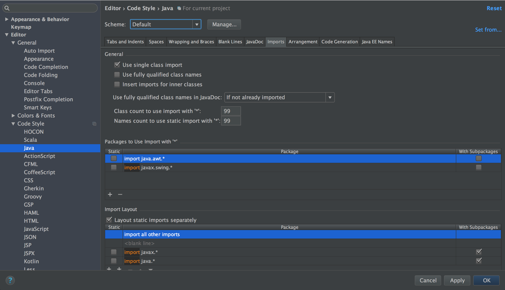

Coding convention is very important for teamwork. Not only it keeps code neat and tidy, but it also saves a lot of work too. Different coding convention (and auto formatter) will cause unnecessary code changes that require more effort at code review and code merge.

## Setup IDE code formatter

For Java code, we use Eclipse's default formatter setting, with one change that allows long lines.

- For Eclipse developers, no manual setting is required. Code formatter configurations `src/core-common/.settings/org.eclipse.jdt.core.prefs` are on the git repo. Your IDE should be auto-configured when the projects are imported.

- For IntelliJ IDEA developers, you need to install `Eclipse Code Formatter` and load the Eclipse formatter settings into your IDE manually.

  you have to do a few more steps:

  1. Install `Eclipse Code Formatter` and use `org.eclipse.jdt.core.prefs` and `org.eclipse.jdt.ui.prefs` in `src/core-common/.settings` to configure `Eclipse Java Formatter config file` and `Import order`.

  

  2. Go to Preference => Code Style => Java, set `Scheme` to Default, and set both Class count to use import with `*` and Names count to use static import with `*` to 99.

  

  3. Disable IntelliJ IDEA’s `Optimize imports on the fly`
  
  

  4. Format the code before committing the code.

## Setup IDE license header template

Each source file should include the following Apache License header

```shell
Licensed to the Apache Software Foundation (ASF) under one
or more contributor license agreements.  See the NOTICE file
distributed with this work for additional information
regarding copyright ownership.  The ASF licenses this file
to you under the Apache License, Version 2.0 (the
"License"); you may not use this file except in compliance
with the License.  You may obtain a copy of the License at

     http://www.apache.org/licenses/LICENSE-2.0

Unless required by applicable law or agreed to in writing, software
distributed under the License is distributed on an "AS IS" BASIS,
WITHOUT WARRANTIES OR CONDITIONS OF ANY KIND, either express or implied.
See the License for the specific language governing permissions and
limitations under the License.
```

The checkstyle plugin will check the header rule when packaging also. The license file locates under `dev-support/checkstyle-apache-header.txt`. To make it easy for developers, please add the header as Copyright Profile and set it as default for the Kylin project.


## Code Rules(Important)

1. For JavaScript, XML, and other code, please use space for indent. And as a general rule, keep your code format consistent with existing lines. No other enforcement at the moment.

2. Using `StringUtils`, just use the `StringUtils` of `org.apache.commons.lang3.StringUtils` and `io.kyligence.kap.guava20.shaded.common.base.Strings`.

3. Using the `guava` in the package of `io.kyligence.kap.guava20.shaded.`.

4. Don't use `log4j` directly, please use `slf4j`. Lombok uses the annotation of `@Slf4j` and Factory class `org.slf4j.LoggerFactory`.

5. Add a new test or modified a test.

    1) Please use the `junit5` instead of `junit4`. For example, Using the annotation of `org.junit.jupiter.api.Test` instead of `org.junit.Test`.

    2) A test case that extends from `NLocalFileMetadataTestCase` needs to change with annotation `@MetadataInfo` and remove the `extend`. 
    
    > Example: org.apache.kylin.junit.MetadataExtension, org.apache.kylin.metadata.epoch.EpochManagerTest
