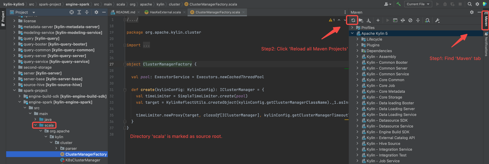
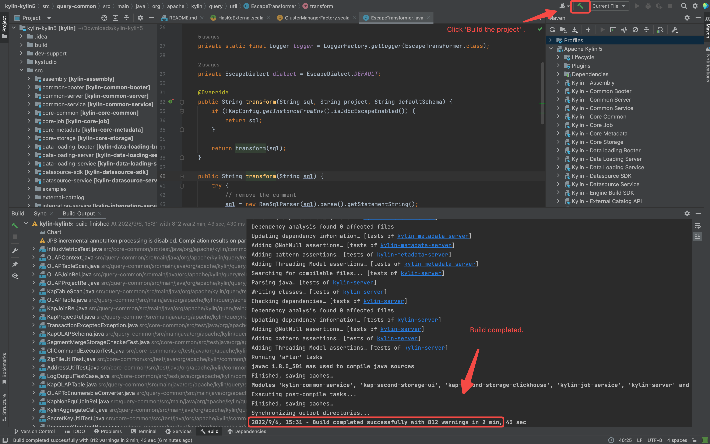
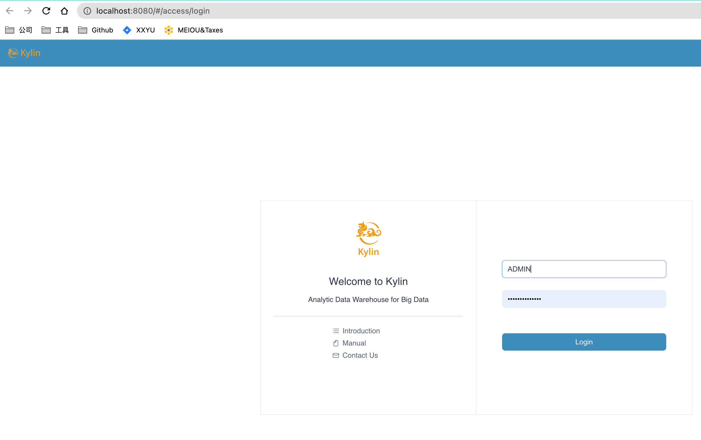

### Background
#### Why debug Kylin in IDEA using docker
This article aims to introduce a simple and useful way to develop and debug Kylin for developer, and provided similar deployment to user's real scenario.

#### Deployment architecture
Following is architecture of current deployment.


This guide **assumes** you have prepared the following things:

- [ ] A **laptop** with MacOS installed to do development work (Windows is not verified at the moment)
- [ ] A **remote linux server** for testing and deployment purpose(if you do not prepare remote linux server, you will deploy Hadoop on your laptop)
- [ ] kylin's source code is cloned into some directory in your laptop

:::info For Windows Dev Machine
For Windows dev machine, setup the Kylin dev env in [Windows Subsystem for Linux](https://learn.microsoft.com/en-us/windows/wsl/about) is the best option. Follow this guide on [how to install WSL with GUI](https://learn.microsoft.com/en-us/windows/wsl/tutorials/gui-apps), and install both Kylin code and your favorite IDE (but not the docker) in WSL for best performance.
:::

### Prepare IDEA and build source code

#### Step 1: Check Software Requirement

Please visit [software_requirement](how_to_package#software_reqiurement), make sure your laptop has meet the requirement.

#### Step 2: Build source code
- Build back-end source code before your start debug.
```shell
cd <path-to-kylin-source>
mvn clean install -DskipTests
```

- Build front-end source code. 
(Please use node.js **v12.14.0**, for how to use specific version of node.js, please check [how to switch to specific node js](how_to_package#install_older_node) )
```shell
cd kystudio
npm install
```

#### Step 3: Install IntelliJ IDEA and build the source
1. Install IDEA Community edition (Ultimate edition is ok too).
2. Import the source code into IDEA. Click the **Open**, and choose the directory of **kylin source code**.
  

3. Install scala plugin and restart


4. Configure SDK(JDK and Scala), make sure you use **JDK 1.8.X** and **Scala 2.12.X**.


5. Reload maven projects, and directory `scala` will be marked as source root(in blue color).


6. Build the projects.(make sure you have executed `mvn clean package -DskipTests`, otherwise some source code is not generated by maven javacc plugin)
   


#### Step 4: Prepare IDEA configuration

1. Download spark and create running IDEA configuration for debug purpose.
  ```shell
  ./dev-support/sandbox/sandbox.sh init
  ```

  Following is the shell output.
  

### Prepare the Hadoop Cluster

#### Deploy Hadoop Cluster
1. Install latest docker desktop in your laptop
2. [**Optional**] Install docker engine on remote machine (https://docs.docker.com/engine/install/)

:::tip
It is recommended to use **remote server** other than laptop to deploy Hadoop Cluster, because 7-8 containers may consume a lot of hardware resources and cause your laptop run slower than before.
:::

3. [**Optional**] If you want to deploy hadoop cluster on remote machine, please set correct `DOCKER_HOST`. 

  If you don't set `DOCKER_HOST`, you will deploy Hadoop Cluster in your laptop. (Make sure you can log in this server via SSH without input password each time by **ssh-copy-id**.)
  ```shell
  # see more detail at : https://docs.docker.com/compose/reference/envvars/#docker_host
  export DOCKER_HOST=ssh://${USER}@${DOCKER_HOST}
  ```

4. Check available resource of your docker desktop in laptop (or docker engine in remote server, depends on which machine you want to deploy Hadoop Cluster), make sure you leave 6 CPUs and 12 GB memory at least .

  Following is the setting page of Docker Desktop of MacBook.

  

5. Deploy hadoop cluster via docker compose on laptop(or on remote machine)

  ```shell
  ./dev-support/sandbox/sandbox.sh up
  ```

  


#### Check status of hadoop cluster
- Wait 2-5 minutes, check health of hadoop, you can use following command to check status

```shell
./dev-support/sandbox/sandbox.sh ps
```

Following output content shows all hadoop component are in health state.


- Edit `/etc/hosts`. (if you deployed Hadoop cluster on remote machine, please use correct ip address other than `127.0.0.1` .)
```shell
127.0.0.1 namenode datanode resourcemanager nodemanager historyserver mysql zookeeper hivemetastore hiveserver 
```

- Load sample SSB data into HDFS and Hive
```shell
./dev-support/sandbox/sandbox.sh sample
```

- Check hive table


### Debug Kylin in IDEA

#### Start backend in IDEA

- Select "BootstrapServer[docker-sandbox]" on top of IDEA and click **Run** .

![click BootstrapServer[docker-sandbox]](images/RUN_KYLIN_IN_IDEA.png)

- Wait and check if Sparder is start succeed.


- Check if SparkUI of Sparder is started.


#### Start frontend in IDEA

- Set up dev proxy
```shell
cd kystudio
npm run devproxy
```


#### Validate Kylin's core functions

- Visit Kylin WEB UI in your laptop



- Create a new project, load table and create model

- Validate Cube Build and Query function


### Command manual
1. Use `./dev-support/sandbox/sandbox.sh stop` to stop all containers
2. Use `./dev-support/sandbox/sandbox.sh start` to start all containers
3. Use `./dev-support/sandbox/sandbox.sh ps` to check status of all containers
4. Use `./dev-support/sandbox/sandbox.sh down` to stop all containers and delete them

### Q&A

// todo
