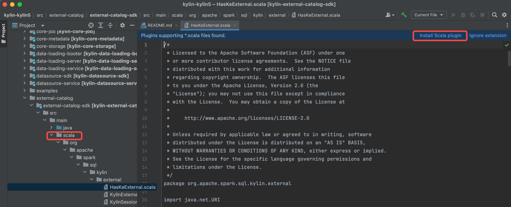
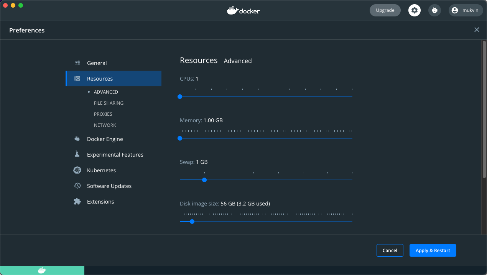
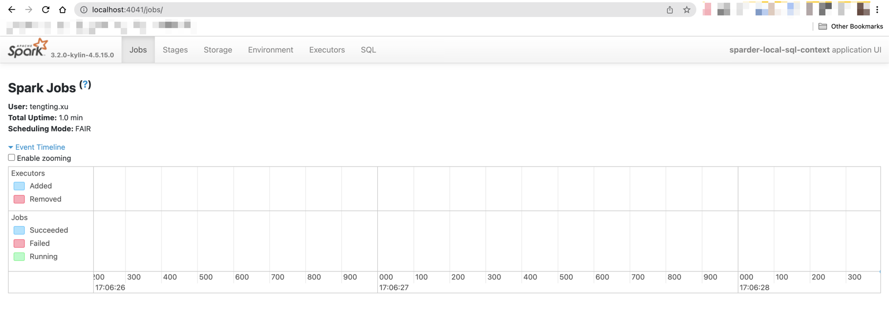
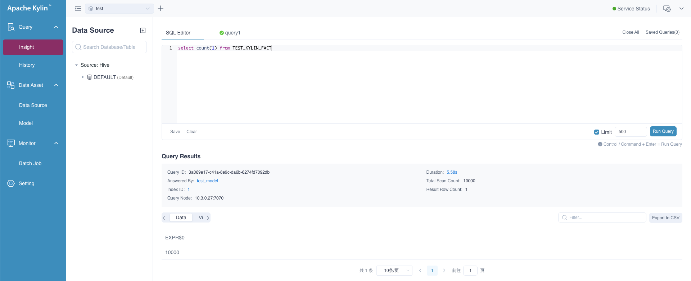

### Background

#### Why debug Kylin in IDEA without Hadoop
This article aims to introduce a simple and useful way to develop and debug Kylin for developer.

#### Deployment architecture

Following is architecture of current deployment.


This guide **assumes** you have prepared the following things:

- [X] A **laptop** with MacOS installed to do development work (Windows is not verified at the moment)
- [X] kylin's source code is cloned into some directory in your laptop

### Prepare IDEA and build source code

#### Step 1: Check Software Requirement

Please visit [Software Requirement](how_to_package#software_reqiurement), make sure your laptop has meet the requirement.

#### Step 2: Build source code

- Build back-end source code before your start debug.
  
    ```shell
    cd <path-to-kylin-source>
    mvn clean install -DskipTests
    ```

- Build front-end source code.
  
    (Please use node.js **v12.14.0**, for how to use specific version of node.js, please check [how to switch to specific node js](how_to_package#install_older_node) )
    
    ```shell
    cd kystudio
    npm install
    ```
#### Step 3: Install IntelliJ IDEA and build the source

1. Install IDEA Community edition (Ultimate edition is ok too).

2. Import the source code into IDEA. Click the **Open**, and choose the directory of **kylin source code**.
   

3. Install scala plugin and restart
   

4. Configure SDK(JDK and Scala), make sure you use **JDK 1.8.X** and **Scala 2.12.X**.
   

5. Reload maven projects, and directory `scala` will be marked as source root(in blue color).
   

6. Build the projects.(make sure you have executed `mvn clean package -DskipTests`, otherwise some source code is not generated by maven javacc plugin)
   

#### Step 4: Prepare IDEA configuration

1. Download spark and create running IDEA configuration for debug purpose and initialize the frontend env.
  ```shell
  ./dev-support/local/local.sh init
  ```

Following is the shell output.


### Prepare the Requirements

#### Deploy Zookeeper(Current only need Zookeeper)

1. Install latest docker desktop in your laptop

2. Check available resource of your docker desktop in laptop, make sure you leave 1 CPUs and 1 GB memory at least .

Following is the setting page of Docker Desktop of MacBook.



3. Start Zookeeper service via docker compose on laptop.

  ```shell
  ./dev-support/local/local.sh up
  ```


#### Check status of Require services
- Check health of Zookeeper, you can use following command to check status

```shell
./dev-support/local/local.sh ps
```

Following output content shows all hadoop component are in health state.


### Debug Kylin in IDEA

#### Start backend in IDEA

- Select "BootstrapServer[Local]" on top of IDEA and click **Run** .

![click BootstrapServer[local]](images/how_to_debug_kylin_in_local/RUN_KYLIN_IN_IDEA.png)

- Check if SparkUI of Sparder is started.



#### Start frontend in IDEA

- Set up dev proxy
```shell
cd kystudio
npm run devproxy
```


#### Validate Kylin's core functions

- Visit Kylin WEB UI in your laptop


- Create a new project, load table and create model

- Validate Cube Build and Query function




### Command manual
1. Use `./dev-support/local/local.sh stop` to stop all containers
2. Use `./dev-support/local/local.sh start` to start all containers
3. Use `./dev-support/local/local.sh ps` to check status of all containers
4. Use `./dev-support/local/local.sh down` to stop all containers and delete them
