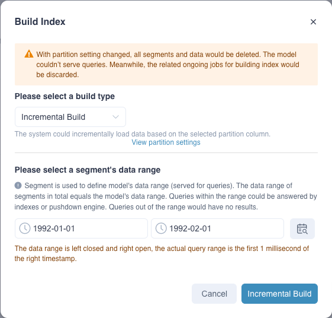
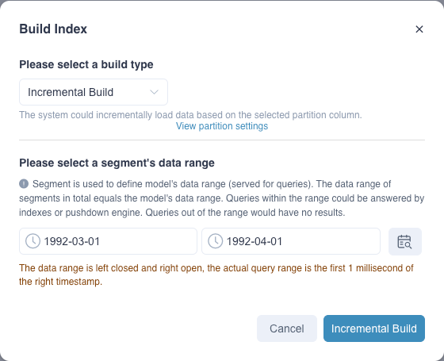
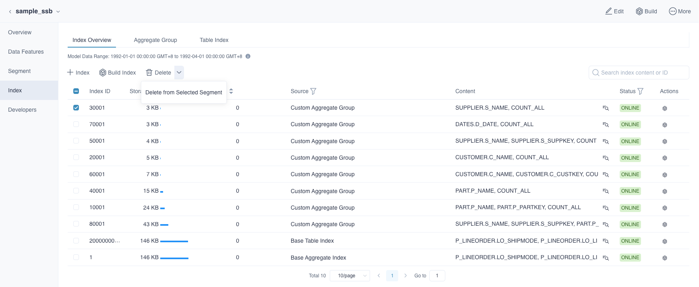

Load data calculates the source data based on the model and index definition. This chapter takes the sample data as an example to introduce two data load methods and processes:

- full load
- incremental load by date/time

This chapter also introduces segment operations and settings, which are used to manage Segments.

- Segment operation and settings
    - Segment Merge

### Full Load
If you want to load all the data in the source table, you can choose full load. The main contents are as follows:

#### Full Load

If you do not set a time partition column for your model, it will be full load each time.

You cannot merge segments in a full load type model since there should be only one segment.

Here we will introduce how to do a full load in the Web UI:

1. Select the model that needs the full load in the model list. Click the **Build Index** button.

   

2. You will be prompted to load all data, including the data already loaded in the model.

   

   > **Note**: If you load data for a model for the first time, the storage size in the above prompt will be 0.00 KB because the model has not been loaded (there is no data in the model).

3. After that, you can view the build index job via the **Monitor -> Job** page.

4. When the data is loaded, you can view the details in the model list. There is only one Segment in the **Segment** tag, and it is marked as full load.

   

### Incremental Load

As your business data grows over time, you can choose to load data by date / time. The main contents are as follows:

#### Load by Date/Time

If you have set a time partition column for your model, you can load data by date / time each time on the **Data Asset -> Model** page.

1. **First Load**
   Open Kylin web UI and access the project. Select the model that needs to load in the model list page.

   **Step 1:** Click the **Build Index** button.

   

   **Step 2:**  Select the load range in the pop-up window and click the **Incremental Load** button. This action will trigger the job of **Load Data**.

   >  **Note**:
   >
   > - You can click the icon on the right side of the load range to automatically detect the latest available range. When your mouse is hovering over the Icon **Detect available range** is displayed.
   > - When you load historical data at the first time and the data volume is too large, it may lead to a long loading time. Please be sure to set the load range according to your data volume, model complexity, and available resources.

   

#### Known limitations
The start time range of Segment should greater than `1970-01-02`.

**Step 3:** After submission, go to the **Monitor -> Job** page, a list of running jobs will be displayed. The first job is the job we just submitted and **Data Range** is displayed as the selected load range in step 2.

**Step 4:** When all steps are complete, the status of the job will become **Finished**. You can view the details in the model list. There is a Segment in the **Segment** tag and it is marked the **Start Time** and **End Time**.

2. **Incremental Load**

   After the first segment is built, we can build more segments incrementally to accommodate new data. The time range of two segments cannot overlap.

   The steps for incremental load are consistent with the steps described above. Click the **Build Index** button then select the load range in the pop-up window. To ensure continuity, a new segment always starts from the end of the last segment.

   When load completes, go to the model detail page and check there are two segments under the model.

   

3. **Add Segment**

   Besides the above methods, you can also increase the model data range by adding a new segment. Click the **+ Segment** button under segment list. Then click the **Incremental Build** button in the pop-up window. After that, a building job will be submitted and the third segment will be shown when the job is finished.

   Note: If you want to use this function, you need to enable **Creating Reserved Segments**. Please refer to [Project Settings](../../operations/project-managing/project_settings.md) for more information.

   
   

### Build Index

As the business scenario changes, some of the indexes in the model need to be retained only in latest months for saving building and storage costs. Therefore, Kylin provides a more flexible way to build indexes since the 5.0 released.

#### Build Index

In the **Index Overview** tab, we can see the index list and some basic information. In the **Index List**, we can filter some indexes by the keyword or ids and then only build them in selected segments. For example, some new columns are added in the source table because of the business demands. Therefore, we need to add some new indexes for those columns in the latest one month for analysis and cost saving. As shown in the figure below, we can select all the new and NO BUILD indexes, and then click the **Build Index** button.

After that, please select the segment with the latest month and click the Build Index button to generate the building job. If you want to build the segments concurrently to improve the efficiency, you can also check the **Generate multiple segments in parallel** box. Then, the system will generate multiple jobs according to the number of selected segments.

#### Delete Index

Similar to the building index, you can also delete some indexes in selected segments. For example, deleting some low frequent usage indexes in last year. As shown below, we can choose some of the indexes and click the **Delete** button to choose delete from all segments or parts of them.

Note: If the indexes are deleted from segments, it may influence the query performance because some of query may route to the pushdown engine due to the lack of index.

#### Build All Index

To support more flexible index building, it may expect that different indexes will be included in different segments. In order to ensure the stable query performance, we recommend you build all index among all segments after a period of time. Therefore, if the index is incomplete, we can quickly build all indexes by clicking the icon after the index data range.

As shown below, all the segments with incomplete indexes will be shown after clicked the icon. Then, you can select all the segments and click **Build Index** to ensure segments with all indexes.

