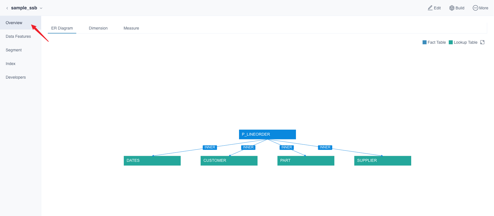

### Model List

 You can create and design models manually. Below are the main content of model list:

1. Log in to Web UI, switch to a project.

2. Navigate to **Data Asset -> Model** page, where models are shown in a list. The picture below is the index group list:

	
	
	**Fields Explanation:**
	
	- **Model Name**: Model's name.
	
	  - **Status**: There are four statuses.
      - *ONLINE* indicates this model is online and is able to answer queries.
	    - *OFFLINE* indicates this model is offline and not available to answer queries. We recommend using offline when you need to edit the model. 
	    - *BROKEN* indicates this model is broken and not available. Mostly happens when the schemas of related source tables have changed, for instance, a related source table is deleted.
	    - *WARNING* indicates this model is warning and can only server parts of queries. Mostly happens when the segments exist holes or indexes are waiting to build.
	  - **Last Updated Time**: The lastest time to update model.
	
	- **More Actions**: The **More Actions** button will appear when you are hovering on model name area, please refer to [Model Operations](model_operation.md) for details.
	
	- **Owner**: The user who created this model.
	
	- **Description**: Model description.

	- **Fact Table**: The fact table of this model.
	
	- **Types**: Model types, which include *Batch Model*
	
	- **Usage**: Hit count by SQL statements in the last 30 days. Update every 30 minutes.

	- **Rows**:  The rows of loaded data in this model.
	
	- **Storage**: The storage size of loaded data in this model, which combines the storage size of all Segments data.
	
	  > Tip: When the tiered storage is turned on, the total storage size of the data loaded into the tiered storage (ClickHouse) will be displayed.
	
	- **Expansion Rate**: The ratio of the storage size of the built data to the storage size of the corresponding source table data under the model. Expansion Rate = Storage Size / Source Table Size.
	      
	  
	> Notice: The expansion rate won't show if the storage size is less than 1GB.
	
	- **Index Amount**: The amount of indexes in this model.

### Model view

After expanding the model information, you can see the model overview page, which will help you to quickly get the model information.

On this page, you can view the ER diagram of the model.

What's more, you can view the dimensions and measures information contained in the model.

### Model Details

Models contain Segments and indexes. You can click model name to unfold the detailed information, as shown below:

