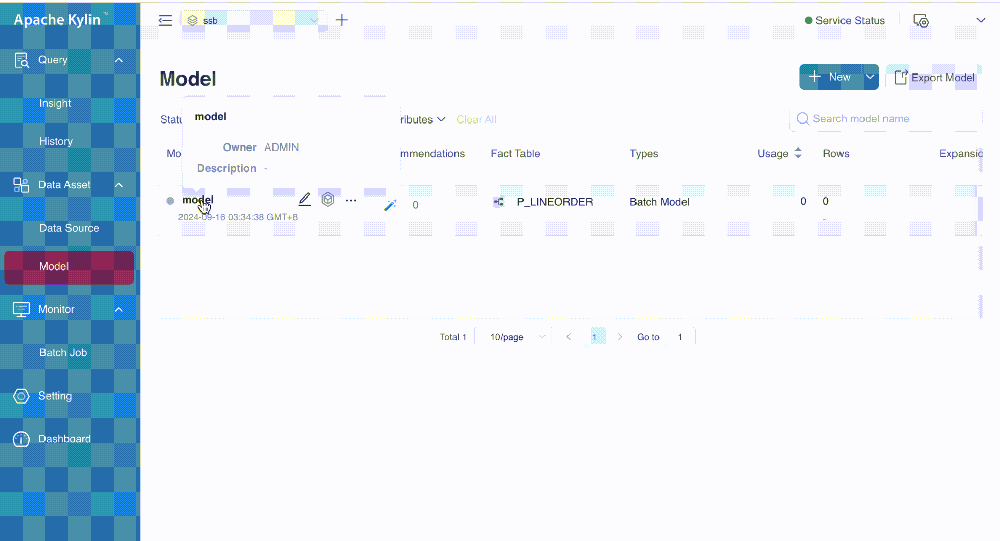
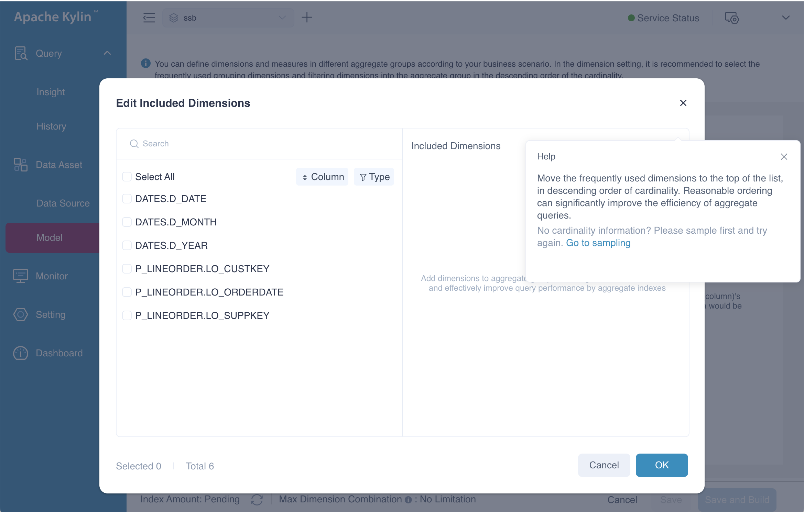
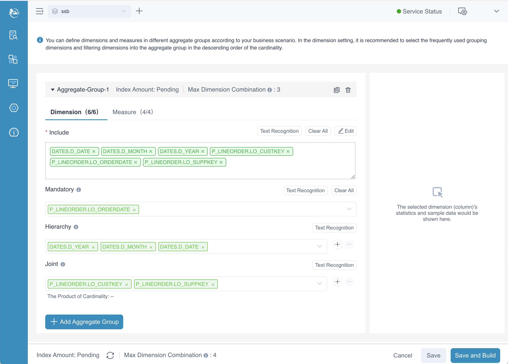
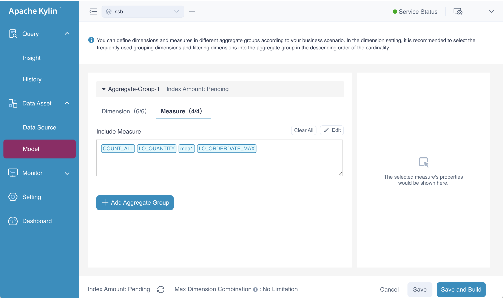
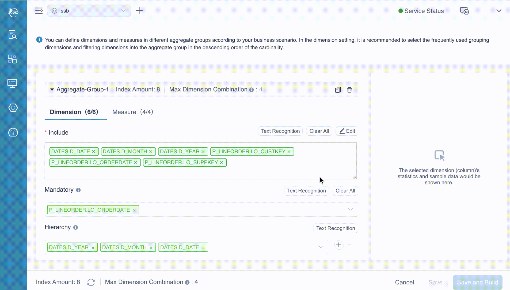
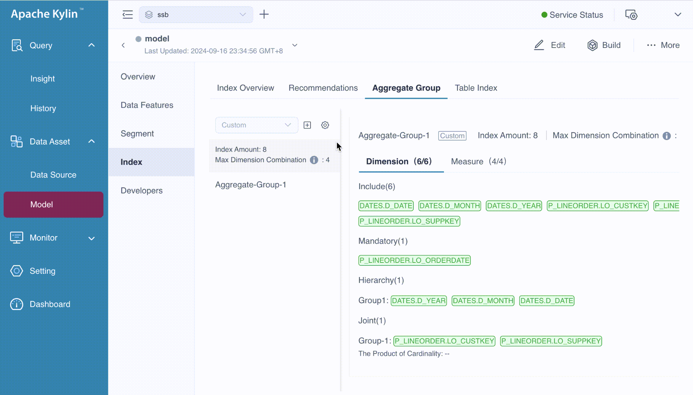
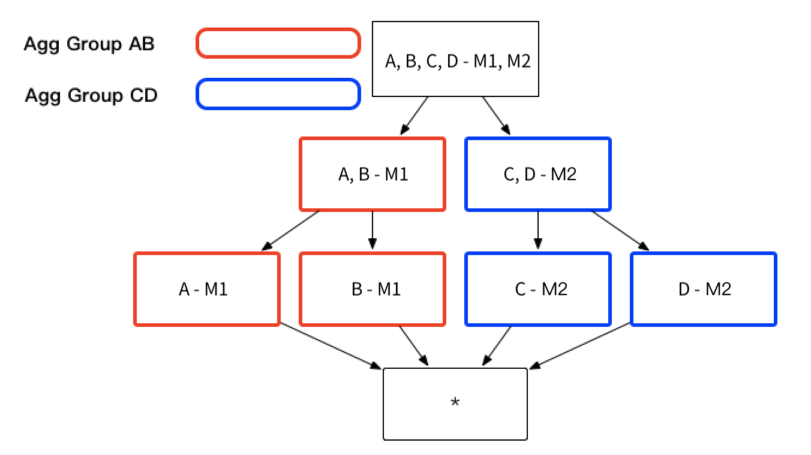
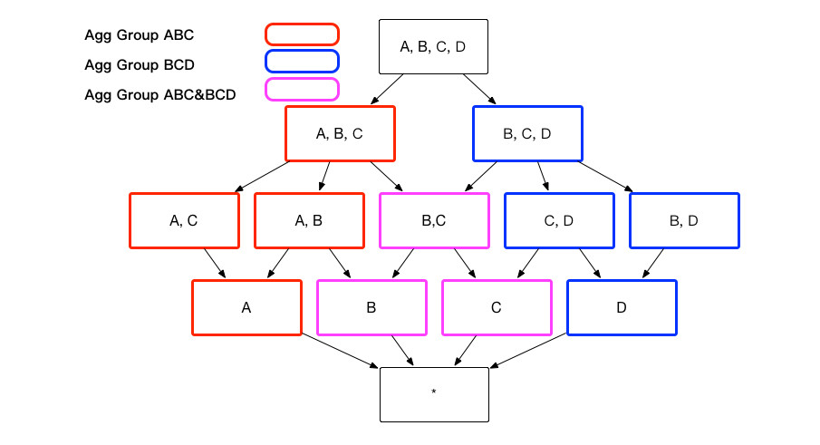

Kylin is renowned for enhancing query performance by pre-calculated aggregate groups, which represent various combinations of all dimensions, also known as cuboids. However, it faces the well-known challenge of the **curse of dimensionality**—as the number of dimensions increases, the number of possible indices grows exponentially (2^n - 1). For example, with 3 dimensions, there are 7 possible indices, but with 10 dimensions, the number of cuboids surges to 1023.

To address this challenge, Kylin employs an **aggregation group mechanism** that optimizes the management of high-dimensional data, helping to reduce the complexity and significantly improve query performance.


### <span id="background">Basic Concepts</span>

To create aggregate indexes, it is important to understand the following key concepts:

- **Aggregate Group**: Defines specific sets of dimensions that should be aggregated together, limiting the scope of combinations to what is most relevant for queries.
- **Joint Dimension**: Groups dimensions that are frequently queried together, helping to optimize index creation for common query patterns.
- **Hierarchy Dimension**: Establishes a hierarchy among dimensions, ensuring that when one dimension is queried, all related dimensions are considered, reducing unnecessary combinations.
- **Mandatory Dimension**: Marks certain dimensions as essential, ensuring they are always included in index combinations, which helps avoid generating irrelevant cuboids.

These settings are crucial for optimizing the index-building process, as they minimize both storage and computation costs while maintaining efficient query performance.

In this chapter, we will first guide you through the process of designing an **Aggregation Group**. Following that, we will delve into the principles behind aggregation groups, equipping you with the knowledge to design them effectively.

The following GIF demonstrates how to navigate to the Aggregation Group page.



### <span id="edit">Add Aggregate Group</span>

On the **Aggregation Group** page, when you hover over the  button, a tooltip will appear displaying **Add Aggregate Group**. By clicking this button, you will be redirected to the page for adding an aggregate group, as shown below.


Alternatively, you can navigate to the same page by clicking the **Aggregate Group** button. Both methods will take you to the interface where you can define the dimensions and measures for the aggregation group, and configure advanced settings such as **Mandatory**, **Hierarchy**, and **Joint** dimensions. Additionally, there is an option to set the **Max Dimension Combination**, which limits the maximum number of dimension combinations allowed for the aggregation group, helping to optimize performance and manage storage effectively.

#### Setting Dimensions

When you click the **Add** button on the **Include** sub-page, a dialog box labeled **Edit Included Dimensions** will appear. This dialog allows you to select the dimensions for the aggregate group. In this example, we will select all available dimensions and then click the **OK** button to confirm the selection. 




After selecting the dimensions to be included, the next step is to configure the **Mandatory Dimensions**, **Hierarchy Dimensions**, and **Joint Dimensions**. Tooltips are available to assist in understanding these settings—when the icon  was clicked, they provide explanatory messages. For instance, the tooltip for **mandatory dimension** shows: "If a dimension is set as a mandatory dimension, only the index with this dimension will be calculated."

In our example:

- *LO_ORDERDATE* is designated as a mandatory dimension, ensuring that any query using the aggregation group must include this dimension.
- *LO_CUSTKEY* and *LO_SUPPKEY* are configured as joint dimensions, indicating that these dimensions are frequently queried together and should be optimized accordingly.
- *D_DATE*, *D_MONTH*, and *D_YEAR* are set as hierarchy dimensions, establishing a parent-child relationship that allows for drill-down queries, such as from year to month to date.



#### Max Dimension Combination

At the bottom of the page, you'll notice a label of *Max Dimension Combination*. This setting applies globally to all aggregation groups within the model, meaning it defines the maximum number of dimension combinations allowed for the entire model. Each individual aggregation group also has its own setting, which works independently for that specific group.

In our example, the max dimension combination for the model is set to 4, meaning the maximum number of dimension combinations across all aggregation groups cannot exceed this limit. However, for the aggregation group *Aggregate-Group-1*, the limit is set to 3, meaning this particular group can only combine up to 3 dimensions.

#### Setting Measures

When you choose the page of **Measure**, you can define all the measures of this aggregate group. By default, all the measures of model are included in the aggregate group, if you don't need all of them, you can edit the content.



#### Aggregate Group View


After completing all the steps mentioned above, you'll have an aggregation group ready to be saved, as shown in the picture above. If you want to add more aggregation groups, simply click the **Add Aggregate Group** button. In this example, we have defined just one aggregation group. Once you're done, click the **Save** button, and you will be directed back to the **Aggregation Group** page as follows.


#### Text Recognition

You may notice the **Text Recognition** button, which is particularly useful when your model contains a large number of dimensions. This feature allows you to prepare the dimensions in advance, paste them into the provided text box, and then execute the process. Kylin will automatically extract the correct dimensions from the input. In this example, we just manually input the desired dimensions into the text box, separating each dimension with a comma, as shown below. 



#### Index Overview

If you want to know the indexes generated by the aggregate group, you should navigate to the **Index Overview** page. This page gives you all the information of index, we will introduce them in the chapter of [model info](../manage/model_info.md).


#### Advanced Settings

On the **Aggregate Group** page, you’ll notice an icon (). Clicking this icon will navigate you to the **Advanced Setting** page. Here, you can specify columns as **ShardBy** as needed. 

The **ShardBy** column is typically one of the filter or grouping dimensions that are frequently used in queries. While you can designate more than one shard by dimensions, only the first one will be applied during queries. Therefore, it’s important to choose this column wisely, balancing factors such as column cardinality. Cardinality information is generated via [table sampling](../../datasource/data_sampling.md).

This setting applies to all aggregate groups. If an aggregate group does not contain the specified shard by dimensions, the system will automatically bypass them when generating aggregate indexes.




Based on your business scenario, you can decide whether to add an index that includes the dimensions and measures defined across all aggregate groups. This index can support queries that span multiple aggregate groups but may not achieve the optimal query performance. Besides, incorporating this index comes with higher storage and building costs. How to set this configuration, please refer to the [configuration](../manage/configuration.md) chapter.

```shell
# generating base cuboid of all aggregate groups, by default this is true
kylin.cube.aggrgroup.is-base-cuboid-always-valid=true
```

Please note, this is different from the **Base Index**. The dimensions and measures in the aggregate groups may not cover everything in the model, and the base table index will not be generated in this context.

### Principles

Now that we have completed the design of the aggregation group, we will delve deeper into the underlying principles in this section. Understanding these principles will help you optimize the performance and management of aggregation groups in Kylin, ensuring efficient query processing and resource utilization.


#### <span id="agg">Aggregate Group</span>

You can categorize the combinations of dimensions and measures into several groups, referred to as **Aggregate Groups**. For instance, as illustrated at the beginning of this chapter, if you only require the dimension combinations of *[A B M1]* and *[C D M2]*, the aggregate index group can be segmented into two distinct aggregate groups: *A B-M1* and *C D-M2*. This approach effectively reduces the total number of indexes from 15 to 7, optimizing storage and improving query performance.




The aggregate groups required by end users may contain overlapping dimensions. For instance, consider aggregate group ABC and aggregate group BCD, both of which include dimensions B and C. If these two aggregate groups share the same measures, they will generate identical indexes; for example, both aggregate group ABC and aggregate group BCD will derive the index BC. However, Kylin ensures that an index is not generated multiple times. If an index can be derived from more than one aggregate group, it will only be created once, as illustrated below.



#### <span id="mandatory">Mandatory Dimension</span>

When you want to focus your analysis on one or more specific dimensions that must be included in every query, you can designate these dimensions as **Mandatory Dimensions**. This setting ensures that only indexes containing the mandatory dimension will be calculated and considered for queries.

For instance, if we take the aggregate index example from earlier in the chapter, where there were originally 15 possible indexes based on various combinations of dimensions, and we set dimension **A** as mandatory, the result would be a reduced set of indexes. In this case, only those indexes that include dimension **A** will be calculated, effectively limiting the combinations and simplifying the number of  indexes from 15 to 8.


#### <span id="hierarchy">Hierarchy Dimension</span>

End users typically utilize dimensions with hierarchical relationships, such as country, province, and city. In this context, a hierarchical relationship can be defined as a **Hierarchy Dimension**. From top to bottom, the hierarchy consists of a one-to-many relationship: country, province, and city. These three dimensions can be grouped into the following combinations:

1. Group by country.

2. Group by country and province (equivalent to grouping by province).

3. Group by country, province, and city (equivalent to grouping by country and city, or simply by city).

In the aggregate index group outlined below, let dimension A represent Country, dimension B represent Province, and dimension C represent City. Here, dimensions A, B, and C can be configured as a hierarchical dimension. Consequently, the following index relationships hold true: 

- Index [A, C, D] is equivalent to index [A, B, C, D].
- Index [B, D] is equivalent to index [A, B, D].

Thus, indexes [A, C, D] and [B, D] can be pruned effectively.


As the diagram below illustrates, based on the method above, Kylin can prune redundant index, hence reducing index from 15 to 7.


#### <span id="joint">Joint Dimension</span>

Sometimes you don’t need details of all possible combination dimensions. For example, you might query dimension A, B, C together in most cases but not dimension A, C or dimension C alone. To enhance performance in this case, **Join Dimension** can be used. If A, B, and C are defined as Joint Dimension, Kylin will only build index ABC but not index AB, BC and A. Finally, indices will be built as below. The number of indices can then be reduced from 15 to 3.


**Dimensional cardinality product **

The *Dimensional Cardinality Product* refers to the product of the cardinalities of each dimension field within a joint dimension. This cardinality data is derived from the sampling results of the source data table. The dimensional cardinality product represents the maximum number of possible permutations and combinations of dimensions in the joint index (i.e., the maximum number of records for that index).

Although the dimensional cardinality product does not directly participate in the index creation process, it serves as a useful reference when defining the union dimension of an aggregate group. To ensure optimal query performance, it is generally recommended that the dimensional cardinality product of a union dimension does not exceed 100,000. In special cases, where dimensions in the union dimension must always be queried together, this value can be less of a concern.

#### ShardBy Column

In some cases, subqueries within a join may match two indexes. When this happens, Kylin retrieves data from both indexes and performs the join operation. However, if the cardinality of the subquery is high, the join operation may become time-consuming. To optimize this, users can set the *ShardBy* column to the join key.

```shell
kylin.storage.columnar.expose-sharding-trait=true
```

This feature is enabled by default, Kylin will expose the sharding information to Spark. Normally, joining two large datasets in Spark requires a data shuffle beforehand to achieve hash partitioning. However, if the *ShardBy* column has already partitioned the data, the shuffle stage can be skipped, significantly speeding up the join operation.

:::note Limitations
Since there can only be one **ShardBy** column for a model, the optimization applies exclusively to joins that involve this single **ShardBy** column. For joins on other columns, the optimization will not take effect, and a data shuffle will still be required in Spark. Therefore, it’s important to choose the **ShardBy** column carefully, particularly when frequent joins occur on that specific column.
:::


#### <span id="mdc">Max Dimension Combination</span>

The use of aggregate groups helps prevent index explosion, but achieving optimal index performance requires a solid understanding of the data model, which can be challenging for junior modelers.

This section introduces a simple index pruning tool called **Max Dimension Combination (MDC)**. The MDC specifies the maximum number of dimensions allowed in a single index, preventing the creation of indexes with excessive dimensions during the index-building process. The MDC is especially useful when most queries interact with no more than N dimensions, where N is the configurable MDC threshold. This helps streamline index creation and improve query performance by focusing on the most relevant dimensions.

The following graph illustrates a scenario with 7 dimensions, with some details hidden for clarity:

- When the MDC is set to 4, indexes with more than 4 dimensions, such as *ABCDEF*, *ABCDEG*, *ABCDE*, and *ABCDF*, will be pruned.
- When the MDC is set to 3, indexes like *ABCDEF*, *ABCDEG*, *ABCD*, and *ABCE* will be excluded.


To optimize index building, creating an index that includes dimensions and measures from all aggregate groups ensures it won't be pruned. Remember that joint dimensions and hierarchy dimensions are counted as a single dimension, while mandatory dimensions are ignored. When using the **Max Dimension Combination (MDC)** tool, consider the actual number of dimensions in the index, especially with joint or hierarchy dimensions, to ensure effective pruning aligned with query performance.

The MDC dimension pruning tool significantly reduces the number of indexes and storage size. However, complex queries that involve more dimensions may encounter larger indexes, which can slow down query responses due to online calculations. Like other optimization tools, this involves a trade-off. If most of your queries touch fewer dimensions, using MDC is beneficial.

Laboratory tests have shown that when the number of dimensions in the aggregate group is large, checking the index count can take several minutes, potentially causing web UI lags. Here are some test results for reference:

- **1 aggregate group with 1000 dimensions**: MDC set to 1, average check time is **3.1 minutes**.
- **1 aggregate group with 1500 dimensions**: MDC set to 1, average check time is **13.9 minutes**.
- **3 aggregate groups with 500 dimensions each**: MDC set to 1, average check time is **3 minutes**.

Please consider these results as general guidance and assess based on your specific scenario.

#### How to Count Dimensions

Next, let’s discuss how to count the number of dimensions in a query. This count refers to the dimensions represented in the corresponding index.

- For ordinary dimensions, each counts as one dimension.
- A group of joint dimensions or hierarchy dimensions is treated as a single dimension.
- Mandatory dimensions are ignored.

For example, in the following SQL query:

```sql
SELECT 
    COUNT(*) 
FROM 
    table 
GROUP BY 
    column_mandatory, 
    column_joint1, 
    column_joint2, 
    column_hierarchy1, 
    column_hierarchy2, 
    column_normal;
```

We can analyze the dimensions as follows:

- **1** mandatory dimension.
- **2** dimensions from a single joint dimension.
- **2** dimensions from a single hierarchy dimension.
- **1** normal dimension.

Thus, for index pruning, this query is considered to involve **three dimensions**. This counting method helps ensure that the index pruning mechanism effectively limits the number of dimensions in the created indexes.

### Summary

In this chapter, we covered how to create aggregate groups and the principles behind them. However, designing effective indexes seems quite complex, especially for beginners. If you're looking for a simpler approach, please refer to the [recommendation](../rec/intro.md) for more details.

