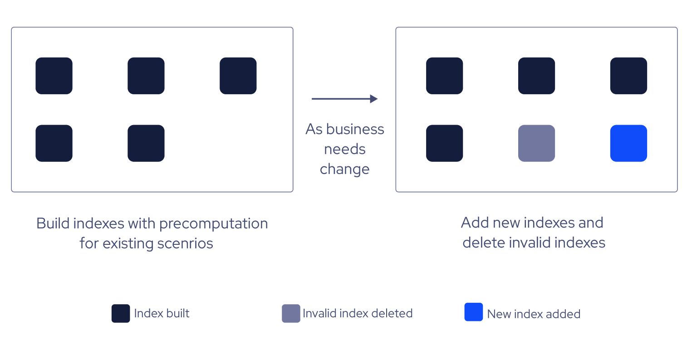
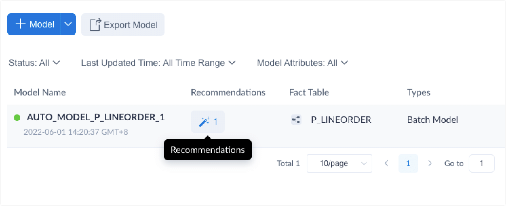

In traditional model development mode, data modelers may need to frequently update indexes to reflect business changes. Kylin, powered by the recommendation engine, helps users flexibly adjust indexes with recommendations based on query history and source data characteristics to better handle their business needs. 

### Operation steps 

1. Log in to Kylin as any of the following roles: 

   - System admin 
   - **Management** or **Admin** of the target project 

2. In the left navigation panel, click **Data Assets** > **Model**. 

3. Check if there is any recommendation for the model. Click  to view details about the recommendation. 

   

4. In the **Recommendations** tab, view details about the recommendations.  

   

   In this example, Kylin recommends adding an aggregate index. Click in the **Content** column to check the recommended dimensions and measures. If the recommendation type is **Delete**, you can check the reason in the **Note** column to evaluate whether to approve this recommendation.

5. Select the check box before the recommendation and click **Approve**. 

6. After adding the new index, you still need to build it so Kylin can help to accelerate queries with beforehand precomputations based on the index. 

   1. Click the **Index Overview** tab. 

   2. Find the index just created. Click  in the **Actions** column. 

      

      You can also use the search filter to quickly locate the indexes in **NO BUILD** status. 
      
   3. In the pop-up dialog box, select the check box before time range, and click **Build Index**. 

      To check the progress of the index building task, click **Monitor** > **Batch Job** in the left navigation panel. 

### FAQ

- Question: How to modify recommendation generation rules?

  Answer: You can customize query duration, hit rules, the maximum number of recommendations, and other recommendation generation rules based on your business needs.  For details, see [Set Recommendation Rules](../rule_setting.md).

- Question: What index optimization strategies are supported?

  Answer: Kylin supports the low-frequency, inclusion, and similarity strategies to help you reduce build pressure and storage cost. For details, see [Index Optimization Strategies](../../modeling/model_design/advance_guide/index_optimization.md).