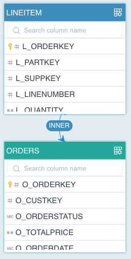
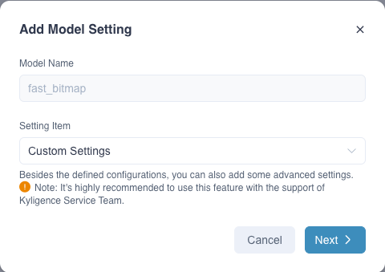
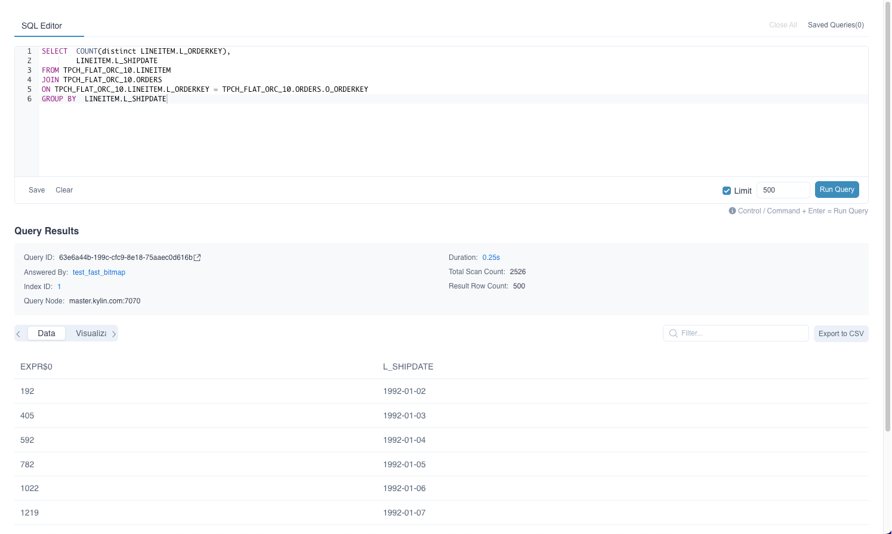
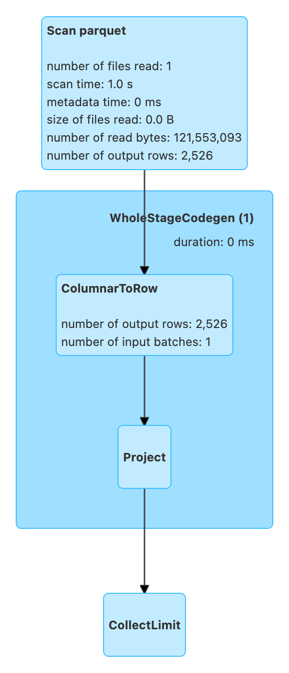

Since Kylin 5, the system has enhanced the optimization of queries that hit the index exactly (the query contains dimensions that are exactly the same as the dimensions of the selected index), and it also improves the performance in count distinct scenario.

With the following settings, optimization of precise count distinct queries can be applied:

1. Build a model that contains precise count distinct measure.
2. Modify the configuration in model level and add custom settings:
   `kylin.query.fast-bitmap-enabled = true`
3. Build the model
4. Query the SQL statements with exact indexes

### Configuration Level

This configuration is only available at the model level.

### Query Example

Taking Kylin's sample data set TPC-H as an example, the fact table LINEITEM simulates the recording of transaction data. The following query gets the number of orders under different sales dates.

```sql
SELECT  COUNT(distinct LINEITEM.L_ORDERKEY),
        LINEITEM.L_SHIPDATE
FROM TPCH_FLAT_ORC_50.LINEITEM
JOIN TPCH_FLAT_ORC_50.ORDERS
ON TPCH_FLAT_ORC_50.LINEITEM.L_ORDERKEY = TPCH_FLAT_ORC_50.ORDERS.O_ORDERKEY
GROUP BY  LINEITEM.L_SHIPDATE
```


1. Create the model:

    

2. Switch to the **Model Settings** interface:

    

3. Enter the configuration to enable the function:

    

4. Add  indexes:

    

5. After building successfully, the query performance is improved a lot when the query exactly matches index.

    

    

6. Compare the execution plans before and after optimization
   
    

    


### Known Limitations

1. This operation will lead to a longer build time and almost double storage cost.
2. The indexes need to be refreshed when enabling this function.
