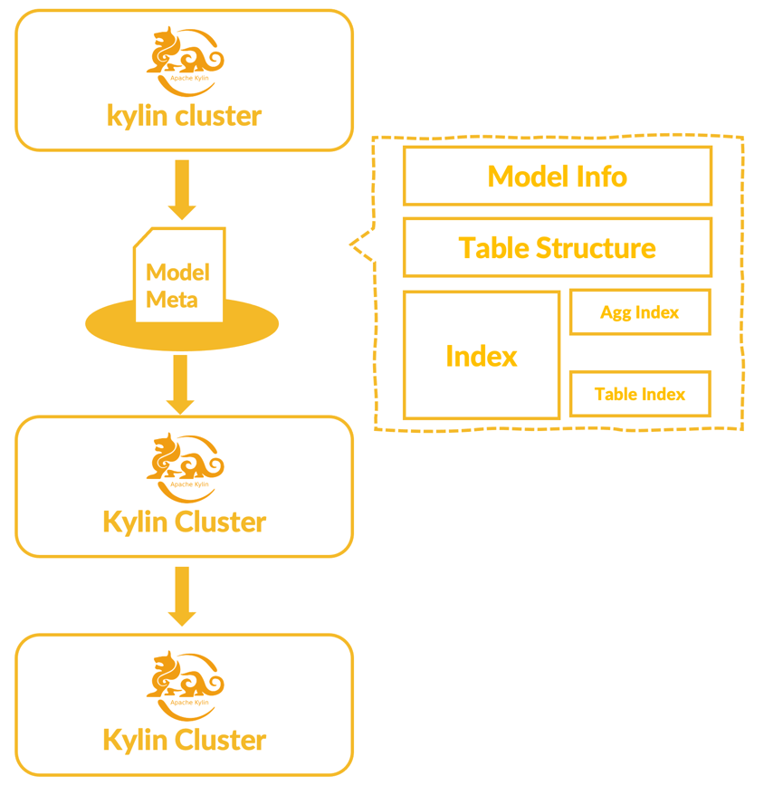
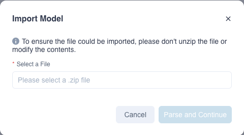
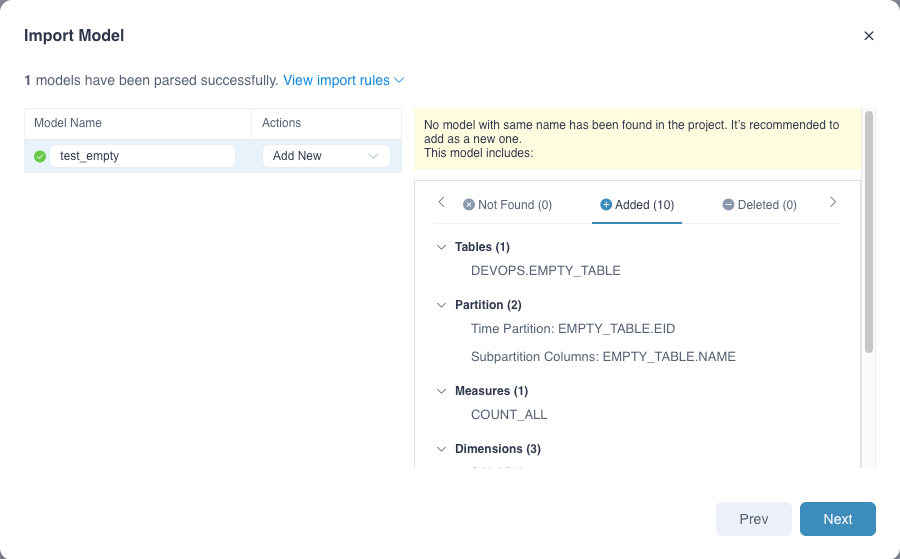

## Model Metadata Management

Kylin is stateless service. All state information is stored in metadata. The model is the core asset of the KE cluster. The model metadata describes the content of the model information in detail.

The movement of models in different environments is an important process of actual production. Therefore, importing and exporting metadata is a crucial link in operation and maintenance. Kylin provides import and export model metadata functions.

### Model Publishing {#model_publish}

In many companies, in order to ensure the stability of the production environment, the release and change of models in the production environment is very strict. Users often need to deploy an additional independent development environment for data development and test verification (and possibly there is still a test environment), and migrating the data model from the development environment to the production environment is the process of model release. At the same time, this process needs to undergo rigorous review to ensure that the model is complete and accurate in the migration. The export and import of metadata is a crucial part of the migration.

### Model Metadata Export {#model_metadata_export}

#### Export contents

Model metadata export, you can export single or multiple models to a compressed package in zip format.

The exported model metadata range:

- Include: model definition information, such as the tables referenced by the model, table relationships, partition columns, calculable columns, filter conditions, measures, dimensions, aggregation groups, index content, etc.

- Not include: Segment information, building data, index status, etc.

- You can choose whether to include recommendations, model rewrite settings and sub-partition values in multi-level partitioning models. After selecting export, if the target system has a model with the same name, the recommendations, model rewrite settings and sub-partition values of the target model will be directly overwritten during import.

Notes:

- To ensure the integrity of the file, please do not unzip the file or modify the content of the file. The second half of the file name is the file integrity check code. If you need to modify the file name to increase recognition, please keep the check code unchanged.

#### Export operation

- Export a single model

   Click **Data Asset->Model** in the left navigation bar to enter the **Model List** page. Through**...(More Actions) - Export Model** of a single model, the specified model can be exported in the format of a zip compressed package.

- Export multiple models

   - You can click the **Export Model** button on the **Model List Page**, select multiple models and export.
   - Or click the **Admin** button on the right of the status bar at the top of the page, in the project list page, in a single project **Actions - More Actions - Export Model**, select multiple models and export.

### Model Metadata Import {#model_metadata_import}

#### Import operation

- On the **Model List** page, click the drop-down button behind **+Model**, select **Import Model**, and upload the model metadata compression package.

- Or enter the **Admin** page, on the project list page, select the project to import the model metadata, in **Action - ...(More Actions) - Import Model**, upload the model metadata compression package.

  
  
#### Select operation type

When parsing the metadata package, the system will use **model name** as the unique identifier to distinguish the model, and match the target system with the model metadata in the metadata package. After the model is parsed by the system, there will be three operations to choose from: **Replace**, **Add New**, **Not Import**, the following will introduce in detail the default appearance of these three operations and whether they can be used as the next operation conditions of:

- **Not import**

  - Operation instructions: The system cannot import the model, or the user actively chooses not to continue importing the model.

  - The condition that appears by default: **cannot find a table or column in the target system data source in the model to be imported, or the data type of the column is inconsistent**.

  - Whether it can be switched to other operations:No.

- **Replace**

  - Operation instructions: A model with the same name already exists in the target system, and **the model has no major changes**, the system recommends using the model in the metadata package to replace the model with the same name in the target system.

    The criteria for no major changes in the model are:

    - The fact table and the dimension table are exactly the same.
    - The table relationship is completely consistent, including table connection conditions, table relationships, and column join conditions.
    - The partition column and format are exactly the same, including the model loading method (full and incremental), excluding multi-level partition sub-partition value differences.
    - The data filter conditions are completely consistent.

  - Condition of appearance by default: A model with the same name already exists in the target system, and there is no major change in the model.

  - Whether it can be switched to other operations: it can be switched to 'add new' or 'not import'. When manually switching to 'add new', please also change the model name to a name that does not exist in the target system to avoid model name conflicts.

  - **Note: Replacing may result in the deletion of part of the built data. Please backup and double check before importing.**

- **Add New**
  
  - Operation instructions: There is no model with the same name in the target system, and the model to be imported has the **table and column in the target system data source, and the column data type is consistent**. Or there is a model with the same name in the target system, and the model has major changes. For major changes in the model, refer to the above description of the replace operation.
  - Conditions that appear by default: the same as the two conditions in the operating instructions.
  - Whether it can be switched to other operations: it can be switched to not import.

When the model to be imported is selected, the model to be imported will be displayed on the right side, the difference between the model with the same name and the data source in the current project. Differences will be divided into four categories: **Not found**, **Add**, **Delete**, **Change** display.

After the model is imported, it may be necessary to build the newly added index before it can serve queries.

### Some Practice {#model_io_practice}

#### How to deal with model rewrite settings

Different environments may have different requirements for model rewrite settings. When you export a model, you can choose whether to export the model rewrite settings at the same time. Later, when you import the model, the model settings of the target system with the same name will be overwrited.

#### How to deal with sub-partition values of multi-level partition models

Different environments generally have different values of multi-level partition sub-partitions. For models that use the multi-level partition, you can choose whether to export the multi-level sub-partition values ​​at the same time when exporting the model. When importing the model, the multi-level partition sub-partition values will be overwrited in the target system. The building data corresponding sub-partition value will be deleted while importing.

#### Model metadata export and import related API

You can also export and import model metadata through API. For details, please refer to: [Model Import and Export API](../../../restapi/model_api/model_import_and_export_api.md)

### Known limitation {#know_limitation}
- **After the model is imported, it cannot be undone. Please make a backup of the model in advance**.
- Only supports export and import between the first two versions of the same version number. For example, the model metadata package exported by Kylin 4.x does not support importing in Kylin 5.x.
