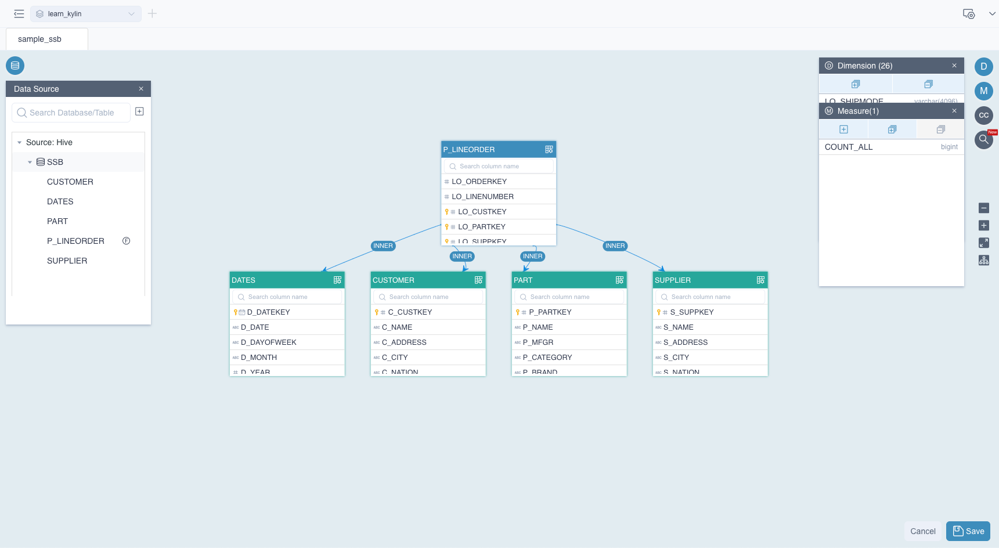
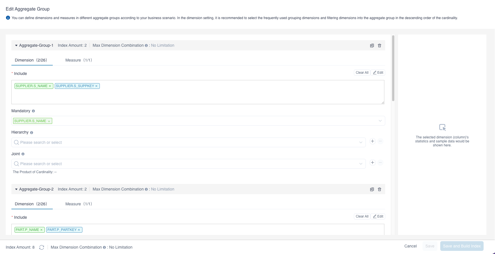
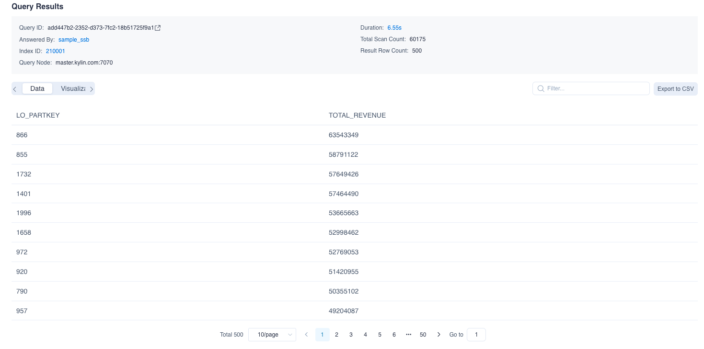

Kylin 5.0 provides which the modeling process dominated by user. In this section, we will show you how to create and optimize model.

### <span id="preparation">Preparation</span>

1. Kylin 5.0 provides one mode:  You are able to design your own models to fulfill your analysis demands and load data for your models. You can design the index manually and let the system continue to improve the index according your query habits and data characteristics.
	
2. We will use the SSB (Star Schema Benchmark) sample data to introduce the AI augmented mode project. You can find out how to import the sample data in the [Import Data from Hive](../datasource/import_hive.md) section.


### <span id="project">Create Project</span>

Project is the primary management unit of Kylin. In a project, you can design multiple models and perform query analysis.

In Kylin toolbar, click the **+** (Add Project) button to the right of the item list to add a project, and fill in the project name and  description. The project name is mandatory; the project description is optional. A good project description will help with the maintenance of the project in the future.

At this point, you have completed the creation project. The interface stays in the **Data Asset -> Data Source** page, ready to add data sources for the next step.


### <span id="metadata">Add Data Source</span>

Once the project is created, you need to add a data source table to the project. The data source tables added here will be used during model creation stage and/or query analysis.

When you add a data source, the metadata of the source table is synchronized. The metadata of a table is the data that describes the characteristics of the table e.g. table names, column names, types etc.

1. **Import Table Metadata**

   In the **Data Asset -> Data Source** interface, click the **Add data source** button at the top left to add a data source table for your project.

   - Select data source type: Hive.

   - Select the target data source table: Expand the database list and select the target data source table.

   For more information on data source operations, please see the [Data Source](../datasource/intro.md) section.

2. **Table Sampling**

   During the table metadata synchronization process, the data sampling is turned on by default. You can view the auto-launched **sample table data** job in the **Monitor -> Job** page. Once the job has been executed, you can view the sample data from the source table in the **Data Asset -> Data Source** interface. You can find out more in the [Data Sampling](../datasource/data_sampling.md)) section.

    In general, table sampling will answer questions like those listed below. Understanding these will help with the subsequent model design.

   - How many rows are there in the table?
   - What is the cardinality of each column? That is, the amount of data that is not repeated.
   - What are the characteristics of the column values for each column?


3. **Data Source Interface**

   As shown in the following diagram, we added all the tables in the sample SSB dataset in Hive. The data source area is on the left and the information of the specified source table is on the right.

   You can view the source table information on the right side, where **all columns** are the feature information of the source table field, **sampled data** shows the data of each column in the source table.

   


### <span id="model">Create Model</span>

Model design is one of the core functions of Kylin. Good model design can help achieve a better data analysis experience.

1. **Principles of Model Design**

   The model is the semantic layer. A good model can help users visualize the business relationships between the source tables.

   In Kylin, you can view the data source tables in a single panel, complete model design, add dimensions and metrics, and design a model that fits your business logic. Basic principles in a model design:

   - Fact Table: Generally a table with quantifiable measures. For example, the order table is a suitable fact table. There are columns like the order quantity, order amount can be quantified.
   - Dimension Table: A table that represents a perspective looking into the quantifiable measures. For example, the product information table is suitable as a dimension table, and there are product categories and product trademarks, which can be angles to analyze business. Schedules are often used as dimension tables to partition business data by day/week/month/quarter/year.
   - Dimensions: Represents a business angle that can be analyzed, such as the order date indicating the time dimension and the item ID indicating the product dimension.
   - Metrics: Quantifiable numerical information such as total sales, total sales, etc. Usually quantifiable columns are used with functions such as SUM, COUNT, TOP_N, and so on.

2. **Method of Model Design**

   Please create a model in the **Data Asset -> Model** interface and enter the model editing interface to visually complete the creation of the multidimensional model. The specific method of model design will be described in detail in the [Model Design Basics](../modeling/model_design/data_modeling.md) section. Here is a brief introduction to the following steps:

   - Design Model: Select the source table according to the business logic and set the association between the tables. Then set the fact table and dimension tables.
   - Add Dimensions: Identify dimensions from table columns for business analysis.
   - Add Measures: Identify metrics and their aggregate functions for business analytics. You can see the detailed methods in the [Measures](../modeling/model_design/measure_design/intro.md) section.

   As shown in the following diagram, we built the model using the source tables in the SSB dataset.

   


### <span id="index">Design Index</span>

After the model is created, you need to define the index in the model; this should be based on the business analysis you are interested in. Good index design can improve system efficiency and save storage space. When you save a model design, you will often be reminded to add an index.

1. **Principles of designing an index**

   Not every dimension combination is needed for business analysis. In this case, pre-calculating all the dimension combinations will bring a large workload and can result in a long indexing time and a large data storage space. We can improve this by adding aggregate index and table index.

   - Aggregate Index: A group of dimension combinations customized to a particular business analysis. For example, an online store analyst needs to analyze the purchasing power of male and female customers in different cities, and the dimension combination in the index is `[city, customer gender]`. At this time, other dimensions are not needed in the index. If you do not need to analyze the product category, then there is no need to include it in any index. You can find out more in the [Aggregate Index](../modeling/model_design/aggregation_group.md) section.
   - Table Index: Table index supports efficient querying of detailed data records. For example, an online store analyst needs to query the detailed order data, they can add `[OrderKey, OrderDate, PartKey, CustomerKey, OrderQuantity, OrderAmount]` in a table index. After building the index and loading the data, they can query the detailed data records efficiently. You can find out more in the [Table Index](../modeling/model_design/table_index.md) section. 
2. **How to design an index**

   - Edit aggregate group: On the left navigation bar, click **Data Asset -> Model**. In the **Model List** page, click one model to enter the specific model page, click **Index**. In the **Index Overview** tab, click **+ Index -> Aggregate Group**. The diagram below shows an aggregation group in the built-in demo. There are basically four concepts in an aggregation group in order to control the combination of dimensions:

     - Included Dimensions: Select the dimensions that need to appear in the index from the list of dimensions in the model.
     - Mandatory Dimension: The dimension corresponding to the business angle that must be analyzed e.g. customer statistics.
     - Hierarchy Dimensions: Dimensions with hierarchical relationships e.g. countries, provinces, and cities.
     - Joint Dimensions: Dimensions that must appear together e.g. the supplier and the order date 

     

   - Add table index: On the left navigation bar, click **Data Asset -> Model**. In the **Model List** page, click one model to enter the specific model page, click **Index**. In the **Index Overview** tab, click **+ Index -> Table Index**. You can select the dimensions you need in the table index and build the index.


### <span id="loaddata">Load Data</span>

Kylin applies pre-calculation technology to achieve sub-second query response time in the big data era. After creating the model and editing the index, you need to load the data for the model. The process of loading data is also the pre-calculation process for the pre-defined index. Models that do not have data loaded cannot serve queries. You can find out more about how to load data from the [Load Data](../modeling/load_data/intro.md) section.

1. **Principle of Loading Data**

   - Set time partition column: The data in the fact table in the model generally increases over time, such as new orders grow over time in the order table. Then the order date can be the time partition column to partition orders into daily incremental batches. Setting the time partition column occurs after saving the model design.
   - Full load: When the model does not have a time partition column, then data in fact table is loaded fully every time. If you need to load the latest week of data in the order table, all data will be reloaded because the model does not have a time partition column. You can find out more in the [Full Load](../modeling/load_data/full_build.md) section.
   - Incremental load: When the model has been built and put into business analysis, and the model has a time partition column, you can still incrementally load new data while serving queries. For example, new data in the order table can be loaded incrementally daily. Incremental loading eliminates the need to reload pre-calculated data, this increases productivity and saves resources. You can find out more by looking at the [Load by Date/Time](../modeling/load_data/by_date.md) section.

2. **How to Load Data**
  
   There are a few options to load data and build the index.
   
   - Load data:  On the left navigation bar, click **Data Asset -> Model**, choose to load the data of a model. If the model has a time partition column, you can choose a time range for this data load. The system will launch a new job to load the data of specified time period and build the index at the same time.
   - Build index:  On the left navigation bar, click **Data Asset -> Model**. In the **Model List** page, click one model to enter the specific model page, click **Index**. You can edit and modify the aggregate index or detail index of the specified model in the **Index Overview** tab , and select which indexes need to be built to the specified data range.
   
3. **View Storage Size**

   To view storage size, click **Data Asset -> Model** in the left navigation bar. Then you can check the **Storage** column to view the storage size. If the number is 0.00 KB, the model has no data. If the storage size is larger than 0.00 KB, it means that the model has been loaded with data.

   As shown in the following diagram, the model named *Model3* has loaded data, and the model named *Model* is empty. Queries can't hit the model *Model*.

   

### <span id="query">Query Analysis</span>

You can submit a query to analyze your business data and experience the sub-second response time that Kylin offers.

1. **Query Analysis Principles**

   Kylin supports standard SQL queries. After you add a data source table, the query is already pushed down to the Hive data source. You can immediately query the data; however, we do not recommend doing so at this time. Doing so immediately, especially when the data volume is high or the query is complex, can cause the query execution to take a long time.

   Once you have the model and index created and have data loaded in the model, new queries can then hit the model and the pre-calculated data   saved in the model will be used to answer queries. This accelerated query execution method can be 10x to 100x faster. You can read the [Query Analysis](../query/insight/intro.md) section for a detailed explanation of SQL statements.

   Your history query will be saved in the **Query -> History** page, you can view the [Query History](../query/history.md) section for more information.

2. **Query Analysis Example**

   After you import the SSB test dataset, you can navigate to the **Query -> Insight** page, in the **SQL Editor** enter the following SQL statement. The data source we use is the SSB dataset simulating the transactions of an online store. The SQL statement is to query the revenue of different items within the specified order time range, and the results are sorted in descending order of revenue.

   ```sql
   SELECT LO_PARTKEY, SUM(LO_REVENUE) AS TOTAL_REVENUE
   FROM SSB.P_LINEORDER
   WHERE LO_ORDERDATE between '1993-06-01' AND '1994-06-01' 
   group by LO_PARTKEY
   order by SUM(LO_REVENUE) DESC
   ```

   The result of the query is shown in the diagram below. You can find the query object in the query information as *test_model*, which is the model created in the built-in demo. The results of the example query above shows the revenue of different products in the online store.

      

### <span id="job">Job Monitor</span>

Different jobs are triggered during the process of using Kylin, such as the job of building index, loading data, and sampling table. You can view the job list in the navigation bar **Monitor -> Job** interface. For more detailed instructions, please see the [Monitor Job](../operations/monitoring/intro.md) section.

Job monitoring can help you effectively manage the use of Kylin. You can check the status of the job to determine whether the operation is complete, whether the operating environment is stable, and so on. The following diagram shows the job monitoring interface in the built-in demo where all jobs are successfully completed.


