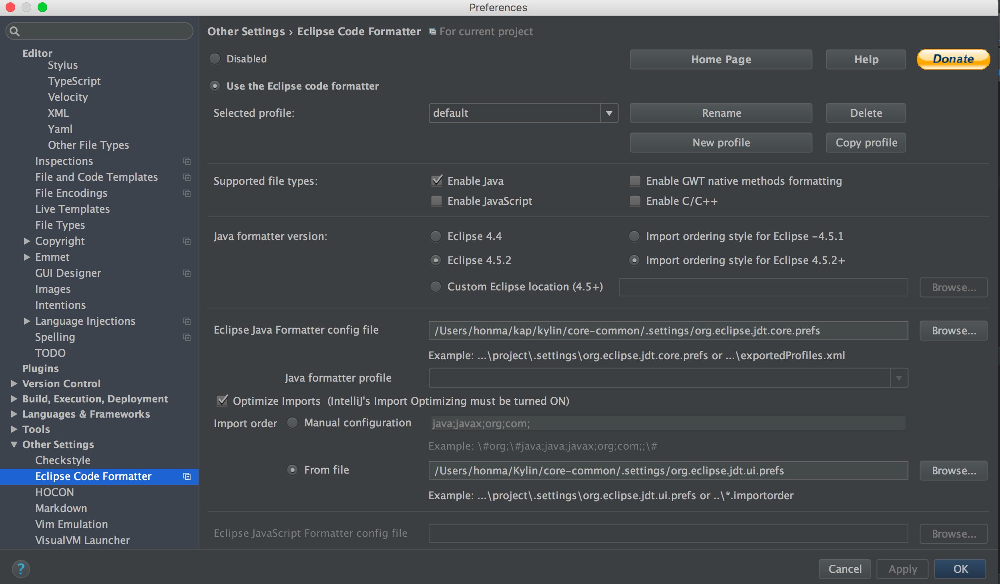
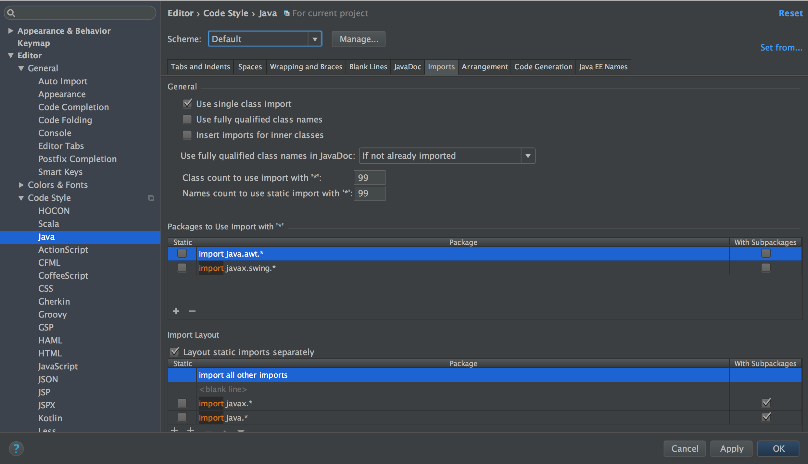
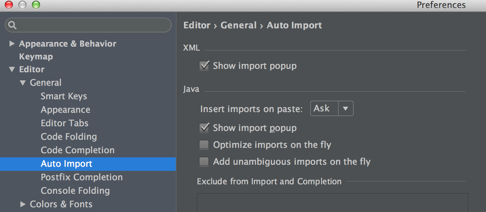
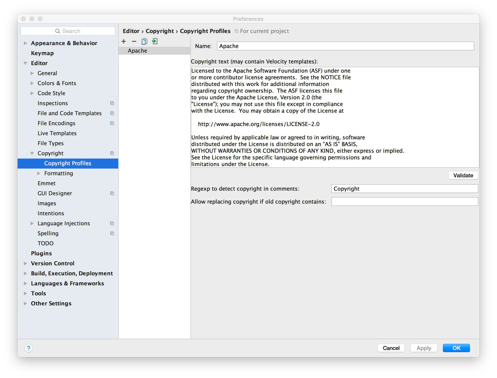

编码约定对于团队合作非常重要。它不仅使代码保持整洁，而且还节省了大量工作。不同的编码约定（和自动格式化器）将导致不必要的代码更改，需要在代码审查和代码合并方面付出更多努力。

## 设置IDE代码格式

对于Java代码，我们使用 Eclipse 的默认格式器设置，但有一项更改: 允许长行。

- 对于Eclipse开发人员，不需要手动设置。代码格式化程序配置 `src/core-common/.settings/org.eclipse.jdt.core.prefs` 在git存储库上。导入项目时，应自动配置IDE。

- 对于 IntelliJ IDEA 开发人员，您需要安装 `Eclipse Code Formatter` 并手动将 Eclipse 格式化设置加载到 IDE 中。

  您还需要执行几个步骤：

  1. 安装 `Eclipse Code Formatter` 后, 使用 `src/core-common/.settings` 目录下的 `org.eclipse.jdt.core.prefs` 文件设置 `Eclipse Java Formatter config file`，
  `org.eclipse.jdt.ui.prefs` 文件设置 `Import order`.

  

  2. 点击 Preference => Code Style => Java, 设置 `Scheme` 为 Default, 并设置类的 import 数量和 static import 修改为 99.

  

  3. 禁用 IntelliJ IDEA 的 `Optimize imports on the fly`
  
  

  4. 在提交代码之前格式化代码。

## 设置 IDE 许可证标头模板

每个源文件都应包括以下 Apache 许可证头

```shell
Licensed to the Apache Software Foundation (ASF) under one
or more contributor license agreements.  See the NOTICE file
distributed with this work for additional information
regarding copyright ownership.  The ASF licenses this file
to you under the Apache License, Version 2.0 (the
"License"); you may not use this file except in compliance
with the License.  You may obtain a copy of the License at

     http://www.apache.org/licenses/LICENSE-2.0

Unless required by applicable law or agreed to in writing, software
distributed under the License is distributed on an "AS IS" BASIS,
WITHOUT WARRANTIES OR CONDITIONS OF ANY KIND, either express or implied.
See the License for the specific language governing permissions and
limitations under the License.
```

Checkstyle 插件在打包时也会检查头部规则。
许可证文件位于 `dev-support/checkstyle-apache-header.txt`。
为了方便开发，请将该头部添加为版权模板，并将其设置为 Kylin 项目的默认值。



## 代码规范（重要）

1. 对于 JavaScript、XML 及其他代码，请使用空格进行缩进。作为一般规则，请保持代码格式与现有代码行一致。目前不做其他强制要求。

2. 关于 `String` 工具类，请使用 `org.apache.commons.lang3.StringUtils`，和 `io.kyligence.kap.guava30.shaded.common.base.Strings`。

3. 请使用 `io.kyligence.kap.guava30.shaded.` 下的 `guava`。

4. 不要直接使用 `log4j`，请使用 `slf4j`。Lombok使用 `@Slf4j` 的注释和 Factory 类 `org.slf4j.LoggerFactory` 。

5. 添加新测试或修改测试

    1) 请使用 `junit5` 代替 `junit4`。例如: 使用 `org.junit.jupiter.api.Test` 代替 `org.junit.Test` 。

    2) 继承 `NLocalFileMetadataTestCase` 的测试类替换成使用注解 `@MetadataInfo` 并去除 `extend` 。
    
    > 例如: org.apache.kylin.junit.MetadataExtension, org.apache.kylin.metadata.epoch.EpochManagerTest
