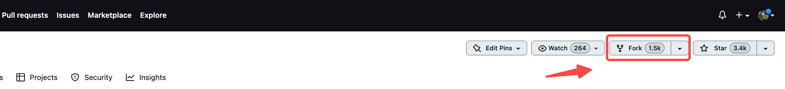
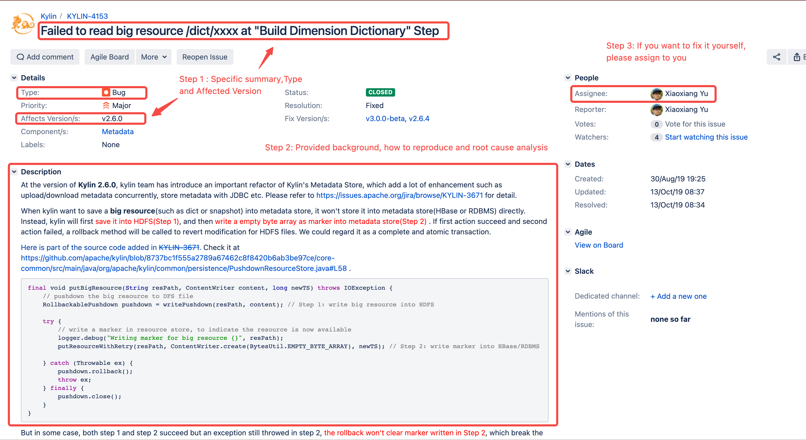
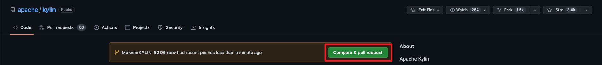
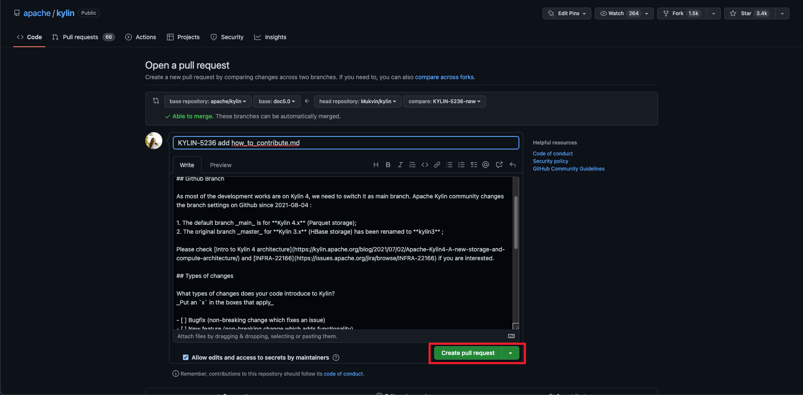

Apache Kylin
始终在寻找各种贡献，不仅包括代码，还包括文档、测试、[性能报告](https://cwiki.apache.org/confluence/display/KYLIN/Performance+Benchmark+Report+of+Kylin+4.0.0+vs+Kylin3.1.2+on+Hadoop)
、发布管理、团队协调、成功参考等。所有这些都为迈向 [Apache Committer](https://www.apache.org/foundation/how-it-works.html#committers)
铺平了道路。
特别是，我们期待从业务和分析角度来看的内容，例如分析最佳实践和成功生产场景。技术只有在对现实世界产生影响时才有用。这些内容对刚进入社区的用户非常有帮助，但往往被技术开发人员忽视。

:::info User story wanted
如果您想贡献业务或分析内容，请参阅 [如何编写的文档](./how_to_write_doc)。
:::

### <span id="branch_table">源码分支</span>

代码和文档都处于Git源代码管理之下。注意不同分支的目的。

| 分支           | 类型   | 描述                | 
|:-------------|------|:------------------|
| **kylin5**   | 开发分支 | **活跃的** v5.x 开发分支 |
| **doc5.0**   | 文档分支 | v5.x 文档分支         |
| **main**     | 维护分支 | v4.x 维护分支         |
| **kylin3**   | 维护分支 | v3.x 维护分支         |
| **document** | 文档分支 | v4.x 及更早版本的文档分支   |

-----

## 贡献者指南

:::note 如何协作?
与所有 ASF 项目一样，Apache Kylin 遵循[How the ASF works](https://www.apache.org/foundation/how-it-works)在世界各地进行分布式协作。
:::

对于新人，请阅读 [Project Management and collaboration](https://www.apache.org/foundation/how-it-works.html#management)
和 [Roles](https://www.apache.org/foundation/how-it-works.html#roles)，快速了解基础知识。

### 代码贡献

简介之后是分步详细说明。

1. 设置开发环境
2. 选择或创建新的 JIRA 任务
3. [社区胜过代码!](http://theapacheway.com/community-over-code/) 与他人讨论您的更改计划
4. 更改代码并创建拉取请求
5. 代码评审人评审代码
6. 进行相关文档更改 [如何编写文档](./how_to_write_doc).

### Step 1. 设置开发环境

:::info 使用 Windows 开发
对于对于使用 Windows 开发，在 [Windows Subsystem for Linux](https://learn.microsoft.com/en-us/windows/wsl/about)
中设置Kylin开发环境是最佳选择。
请遵循 [how to install WSL with GUI](https://learn.microsoft.com/en-us/windows/wsl/tutorials/gui-apps)
，了解如何安装带有图形界面的WSL，
并在 WSL 中下载 Kylin 代码和安装您最喜欢的 IDE 以获得最佳性能。
:::

1. 访问 https://github.com/apache/kylin 并点击 **Fork** 按钮。
   
2. 克隆 forked repo 到本地
   ```shell
   cd /path/you/prefer
   git clone https://github.com/<YourUserName>/kylin.git 
   ```
3. 创建一个开发分支

   **base_branch** 取决于您的计划要修复的 Kylin 版本，请查看 [源码分支](#branch_table).

   ```shell
   ## check out to base branch you want to work on
   git checkout <base_branch>
   
   ## create a development branch based on base branch
   git checkout -b <development_branch>
   ```

   例如，如果我想修复 Kylin 5.0.0-Alpha 的一些问题，您可以执行以下命令：
   ```shell
   git checkout kylin5
   git checkout -b fix_some_issue
   ```

   为了更好地了解 Git
   操作，请查看 [Contributing to a Project](https://www.git-scm.com/book/en/v2/Distributed-Git-Contributing-to-a-Project).

4. 阅读更多关于开发环境设置的更多信息，请参阅 [如何设置 IDE ](./how_to_debug_kylin_in_ide).

### Step 2. 选择或创建新的 JIRA 任务

与其他的 ASF 项目一样，我们使用 [JIRA](http://issues.apache.org/jira/browse/KYLIN) 来跟踪开发任务。

:::warning 提交安全漏洞
对于可能存在的漏洞，请不要使用JIRA，因为公开该信息可能会立即伤害现有用户。请
遵循 [report possible vulnerability](https://apache.org/security/committers.html#report) 进行提交
:::

如果您想为异常或功能创建新的JIRA，请记住为社区提供足够的信息：

* 精确而紧凑的 **摘要**
    - 例如: _在 `构建全局字典` 步骤中读取大文件 /dict/xxx 失败_
* 准确的 issue **类型**
    - _New Feature_ , 如果您想开发新功能
    - _Improvement_ , 如果您想改进现有功能
    - _Bug_ , 如果您发现某些东西没有按预期工作
    - _Wish_ , 如果您希望其他人提供新功能
* **受影响版本**: 受影响 Kylin 的版本
* 详细的 **描述**，可能包括：
    - 发生此问题的环境，OS/Hadoop/Spark版本 ...
    - 复现问题的步骤
    - [线程堆栈信息](https://issues.apache.org/jira/secure/attachment/13048219/image-2022-08-17-13-17-40-751.png),
      异常堆栈或日志文件（作为附件上传）
    - 模型或者 cube 元数据（作为附件上传）
    - 如果可能的话，进行问题原因分析，例如: [分析问题原因示例](https://issues.apache.org/jira/browse/KYLIN-4153)
* 如果您计划解决该问题，请将任务 **分配** 给您。

JIRA 示例:


### Step 3. 与他人讨论您的更改计划

时刻牢记, **[社区胜过代码!](http://theapacheway.com/community-over-code/)**

在开始编码之前，请务必与社区讨论您的想法、计划和设计。如果没有社区的参与，这仅仅是你的一个个人项目。

与社区合作有以下好处：

- 知识比代码更重要。如果没有人掌握维护代码的知识，代码就会失效。与社区合作可以传承知识，保持开源的活力。
- 对于重大变更，调整架构和高层设计至关重要。否则，在以后提交代码时，您可能会面临问题甚至在提交代码时甚至被拒绝。
- 你可能会找到想做或已经在做同样事情的志愿者。有了更多的帮手，通常会带来更好的代码质量、更好的测试和更好的文档。

在 ASF ，**通常在 [邮件列表](https://www.apache.org/foundation/mailinglists.html) 进行社区讨论**。

- 如果尚未订阅过 Apache Kylin 邮件列表，请阅读[如何订阅邮件列表](how_to_subscribe_mailing_list)。
    - 注意: [确认邮件](https://www.apache.org/foundation/mailinglists.html#request-confirmation) 可能会在垃圾箱中。
- 有关电子邮件讨论的建议和示例
    - [如何更好的提问](https://infra.apache.org/contrib-email-tips.html#usefulq)
    - [优秀示例: 关于邮件讨论](https://lists.apache.org/thread/gtcntp4s8k0fz1d4glospq15sycc599x).

### Step 4. 更改代码并创建拉取请求

关于修改代码的一些注意事项：

* 虽然目前没有严格的代码风格，但一般规则是与现有文件保持一致。例如: 使用 4 空格 Java 文件缩进。
* 为你的代码更改添加测试用例是必须的。
* 在创建拉取请求之前，确保[所有测试通过](how_to_test.md)，这将确保您的更改质量和不影响其他功能
* 由于你的代码将被评审，请提前阅读[代码审查指南](#CodeReviewGuideline)。追求更好的设计原则。

如果代码更改完成，您可以在新的拉取请求中提交更改：

* 将代码更改推入开发分支

  ```shell
  # After making changes to the code ...
  git commit -m "KYLIN-XXXX COMMIT SUMMARY"
  git push <your_fork> <development_branch>
  ```

* 在GitHub中，点击 ___Compare & pull request___ 按钮来发起一个新的拉取请求。

  

* Kylin 社区要求填写一个拉取请求模板。填写信息后，点击 ___Create pull request___ 来创建一个新的拉取请求

  :::info Kylin 拉取请求模板
  交流内容，而不仅仅是代码。
    1. 在 `Proposed changes` 中，描述变更的 __why__ 和 __how__ 。
    2. 选择正确的 `Types of changes` 并检查 `Checklist`。
    3. 再次检查目标分支是否正确，否则代码无法合入。
  :::

  

### Step 5. 代码评审

Kylin committer 会接收到通知，并按照[代码评审指南](#CodeReviewGuideline)审查你的拉取请求。您可能会通过拉取请求或 JIRA 评论联系，如果涉及到讨论可能会是会议邀请。

审查正在进行中，请耐心等待。大多数 committer 都有自己的工作，只能在业余时间为社区服务。如果你想加快流程，试着在拉取请求中添加评论。

当所有这些都完成后，您的拉取请求将被 committer 合并到目标分支中。

### Step 6. 进行相关文档更改

如果你想让别人了解一个新特性或者一个重要的 bug 已经被解决了，那么文档和代码一样重要。
**[社区胜过代码！](http://theapacheway.com/community-over-code/)**

请按照 [如何编写文档](./how_to_write_doc) 为每个较大的新特性或者重要的 bug 更改编写文档。
一定要在代码PR中提到文档更改，这样审阅者就知道您遵循了最佳实践。

-----

## 评审人指南

### <span id="CodeReviewGuideline">代码评审指南</span>

评审人需要从以下几个方面对代码进行审查：

* _Functionality_: 补丁 __必须__ 解决问题，并且在提交审查之前已被贡献者验证。
* _Test coverage_: 变更 __必须__ 由单元测试或集成测试覆盖，否则它是不可维护的。异常案例包括GUI、shell脚本等。
* _Performance_: 改变 __不应该__ 降低 Kylin 的性能。
* _Metadata compatibility_: 更改应该支持旧的元数据定义。否则，需要元数据迁移工具和文档。
* _API compatibility_: 更改 __不应该__ 坏公共 API 的功能和行为；如果需要用新的 API 替换旧的 API ，则需要打印警告消息。
* _Documentation_: 如果 Kylin 文档需要一起更新，创建另一个文档 JIRA 。在文档 JIRA 中，附加针对 “document” 分支的文档更改补丁。

:::info 必须遵守规则
不符合上述规则的补丁可能不会被合并。
:::

### 补丁+1策略

在提交之前，单个模块范围的补丁至少需要模块所有者之一的人的 +1。
如果所有者缺席(忙或其他), 将需要两个非所有者的 +1 或者 committer 的 +1。

跨越模块的补丁在提交之前至少需要两个 +1，最好是模块补丁所涉及的模块的所有者 +1。

任何人在一个补丁上的任何 -1 都会否决了这个补丁；在解决 -1 的理由之前，不能合并它。