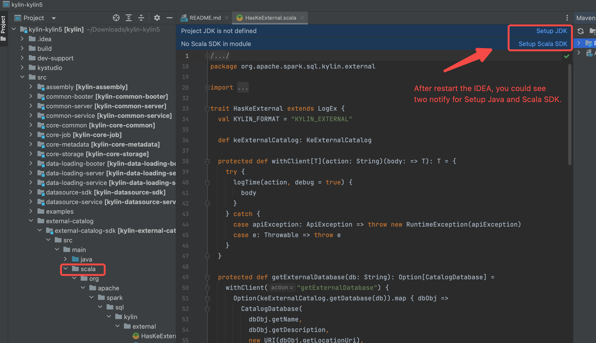

### 背景

#### 为什么在 IDEA 中调试 Kylin 使用 docker ？

本文旨在为开发人员介绍一种简单而有用的方法来开发和调试Kylin，并提供了一个类似于用户实际场景的部署。

#### 部署架构

下面是当前部署的架构。


本指南 **假设** 您已经准备了以下内容：

- [ ] 一台安装了 macOS 的 **笔记本电脑** 来做开发工作（Windows目前还没有验证）
- [ ] 用于测试和部署目的的 **远程Linux服务器**（如果您没有准备远程Linux服务器，您可以在笔记本电脑上部署 Hadoop）
- [ ] 克隆 kylin 的源码到笔记本电脑中

:::info Windows 开发机
对于Windows开发机，在 [Windows Subsystem for Linux](https://learn.microsoft.com/en-us/windows/wsl/about) 中设置 Kylin
开发环境是最好的选择。
遵循 [how to install WSL with GUI](https://learn.microsoft.com/en-us/windows/wsl/tutorials/gui-apps) 安装 WSL GUI，并在
WSL 中下载安装 Kylin 代码和你最喜欢的 IDE (但不是 Docker)。
:::

### 准备 IDEA 并编译源代码

#### 步骤 1: 检查软件环境

请访问 [软件环境要求](how_to_package#software_reqiurement)，并确保您的笔记本电脑符合要求。

#### 步骤 2: 编译源码

- 在调试代码前，编译后端源码

```shell
cd <path-to-kylin-source>
mvn clean install -DskipTests
```

- 编译前端源码
  (请使用 **v16.20.2** 版本的 node.js , 如果您使用的是其他版本的 nodejs,
  可以参考 [如何安装特殊版本 node.js](how_to_package#install_other_node) )

```shell
cd kystudio
npm install
```

#### 步骤 3: 安装 IntelliJ IDEA 并配置

1. 安装 IDEA 社区版 ( Ultimate 版本也可).
2. Import 源代码到 IDEA. 点击 **Open**, 并选择 **Kylin 源码** 文件夹.
   

3. 安装 scala 插件并重启
   

4. 设置 SDK(JDK and Scala),并确保使用的版本为 **JDK 1.8.X** and **Scala 2.12.X**.
   

5. 重新加载 maven 项目, 确保 `scala` 文件夹标记位源码(蓝色).
   

6. 构建项目 (确保你已经执行了 `mvn clean package -DskipTests`，否则一些源代码不会由 maven javacc 插件生成)
   

#### 步骤 4: 设置 IDEA 配置

1. 下载 spark 并设置 IDEA 调试参数

  ```shell
  ./dev-support/sandbox/sandbox.sh init
  ```

以下是 shell 输出。


### 准备 Hadoop 集群

#### 部署 Hadoop 集群

1. 在您的笔记本中安装最新的 docker desktop
2. [**可选**] 在远程机上安装 docker 引擎(https://docs.docker.com/engine/install/)

:::tip
建议使用 **远程服务器** 而不是笔记本电脑部署 Hadoop Cluster，因为7-8个容器可能会消耗大量硬件资源，导致笔记本电脑运行速度比以前慢。
:::

3. [**可选**] 如果要将 hadoop 集群部署在远程机上，请设置正确的 `DOCKER_HOST`。

如果未设置 `DOCKER_HOST`，您将在您的笔记本电脑上部署Hadoop集群。（确保每次都可以通过 SSH 登录该服务器，而无需输入 *
*ssh-copy-id**。）

  ```shell
  # see more detail at : https://docs.docker.com/compose/reference/envvars/#docker_host
  export DOCKER_HOST=ssh://${USER}@${DOCKER_HOST}
  ```

4. 检查笔记本电脑中的 docker（或远程服务器中的docker引擎）的可用资源（具体取决于部署Hadoop集群的机器），确保你至少留下
   6 core 和 12 gb 内存。

以下是 MacBook 中的 Docker Desktop 设置页面。


5. 通过 docker 在笔记本电脑（或远程机器）上部署 hadoop 集群

  ```shell
  ./dev-support/sandbox/sandbox.sh up
  ```


#### 检查 hadoop 集群状态

- 等待 2-5 分钟, 检查 hadoop 状态, 可以执行如下命令用于检测状态

```shell
./dev-support/sandbox/sandbox.sh ps
```

以下输出内容显示所有hadoop组件处于健康状态。


- 编辑 `/etc/hosts` (如果您在远程机器上部署 Hadoop 集群, 请使用正确的ip地址，而不是 `127.0.0.1`)

```shell
127.0.0.1 namenode datanode resourcemanager nodemanager historyserver mysql zookeeper hivemetastore hiveserver 
```

- 加载示例 SSB 数据到 HDFS 和 Hive

```shell
./dev-support/sandbox/sandbox.sh sample
```

- 检查 hive 表


### 在 IDEA 中调试 Kylin

#### 在 IDEA 中启动后端

- 选择 "BootstrapServer[docker-sandbox]" 并点击 **Run** 

![click BootstrapServer[docker-sandbox]](images/RUN_KYLIN_IN_IDEA.png)

- 等待并检查 Sparder 是否启动成功


- 检查 Sparder 的 SparkUI 是否已启动。


#### 在 IDEA 中启动前端

- 设置开发代理

```shell
cd kystudio
npm run devproxy
```


#### 验证 Kylin 的核心功能

- 访问 Kylin UI


- 创建一个新项目, 加载表和创建模型

- 验证模型构建和查询功能


### sandbox.sh 命令手册

1. `./dev-support/sandbox/sandbox.sh stop` 停止所有容器
2. `./dev-support/sandbox/sandbox.sh start` 启动所有容器
3. `./dev-support/sandbox/sandbox.sh ps` 检查所有容器状态
4. `./dev-support/sandbox/sandbox.sh down` 停止并删除所有容器

### Q&A

// todo
