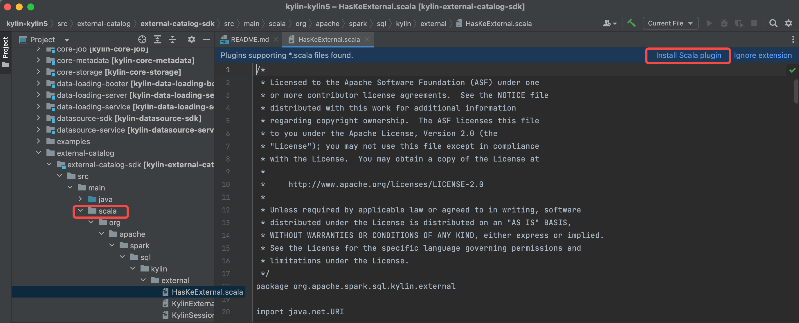

### 背景

#### 为什么在没有 Hadoop 时, 在 IDEA 中调试 Kylin?

本文旨在为开发人员介绍一种简单而有用的开发和调试Kylin的方法。

#### 部署架构

下面是当前部署的架构。


本指南 **假设** 您已准备好以下内容

- [X] 一台安装了 macOS 的 **笔记本电脑** 用于开发工作（Windows目前尚未验证）
- [X] 克隆 kylin 的源码到笔记本电脑中

:::info Windows 开发机
对于Windows开发机，在 [Windows Subsystem for Linux](https://learn.microsoft.com/en-us/windows/wsl/about) 中设置 Kylin
开发环境是最好的选择。
遵循 [how to install WSL with GUI](https://learn.microsoft.com/en-us/windows/wsl/tutorials/gui-apps) 安装 WSL GUI，并在
WSL 中下载安装 Kylin 代码和你最喜欢的 IDE (但不是 Docker)。
:::

### 准备 IDEA 并编译源代码

#### 步骤 1: 检查软件环境

请访问 [软件环境要求](how_to_package#software_reqiurement)，并确保您的笔记本电脑符合要求。

#### 步骤 2: 编译源码

- 在调试代码前，编译后端源码

    ```shell
    cd <path-to-kylin-source>
    mvn clean install -DskipTests
    ```

- 编译前端源码
  (请使用 **v16.20.2** 版本的 node.js , 如果您使用的是其他版本的 nodejs,
  可以参考 [如何安装特殊版本 node.js](how_to_package#install_other_node) )

    ```shell
    cd kystudio
    npm install -g yarn
    yarn install
    ```

#### 步骤 3: 安装 IntelliJ IDEA 并配置

1. 安装 IDEA 社区版 ( Ultimate 版本也可).

2. Import 源代码到 IDEA. 点击 **Open**, 并选择 **Kylin 源码** 文件夹.
   

3. 安装 scala 插件并重启
   

4. 设置 SDK(JDK and Scala),并确保使用的版本为 **JDK 1.8.X** and **Scala 2.12.X**.
   

5. 重新加载 maven 项目, 确保 `scala` 文件夹标记位源码(蓝色).
   

6. 构建项目 (确保你已经执行了 `mvn clean package -DskipTests`，否则一些源代码不会由 maven javacc 插件生成)
   

#### 步骤 4: 设置 IDEA 配置

1. 下载 spark 并设置 IDEA 调试参数

  ```shell
  ./dev-support/contributor/local/local.sh init
  ```

以下是 shell 输出。

```
(base) ➜  kylin git:(kylin5) ✗ ./dev-support/contributor/local/local.sh init
# KYLIN_HOME=/path/to/kylin
# SPARK_HOME=/path/to/kylin/build/spark
* Spark already exists, will be deleted and re-downloaded
* Downloading spark...
spark_pkg_file_name : spark-newten-3.3.0-4.6.26.0.tgz
* Setting IDEA run configurations...
# IDEA run configuration version is community...
* Build Frontend...
* Init Done!
```

### 准备环境

#### 安装 Zookeeper(当前版本仅需 Zookeeper)

1. 在您的笔记本中安装最新的 docker desktop

2. 检查笔记本电脑中的 docker 的可用资源，确保你至少留下 1 core 和 1 gb 内存。

以下是 MacBook 中的 Docker Desktop 设置页面。


3. 通过 docker 在笔记本电脑启动 Zookeeper 服务

  ```shell
  ./dev-support/contributor/local/local.sh up
  ```

以下是 shell 输出。

```
(base) ➜  kylin git:(kylin5) ✗ ./dev-support/contributor/local/local.sh up
# KYLIN_HOME=/path/to/kylin
# SPARK_HOME=/path/to/kylin/build/spark
* Starting container...
[+] Running 9/9
 ⠿ zookeeper Pulled                                         469.1s
   ⠿ b2ddfd337773 Pull complete                             403.5s
   ⠿ 35794a35c4aa Pull complete                             403.8s
   ⠿ 261269474501 Pull complete                             466.3s
   ⠿ 48a873c16c38 Pull complete                             466.4s
   ⠿ 91bcf425c56c Pull complete                             466.4s
   ⠿ 71c2395ae368 Pull complete                             466.5s
   ⠿ 5515e61ba09a Pull complete                             466.7s
   ⠿ 8ce907db3e1a Pull complete                             466.8s
[+] Running 2/2
 ⠿ Network local_local  Created                             0.0s
 ⠿ Container zookeeper  Started                             0.5s
* Up Done!
```

#### 检查需要服务的状态

- 检测 zookeeper 的状态, 可以执行如下命令用于检测状态

```shell
./dev-support/contributor/local/local.sh ps
```

以下输出内容显示所有组件处于健康状态。

```
# KYLIN_HOME=/path/to/kylin
# SPARK_HOME=/path/to/kylin/build/spark
NAME        IMAGE          COMMAND       SERVICE              CREATED        STATUS        PORTS
zookeeper   zookeeper:3.6  "/docker-entrypoint.…"   zookeeper 2 minutes ago  Up 2 minutes        2888/tcp, 3888/tcp, 0.0.0.0:2181->2181/tcp, 8080/tcp
```

### 在 IDEA 中调试 Kylin

#### 在 IDEA 中启动后端

- 选择 "BootstrapServer[docker-sandbox]" 并点击 **Run**

![click BootstrapServer[local]](images/how_to_debug_kylin_in_local/RUN_KYLIN_IN_IDEA.png)

- 检查 Sparder 的 SparkUI 是否已启动。


#### 在 IDEA 中启动前端

- 置开发代理

```shell
cd kystudio
npm run devproxy
```


#### 验证 Kylin 的核心功能

- 访问 Kylin UI


- 创建一个新项目, 加载表和创建模型

- 验证模型构建和查询功能


### sandbox.sh 命令手册

1. `./dev-support/sandbox/sandbox.sh stop` 停止所有容器
2. `./dev-support/sandbox/sandbox.sh start` 启动所有容器
3. `./dev-support/sandbox/sandbox.sh ps` 检查所有容器状态
4. `./dev-support/sandbox/sandbox.sh down` 停止并删除所有容器
