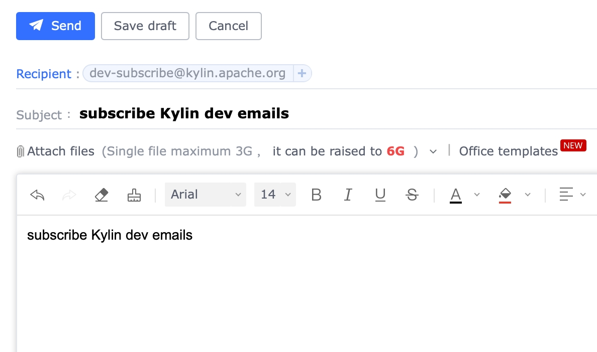
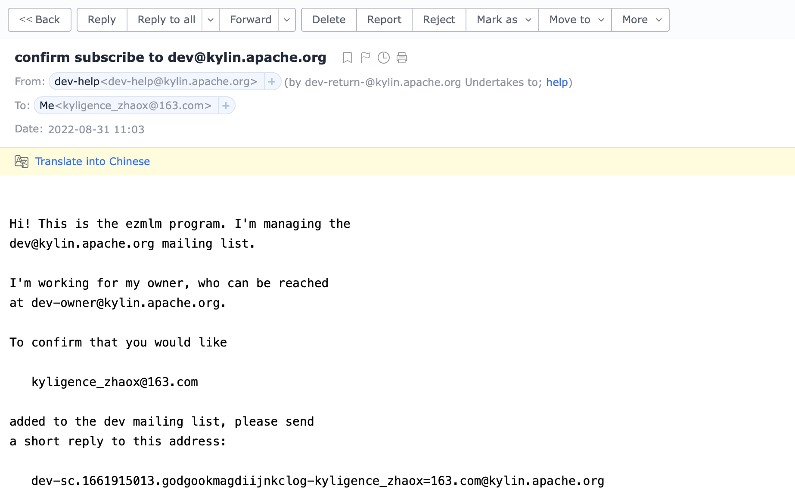
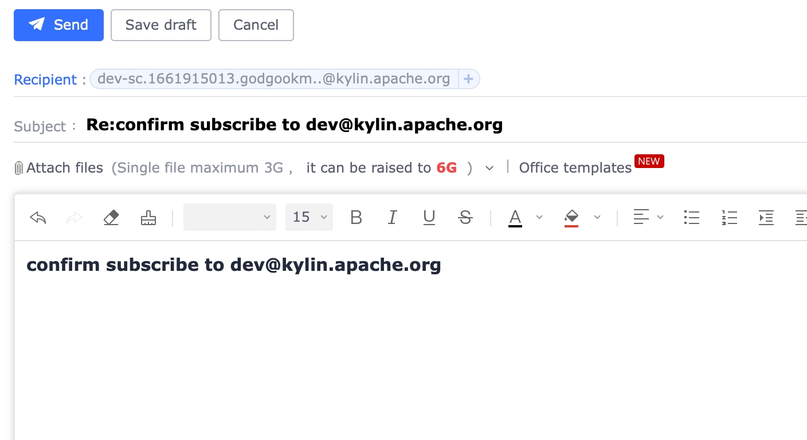
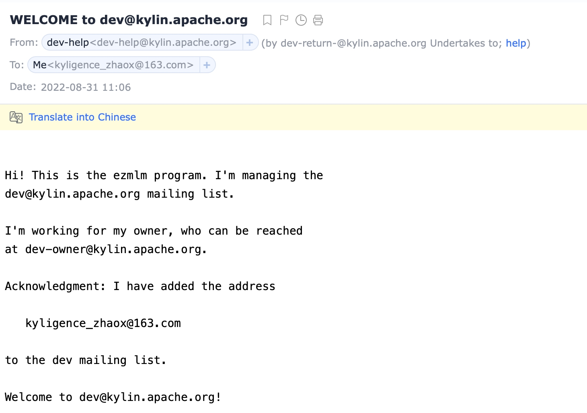

### 邮件列表

Kylin 项目的邮件列表。

| 邮件列表 |                      订阅                       |                       取消订阅                        |                               存档                                |
|:----:|:---------------------------------------------:|:-------------------------------------------------:|:---------------------------------------------------------------:|
|  用户  | [订阅](mailto:user-subscribe@kylin.apache.org)  | [取消订阅](mailto:user-unsubscribe@kylin.apache.org)  | [存档](https://lists.apache.org/list.html?user@kylin.apache.org)  |
| 开发者  |  [订阅](mailto:dev-subscribe@kylin.apache.org)  |  [取消订阅](mailto:dev-unsubscribe@kylin.apache.org)  |  [存档](https://lists.apache.org/list.html?dev@kylin.apache.org)  |
|  问题  | [订阅](mailto:issue-subscribe@kylin.apache.org) | [取消订阅](mailto:issue-unsubscribe@kylin.apache.org) | [存档](https://lists.apache.org/list.html?issue@kylin.apache.org) |

### 订阅邮件列表

#### Step 1: 发送订阅请求

单击上表中的 _订阅_ 并发送简单的请求（可以将标题和正文使用简短内容）发送到邮件地址。

#### Step 2: 从 ezmlm 收取确认回复

邮件列表管理程序 [ezmlm](http://untroubled.org/ezmlm/) 会在 2 - 10 分钟内回复，请您 **确认您的订阅** 。

示例如下:

#### Step 3: 通过回复上一封电子邮件发送确认请求

回复之前的邮件（标题和正文可以用简短内容），示例如下:

#### Step 4: ezmlm 确认您的确认请求

您将在 2 - 10分 钟内收到 “Welcome to user/dev@kylin.apache.org”。
从现在开始，您可以发送和接收当前邮件列表中所有订阅者的邮件。

示例如下:

### 取消订阅邮件列表

todo

----

本文档是基于 [apache mailing list doc](https://www.apache.org/foundation/mailinglists.html#subscribing) 重写的。