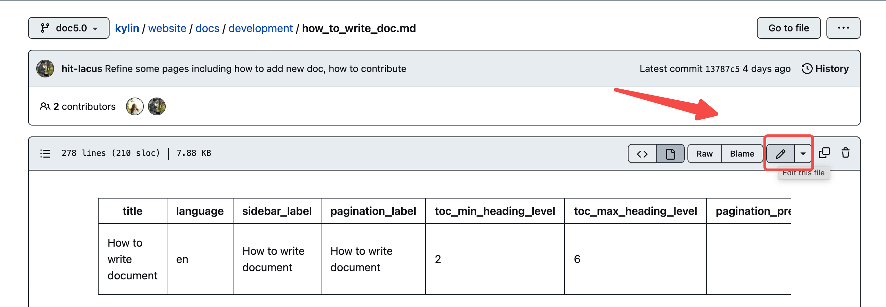
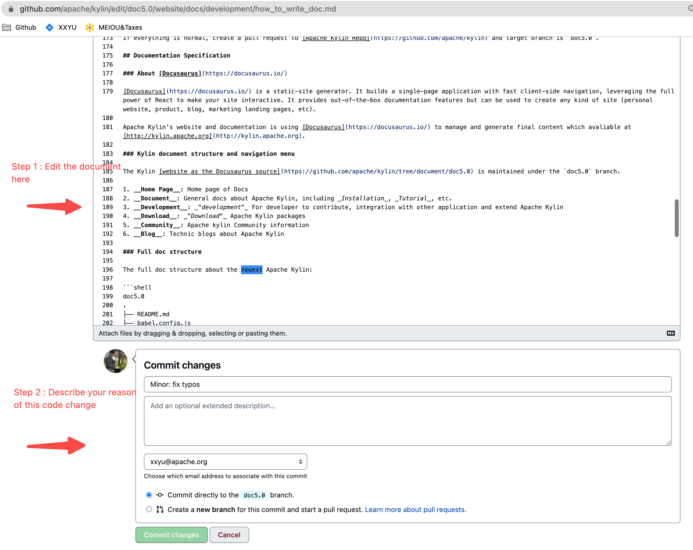

从 Kylin 5.0 开始，Kylin 文档使用 [Docusaurus](https://docusaurus.io/) 编写。请注意，多版本及多版本 i18n（多语言）目前不支持，但在计划中。非常感谢大家的贡献。

### 快捷方式：编辑单个现有页面

:::info 快捷方式：编辑单个现有页面
1. 这个快捷方式非常有用，如果您在一个页面上发现了一些小的拼写错误或错误，您可以在几分钟内立即在浏览器中编辑文档。
2. 但如果更改更复杂，如添加/编辑多个页面，上传图像或更改全局配置文件，请跳转到下一段：[**修改文档前准备工作**](#Before_your_work)。
:::

1. 只要向下滚动到页面底部，点击 `编辑此页`.


2. 在浏览器中编辑此文件。


3. 通过提出拉取请求来提出更改。


4. 这样就完成了！拉取请求的更改将由评审人进行审核。如果通过，将被合入文件分支，社区便可查阅。

### <span id="Before_your_work">修改文档前准备工作</span>

在添加新文档之前，需要先设置预览环境。

1. 安装 Node.js

   通过检查 `node -v` 确保 Node.js 版本为18.20.4 或更高。您可以还可以使用 [nvm](https://github.com/nvm-sh/nvm) 管理多版本 Node.js。

   ```shell
   node -v
   ```

   :::note 提示
   当通过 *Windows/macOS Installer* 安装 Node.js 时，建议勾选所有与依赖项相关的复选框。
   :::

2. 克隆 Kylin 文档分支

   ```shell
   cd /path/you/prefer/
   git clone --branch doc5.0 https://github.com/apache/kylin.git # Or git clone -b doc5.0 https://github.com/apache/kylin.git
   ```

3. 安装 Node 依赖项

   ```shell
   cd /path/you/prefer/
   cd website
   npm install
   ```

   :::note 在中国 NPM 下载缓慢？
   将以下内容添加到 `~/.npmrc` 中。

   ```
   sass_binary_site=https://npm.taobao.org/mirrors/node-sass/
   phantomjs_cdnurl=https://npm.taobao.org/mirrors/phantomjs/
   electron_mirror=https://npm.taobao.org/mirrors/electron/
   registry=https://registry.npm.taobao.org
   ```
   :::

   :::note 故障排除
   Depending on your OS environment, `npm install` may hit various issues at this stage, most of which are due to missing a certain library. Below are a few examples.

   If an error is like the one below, for an Ubuntu user, it can be solved by installing the lib `glib2.0-dev` with **sudo apt-get install glib2.0-dev**.

   不同的操作系统环境，`npm install` 执行时可能会遇到各种问题，其中大多数是由于缺少某个库。下面是一些例子。

   如果出现如下错误，对于 Ubuntu 用户来说，可以通过使用 **sudo apt-get install glib2.0-dev** 安装 lib `glib2.0-dev` 来解决。

   > ../src/common.cc:24:10: fatal error: vips/vips8: No such file or directory

   如果出现如下错误，对于 Ubuntu 用户，可以通过使用 **sudo apt-get install autoconf** 安装 lib `autoconf` 来解决，
   而对于macOS用户，请尝试使用 **brew install autoconf automake libtool** 。

   > Error: Command failed: /bin/sh -c autoreconf -ivf

   :::

   有关 [Docusaurus](https://docusaurus.io/) 的更多信息，请参阅 [Docusaurus Installation](https://docusaurus.io/docs/installation)。

4. 启动文档网站并在本地预览

   ```shell
   npm run start
   
   # 启动中文文档预览请使用 `--locale zh-Hans`
   npm run start -- --locale zh-Hans
   ```

   如果没有错误发生，文档网站‘ http://localhost:3000 ’的主页将在默认浏览器中自动打开。
   修改本地存储库中的任何 MD 或资源文件，更改将立即反映在浏览器中。非常方便文档开发。
### 如何创建新文档

#### 步骤 1: 创建一个新的 MD 文件

使用任何文本编辑器创建一个新的 MD 文件，然后将以下 **Head 元数据模版** 复制并粘贴到文件的顶部。
之后，用实际值替换像 `${TITLE OF NEW DOC}` 这样的变量。

```
---
title: ${TITLE OF NEW DOC}
language: zh-Hans
sidebar_label: ${TITLE OF NEW DOC}
pagination_label: ${TITLE OF NEW DOC}
toc_min_heading_level: 2
toc_max_heading_level: 6
pagination_prev: null
pagination_next: null
keywords:
    - ${KEYWORD OF NEW DOC}
draft: false
last_update:
    date: ${DATE of YOUR COMMIT}
    author: ${YOUR FULL NAME}
---
```

:::info Head metadata?
所有文档文件都需要 ___Head 元数据___ 。更多信息请参考 [docusaurus head metadata](https://docusaurus.io/docs/markdown-features/head-metadata).
:::

#### 步骤 2: 为新文档添加内容

添加 [markdown format](https://docusaurus.io/docs/markdown-features) 的文本

图片通常放在名为 `images` 的子文件夹中。

#### 步骤 3: 向侧边栏添加一个新页面

侧边栏包含文档站点结构的菜单和导航树，保存在 `website/sidebars.ts` 文件。
例如，如果你想添加一个新的文档 `how_to_write_doc.md` 到 `development` 子菜单。
打开 `sidebars.ts` 并修改 `DevelopmentSideBar` ，在 `DevelopmentSideBar` 的 `items` 尾部添加一个新块。
```shell
DevelopmentSideBar: [
    {
        ...
        items: [
            {...},
            ...,
            {
                type: 'doc',
                id: 'development/how_to_write_doc'
            },
        ],
    },
],              
```


#### 步骤 4: 在本地预览结果

保存所有更改后，您可以立即在浏览器中预览结果。请在 `website` 目录下运行以下命令，您的默认浏览器中将出现一个本地版本的 doc 站点：`http://localhost:3000`。

```shell
cd website
npm run start
```

:::info 检查文档
- [ ] **外观和感觉** 是否符合预期？
- [ ] **链接/图片** 是否正常工作？
- [ ] 重要的信息是否被适当地 **突出显示** ？[如何突出？](#highlight_paragraph)
- [ ] **标题** 是否遵循 [标题指南](#heading_level)?
:::

#### 步骤 5: 创建拉取请求

当一切正常时，创建一个到 [Kylin doc5.0 分支](https://github.com/apache/kylin/tree/doc5.0) 的拉取请求.

:::note 什么，拉取请求?
对于那些刚开始操作拉取请求的人，这里解释一下。
- How to geek -- [什么是 git 拉取请求](https://www.howtogeek.com/devops/what-are-git-pull-requests-and-how-do-you-use-them/)
- Github -- [关于拉取请求](https://docs.github.com/en/pull-requests/collaborating-with-pull-requests/proposing-changes-to-your-work-with-pull-requests/about-pull-requests)
:::

----

### 文档规范

#### 关于 [Docusaurus](https://docusaurus.io/)

[Docusaurus](https://docusaurus.io/) 是一个静态站点生成器。它构建了一个具有快速客户导航的网页应用程序，利用 React 的全部功能使您的站点具有交互性。
它提供了开箱即用的文档功能，可以用来创建任何类型的网站（个人网站、产品、博客、营销登陆页面等）。

Apache Kylin 的网站和文档使用 [Docusaurus](https://docusaurus.io/) 来管理和生成，可以浏览 [http://kylin.apache.org](http://kylin.apache.org)。

#### Kylin 的文档结构和导航菜单

Kylin [网站内容](https://github.com/apache/kylin/tree/doc5.0) 在 `doc5.0` 分支中维护。

1. __Home Page__: 文档主页
2. __Documentation__: Apache Kylin 的一般文档，包括 _安装_, _教程_ 等。
3. __Development__: 用于开发人员贡献，开发，与其他应用程序集成并扩展 Apache Kylin。
4. __Download__: 下载 Apache Kylin 安装包
5. __Community__: Apache Kylin 社区信息
6. __Blog__: Apache Kylin 最新博客

#### 完整文档结构

最新 Apache Kylin 的完整文档结构：

```shell
doc5.0
.
├── README.md
├── babel.config.js
├── blog
│ ├── ...
├── docs
│ ├── community.md
│ ├── configuration
│ │ ├── ...
│ ├── datasource
│ │ ├── ...
│ ├── deployment
│ │ ├── ...
│ ├── development
│ │ ├── ...
│ ├── download.md
│ ├── integration
│ │ └── intro.md
│ ├── intro.md
│ ├── modeling
│ │ ├── ...
│ ├── monitor
│ │ ├── ...
│ ├── operations
│ │ ├── ...
│ ├── query
│ │ ├── ...
│ ├── quickstart
│ │ ├── ...
│ ├── restapi
│ │ ├── ...
│ ├── snapshot
│ │ ├── ...
│ └── tutorial
│     ├── ...
├── docusaurus.config.ts
├── package.json
├── sidebars.ts
├── src
│ ├── components
│ │ └── ...
│ ├── css
│ │ └── ...
│ └── pages
│     ├── ...
├── static
│ └── img
│     ├── ...
```

有关 Docusaurus 管理的结构的更多细节，请参阅 [项目结构解读](https://docusaurus.io/docs/installation#project-structure-rundown).

#### <span id="heading_level">标题/标题级别</span>

这里是[关于标题和目录的官方指南](https://docusaurus.io/docs/markdown-features/toc#markdown-headings)。请在大部分文章中使用三级标题 ("###") 和四级标题 ("####")。

以下是一般指引：
- 使用二级标题 ("##") 作为**顶级**标题。顶级标题的数量不应超过两个。
- 使用三级标题 ("###") 作为**中级**标题。
- 使用四级标题 ("####") 作为**最低级别的**标题。


示例:
```
## Guide for Contributor
### Detailed Description
#### Step 1: Fork Apache Kylin Repo
#### Step 2: Clone the fork repo
#### Step 3: xxx
#### Step 4: xxx
...

## Guide for Reviewer
### Code Review Guideline
### Patch +1 Policy
...
```

#### 侧边栏

侧边栏由 __sidebars.js__ 管理，请参考[侧边栏](https://docusaurus.io/docs/sidebar)。

#### 如何在文档中添加图片

所有图片应放在 _images_ 文件夹下，在您的文档中，请使用以下示例包含图片：
```

```

#### 如何链接到另一个页面

使用站点链接的相对路径，请参考 [Markdown 链接](https://docusaurus.io/docs/markdown-features/links)


#### 如何在文档中添加源代码

使用代码块突出显示代码，请参考 [代码块](https://docusaurus.io/docs/markdown-features/code-blocks) 以获取更详细的示例。

#### <span id="highlight_paragraph">如何突出句子/段落</span>

建议使用 [告示](https://docusaurus.io/docs/markdown-features/admonitions) 来突出一个句子/段落。

示例: 
```
:::warning
Some **content** with _Markdown_ `syntax`. Check [this `api`](#).
:::
```
