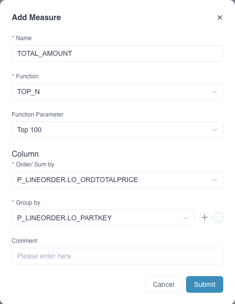

Finding the Top-N entities from a dataset is a frequent use case in data mining. We often read the reports or news titles like “Top 100 companies in the world”, “Most popular 20 electronics” and so forth. So exploring and analyzing the top entities are quite valuable and an essential part of many analyses.

As both the raw dataset and the number of entities increase in the big data era, this need is getting stronger than ever before. Without pre-calculation, retrieving the Top-K entities among a distributed big dataset may take a long time, making the pushdown query inefficient.

In v2.1 and higher, Apache Kylin introduces the “Top-N” measure, aiming to pre-calculate the top entities during the index build phase. In the query phase, Apache Kylin can quickly fetch and return the top records. The performance will be much better than a model without “Top-N” and give the user more power to analzye data.

In the project of Kylin 5 the Top-N measure is customizable.

> **Note**: this Top-N measure is an approximate realization, to use it properly you should have a solid understanding of the algorithm as well as the data distribution.


### Top-N Query

Let’s use the project created in the chapter [Tutorial](../../../quickstart/tutorial.md) as an example to introduce Top-N measure settings. This project uses the SSB Dataset and needs to complete the model design and index build (including data load). A model won't be able to serve any queries if it has no index and data. You can read [Model Design Basics](../../intro.md) to understand more about the methods used in model design. 

We will use the fact table `SSB.P_LINEORDER`. This is a mockup of transactions that can happen in an online marketplace. It has a couple of dimension and measure columns. For easy understanding, we use only use four columns:  `LO_ORDERDATE`, `LO_SUPPKEY`, `LO_PARTKEY` and `LO_ORDTOTALPRICE`. The table below gives an introduction to these columns. 

| Column           | Description                                    | Cardinality |
| ---------------- | ---------------------------------------------- | ----------- |
| LO_ORDERDATE     | Transaction Date                               | 2384        |
| LO_SUPPKEY       | Supplier ID, 1 represents ‘Supplier#000000001’ | 20          |
| LO_PARTKEY       | Part ID                                        | 2023        |
| LO_ORDTOTALPRICE | Sold amount                                    | -           |

*Method 1*: Oftentimes this e-commerce company needs to identify the Top-N (say top 100) in a given period for some suppliers. Please click **Query -> Insight** on the left navigation bar and enter. the following query statements in the **SQL Editor** :

```sql
SELECT LO_PARTKEY, SUM(LO_ORDTOTALPRICE) AS TOTAL_AMOUNT
FROM SSB.P_LINEORDER
WHERE LO_ORDERDATE between '1993-06-01' AND '1994-06-01' 
AND LO_SUPPKEY in (1) 
group by LO_PARTKEY
order by SUM(LO_ORDTOTALPRICE) DESC 
limit 100
```

It returns multiple records. See below:


*Method 2*: In order to get the desired query performance on a massive dataset, we recommend creating a Top-N measure for the target column and pre-calculating it when building the index. Please add a measure in the model editing page as follows. Fill in the measure **Name** for example `TOTAL_AMOUNT`, select **Function** as **TOP_N**, select **Function Parameter** as **Top 100**, and finally select the target column from the dropdown list.



Once the measure is added and the model is saved, you need to go to the **Edit Aggregate Index** page, add the corresponding dimensions and measures to the appropriate aggregate group according to your business scenario, and the new aggregate index will be generated after submission. In this example, the new index will contain the dimension `LO_ORDERDATE`, `LO_SUPPKEY`, `LO_PARTKEY` and the measure ` SUM(LO_ORDTOTALPRICE) `, you need to build index and load data to complete the precomputation of the target column. Apache Kylin will automatically rebuild the index and load data to complete the pre-calculation of the target column. You can check the job status of the Build Index in the **Job Monitor** page. After the index is built, you can use the **Top-N** measure to query the best-selling products.


