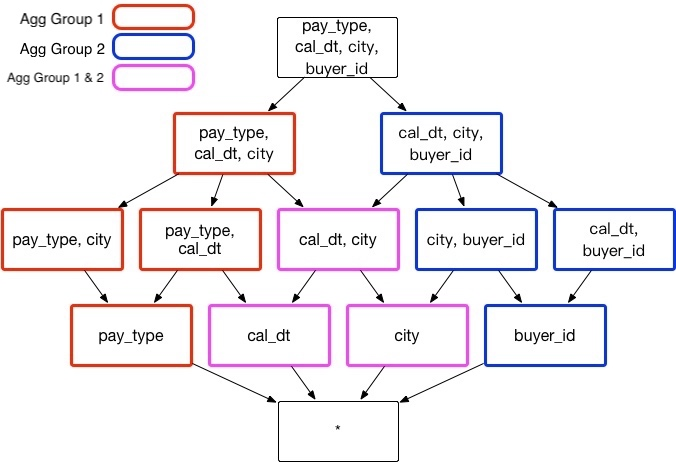
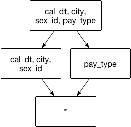

[//]: # (Need move to blog)

### Examples

In this section, we will present several practical examples to guide you through the process of designing aggregate groups effectively. These examples will illustrate different scenarios and considerations, helping you understand how to tailor your aggregation groups to meet specific analytical needs and optimize query performance. By following these examples, you can gain insights into best practices and strategies for creating efficient and effective aggregate groups in Kylin.

#### Aggregate Group

Assuming a transactional aggregate index that includes the following dimensions: **Customer ID** (*buyer_id*), **Transaction Date** (*cal_dt*), **Payment Type** (*pay_type*), and **Customer City** (*city*).

Analysts may need to analyze the data in different ways depending on their objectives. For instance, there are instances when they require grouping the dimensions *city*, *cal_dt*, and *pay_type* to gain insights into the various payment types used in different cities. At other times, they might want to group *city*, *cal_dt*, and *buyer_id* to understand customer behavior across different locations.

To accommodate these analytical needs, we recommend creating two separate aggregate groups:

1. **Aggregate-Group-1**:
    - **Dimensions**: *city*, *cal_dt*, *pay_type*
    - **Purpose**: To analyze the impact of payment types across different cities over time.

2. **Aggregate-Group-2**:
    - **Dimensions**: *city*, *cal_dt*, *buyer_id*
    - **Purpose**: To evaluate customer behavior by examining transactions in various cities over time.




Regardless of other situations, those two aggregate groups can reduce 3 unnecessary index: [pay_type, buyer_id]、[city,pay_type, buyer_id] and [cal_dt, pay_type, buyer_id], so storage space and build time can be saved.

```sql
-- will hit on index [cal_dt, city, pay_type]
Select cal_dt, city, pay_type, count(*) from table
Group by cal_dt, city, pay_type;

-- will hit on index [cal_dt, city, buyer_id]
Select cal_dt, city, buyer_id, count(*) from table
Group by cal_dt, city, buyer_id;

-- No index can be hit, so Kylin will calculate the result based on existing index on-demand
Select pay_type, buyer_id,count(*) from table
Group by pay_type, buyer_id. 
```

#### Mandatory Dimension

Assume a transactional aggregate index that includes transaction date, transaction location, product, payment type. Transaction date is a frequently used group by dimension. If transaction date is set as a mandatory dimension, the combination of dimensions will be calculated as shown below:


#### Hierarchy Dimension

Assume a transactional aggregate index that includes dimensions transaction city `city`, transaction province `province`, transaction country `country` and payment type `pay_type`. Analysts will group transaction country, transaction province, transaction city, and payment type together to understand customer payment type preference in different geographical locations. In the example above, we recommend creating hierarchy dimensions in existing aggregate group (Country / Province / City) that include dimension and combinations shown below:


Aggregate Group: `[country, province, city，pay_type]`

Hierarchy Dimension: `[country, province, city]`


Case 1:

Analysts want to understand city level customer payment type preferences

```sql
SELECT city, pay_type, count() FROM table GROUP BY city, pay_type
```

can be retrieved from index [country, province, city, pay_type].


Case 2:

Analysts want to understand province level customer payment type preferences

```sql
SELECT province, pay_type, count() FROM table GROUP BY province, pay_type
```

can be retrieved from index [country, province, pay_type].


Case 3:

Analysts want to understand customer's payment type preferences from country level

```sql
SELECT country, pay_type, count() FROM table GROUP BY country, pay_type
```

can be retrieved from index [country, pay_type].


Case 4:

Analysts want to reach a different granularity level using the geographical dimension:

```sql
SELECT country, city, count(*) FROM table GROUP BY country, city
```


will retrieve data from index [country, province, city].

#### Joint Dimension

Assume a transactional aggregate index that includes dimension transaction date `cal_dt`, transaction city `city`, customer gender `sex_id`, payment type `pay_type`. Analysts usually need to group transaction date, transaction city, and customer gender to understand consumption preference for different genders in different cities, in this case, `cal_dt, city, sex_id `will be grouped together. In the case above, we recommend assigning them to joint dimensions based on existing aggregate groups that include the following dimension and combination as shown below:



Aggregate Group: `[cal_dt,city, sex_id，pay_type]`

Joint Dimension:  `[cal_dt, city, sex_id]`


Case 1:

```sql
SELECT cal_dt,city, sex_id, count(*) FROM table GROUP BY cal_dt, city, sex_id
```

can retrieve data from index [cal_dt, city, sex_id].

Case 2:

```sql
SELECT cal_dt, city, count(*) FROM table GROUP BY cal_dt, city
```

then no index can be hit, Kylin will leave calculate result based on existing index.


#### ShardBy Column

```
select org_id, cust_id, sum1, sum2
from (
	select org_id, cust_id, sum(....) sum1
	from fact
	where dt = ...
	group by org_id, cust_id
) T1
inner join (
	select cust_id, sum(...) sum2
	from fact
	where dt = ...
	group by cust_id
) T2 on T1.cust_id = T2.cust_id
```

The above SQL can be queried by joining two aggregate indexes. To optimize the join operation, user can set the join key - `cust_id` as the ShardBy column. In that case the shuffle stage can be skipped for the join operation.
