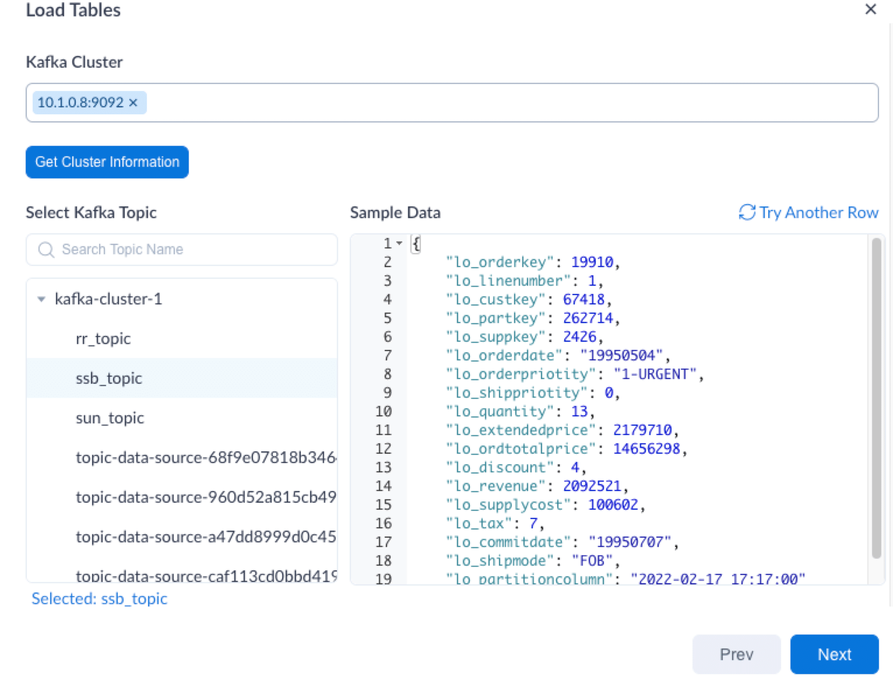
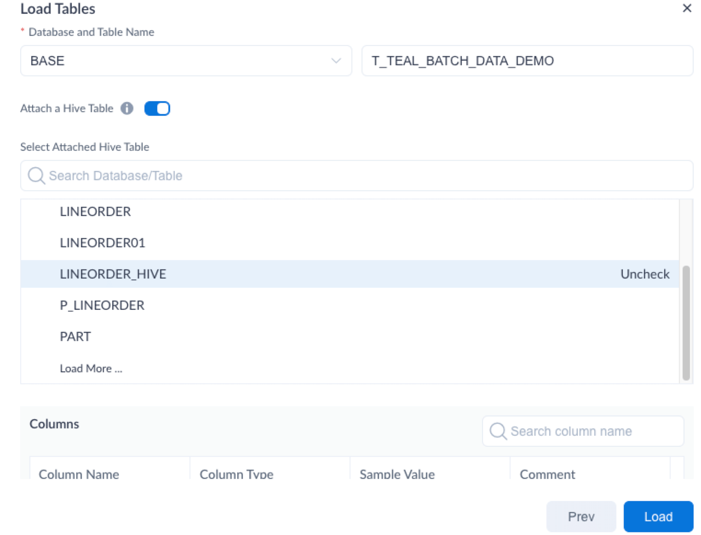
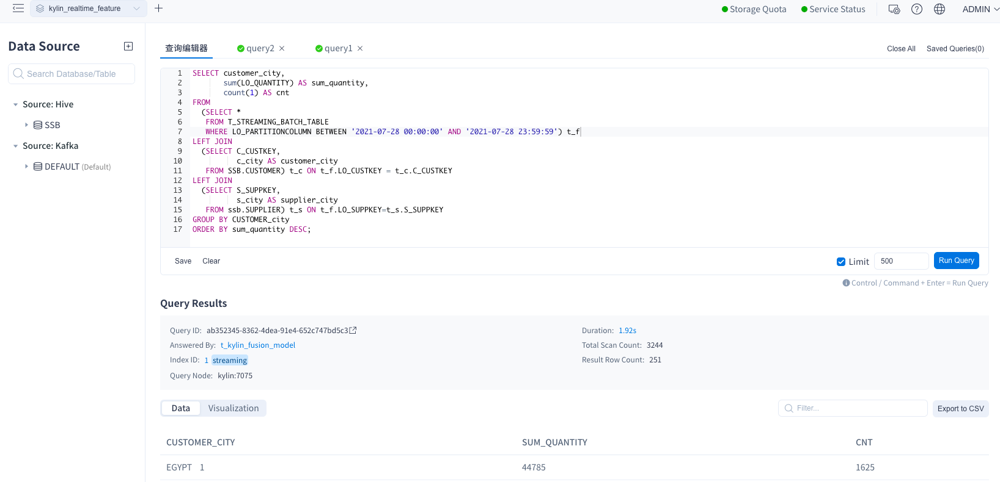
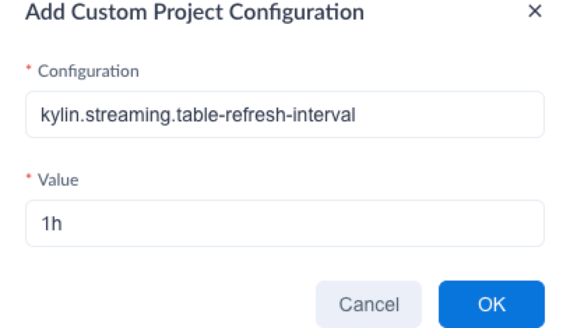

Kylin Real-Time is an advanced feature that supports querying real-time streaming data, which achieves lower latency from data loading to query.

This article discusses how to work with Kylin Real-Time, including how to load streaming data source (Kafka data source) and how to use this feature in models and indexes. 

### Prerequisites

- See [Hardware and software requirements](prerequisite.md). 
- Prepare Kafka data. 

### Operation steps

1. Log in to Kylin platform. 

2. (Optional) Load dimension table (for scenarios with both batch and streaming data processing). For more information, see [Load Hive Table](../../datasource/import_hive.md). 

   3. Load fact table. 

      1. In the left navigation, click **Data Assets** > **Data Source**. 

      2. Click . 

      3. In the pop-up dialog box, choose **Kafka** and click **Next**. 

      4. Enter Kafka broker information `{IP address}:{port number}` (for example 10.1.0.8:9092). Then click **Get Cluster Information**. 

      5. Select the target Kafka topic and the sample data of the topic will show up on the right side panel. Click **Next**. 

         

      6. Follow the instructions below to specify the source table(s). Then click **Load**. 

         

    [NOTE]
    
    Please pay attention that **timestamp** datatype doesn't support format as 1668009600000.
    For such data,please choose string or int.
   Timestamp supports formats as yyyy-MM-dd,yyyy/MM/dd,yyyyMMdd,yyyy-MM-dd HH:mm:ss and yyyy-MM-dd HH:mm:ss.SSSS.

      - **Database and Table Name**: Specify a name for the database and table. 

      - **Attach a Hive Table**: Turn on/off this toggle switch based on the data type to analyze.  

        - For both batch and streaming data processing: Keep the default turned on status, then select the target Hive table to attach. The system will transform the field types of Kafka topic to be the same as Hive column types.
         
         >    [NOTE]
         >
         >    The partition columns of Hive table must be the **timestamp** type; Hive column number and name must be consistent with Kafka topic. 

     - For streaming data processing only: Turn off the toggle switch and specify the partition column type as **timestamp**.

3. Build the model. For more information, see [Model Design](../intro.md). When building the model, you can use the data just loaded from Kafka data source as the fact table. 

4. Build indexes. For more information, see [Aggregate Index ](../manual/aggregation_group.md)and [Table Index](../manual/table_index.md). 

   If you turned on the **Attach a Hive Table** toggle switch when loading the fact table, you can further specify data range for index building: 

   

   - **Batch**: Build indexes with Hive table.
   - **Streaming**: Build indexes with Kafka topic. 
   - **Fusion**: Build indexes with both Hive table and Kafka topic. 

5. Query data. 

   After index building, specify a time range for query and then streaming indexes will be used to respond to your query. 

   

### FAQ

- Question: When using Kylin Real-Time, is it a must that both batch and streaming data are included in the fact table? 

  Answer: No, the fact table can be a Kafka or Hive table. 

- Question: Does Kafka support dimension data?

  Answer: No. For now, dimension data can only be stored in Hive tables. 

- Question: How to check the status of streaming data jobs? 

  Answer: In the left navigation panel, click **Monitor** > **Streaming Job** to check job status. You can customize job parameters by clicking  of the target job. To learn more about parameters, see [Basic Configuration](../../configuration/config). 

- Question: If a query can be answered with data from either Kafka or Hive tables, will there be any data duplication?

  Answer: No. Kylin applies the following query logics to avoid data duplication: 

  - If a query hits both batch and streaming indexes, batch indexes will be used to answer the query; only when data is not within the range of the batch indexes, streaming indexes will be used to answer the query.

  - If a query hits only batch or streaming indexes, the indexes hit will return data.
  - If a query hits neither batch nor streaming indexes, no data will be returned.

- Question: If dimension table changes, will these changes be synced to related models? 

  Answer: Yes. You can set the refresh interval for dimension tables with the following steps: 

  1. In the left navigation panel, click **Setting**.

  2. Click the **Advanced Settings** tab. In the **Custom Project Configuration** section at the end of the tab, click **+ Configuration**.

  3. In the **Add Custom Project Configuration** dialog box, set the configuration and parameter value. Then click **OK**. 

     - **Configuration**: Enter kylin.streaming.table-refresh-interval.

     - **Value**: Set the refresh interval. For example, if you want to refresh data every hour, set the value to **1h**. The unit of **d** (day), **h** (hour), and **m** (minute) are supported. 

       

- Question: How to deal with Segments with overlapping time ranges in the model?
     
  Answer: For models that contain Segments with overlapping time ranges, they will be marked as broken in the model list. To ensure data accuracy, the model cannot be repaired. You need to re-create the model and refresh the data. Loss of checkpoint files may cause this problem (checkpoint files are used to record the building progress of Segment). You can avoid abnormal deletion of checkpoint files by configuring the parameter `kylin.engine.streaming-checkpoint-location={hdfsWorkingDir}/_streaming`.
  
