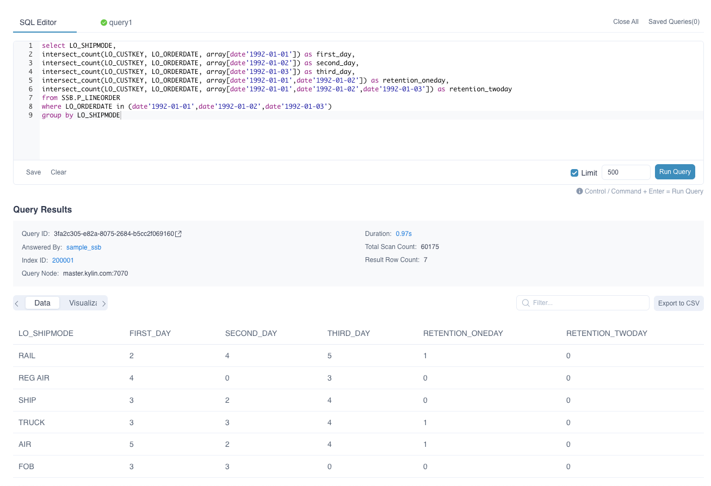
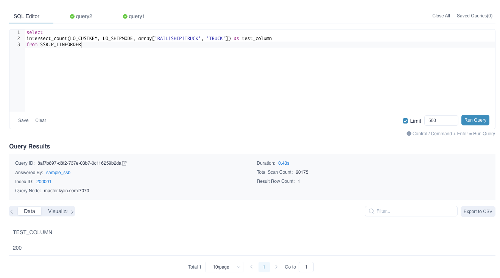
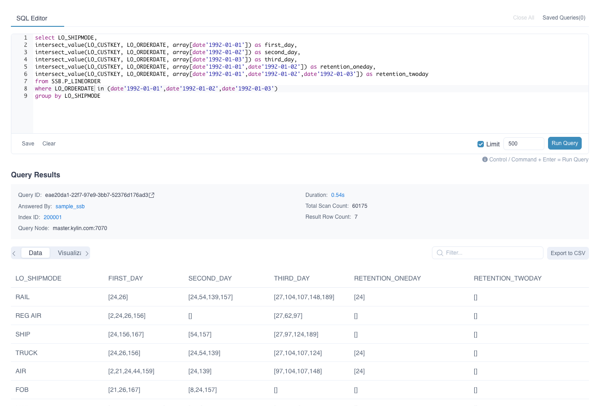
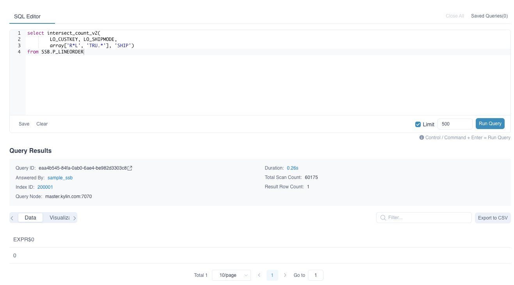
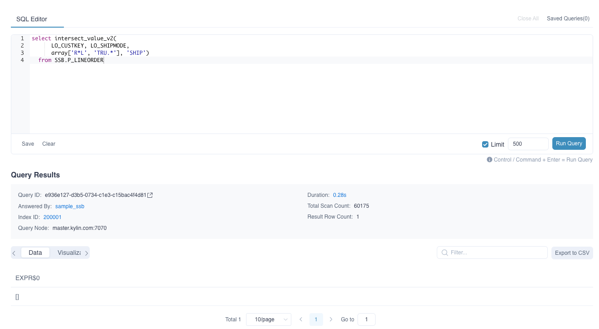

Users can use intersection function to calculate the value of the intersection of two data sets, with some same dimensions and one varied dimension, to analyze the retention or conversion rates.

kylin supports the following intersection function,


### INTERSECT_COUNT

Syntax: intersect_count(column_to_count, column_to_filter, filter_value_list)

Description: Returns the distinct count of the intersection of multiple result sets in different conditions

Parameters:
- `column_to_count`,  the column to be calculated and applied on distinct count, required to be added as **Precise count distinct** measure
- `column_to_filter`, the varied dimension
- `filter_value_list`, the value of the varied dimensions listed in `array[]`, When `column_to_filter` is of type varchar, A single element in an array can map multiple values. By default, the '|' is split. You can set `kylin.query.intersect.separator` in `kylin.properties` to configure the separator, Can take value '|' or ',', default is '|'(Currently this parameter does not support the use of subquery results as parameters).


Example 1:
```sql
-- The result shows that there is no seller keeps trading constantly during this period.

select LO_SHIPMODE,
       intersect_count(LO_CUSTKEY, LO_ORDERDATE, array[date '1992-01-01'])    as first_day,
       intersect_count(LO_CUSTKEY, LO_ORDERDATE, array[date '1992-01-02'])    as second_day,
       intersect_count(LO_CUSTKEY, LO_ORDERDATE, array[date '1992-01-03'])    as third_day,
       intersect_count(LO_CUSTKEY, LO_ORDERDATE, 
                       array[date '1992-01-01', date '1992-01-02'])           as retention_oneday,
       intersect_count(LO_CUSTKEY, LO_ORDERDATE, 
                       array[date '1992-01-01', date '1992-01-02', 
                             date '1992-01-03'])                              as retention_twoday
from SSB.P_LINEORDER
where LO_ORDERDATE in (date '1992-01-01', date '1992-01-02', date '1992-01-03')
group by LO_SHIPMODE
```


Example 2:

```sql
select 
     intersect_count(LO_CUSTKEY, LO_SHIPMODE, 
                     array['RAIL|SHIP|TRUCK', 'TRUCK']) as test_column
from SSB.P_LINEORDER
  ```
 


When the data type of varied dimension is not varchar or integer, the values in 'filter_value_list' need to be explicitly cast, for example:
```sql
-- case 1:
select intersect_count(column_to_count, 
                       column_to_filter, 
                       array[cast(3.53 as double), cast(5.79 as double)]) 
from TEST_TABLE;

-- case 2:
select intersect_count(column_to_count, 
                       column_to_filter, 
                       array[TIMESTAMP'2012-01-02 11:23:45', TIMESTAMP'2012-01-01 11:23:45']) 
from TEST_TABLE;

```


### INTERSECT_VALUE	

Description: Returns the values of the intersection of multiple result sets in different conditions. If the returned result is large, it may cause the analysis page browser to crash.	

Syntax: intersect_value(column_to_count, column_to_filter, filter_value_list)

Parameters:
- `column_to_count`,  the column to be calculated and applied on distinct value required to be added as **Precise count distinct** measure. **And only columns of type tinyint, smallint, or integer are supported**.	
- `column_to_filter`, the varied dimension	
- `filter_value_list`, the value of the varied dimensions listed in `array[]`, When `column_to_filter` is of type varchar, A single element in an array can map multiple values. By default, the '|' is split. You can set `kylin.query.intersect.separator` in `kylin.properties` to configure the separator, Can take value '|' or ',', default is '|'(Currently this parameter does not support the use of subquery results as parameters).	

Example 1:
```sql
-- Fact table `SSB.P_LINEORDER` simulates the online transaction data. 
-- And data type of `LO_CUSTKEY` column is `integer`. The following query 
-- can return the ids of sellers who are trading day by day during 1992.01.01 to 1992.01.03.		
  
-- The result shows that set of keeping trading constantly's sellerId during this period.

select LO_SHIPMODE,	
intersect_value(LO_CUSTKEY, LO_ORDERDATE, array[date'1992-01-01']) as first_day,
intersect_value(LO_CUSTKEY, LO_ORDERDATE, array[date'1992-01-02']) as second_day,
intersect_value(LO_CUSTKEY, LO_ORDERDATE, array[date'1992-01-03']) as third_day,
intersect_value(LO_CUSTKEY, LO_ORDERDATE, array[date'1992-01-01',date'1992-01-02']) as retention_oneday, 	
intersect_value(LO_CUSTKEY, LO_ORDERDATE, array[date'1992-01-01',date'1992-01-02',date'1992-01-03']) as retention_twoday 	
from SSB.P_LINEORDER
where PART_DT in (date'1992-01-01',date'1992-01-02',date'1992-01-03')
group by LO_SHIPMODE
```
	

Example 2:
```sql	
select 
    intersect_count(LO_CUSTKEY, LO_SHIPMODE, 
                    array['RAIL|SHIP|TRUCK', 'TRUCK']) as test_column
from SSB.P_LINEORDER
```


When the data type of varied dimension is not varchar or integer, the values in 'filter_value_list' need to be explicitly cast, for example:
```sql
-- case 1
select intersect_value(column_to_count, column_to_filter, 
                       array[cast(3.53 as double), cast(5.79 as double)]) 
from TEST_TABLE
  
-- case 2
select intersect_value(column_to_count, column_to_filter, 
                       array[TIMESTAMP'2012-01-02 11:23:45', TIMESTAMP'2012-01-01 11:23:45']) 
from TEST_TABLE;
```


### INTERSECT_COUNT_V2

Syntax: intersect_count_v2(column_to_count, column_to_filter, filter_value_list, filter_type)

Description: Returns the distinct count of the intersection of multiple result sets in different conditions. Support Regexp in condition.

Parameters:
- `column_to_count`, the column to be calculated and applied on distinct count, required to be added as **Precise count distinct** measure
- `column_to_filter`, the varied dimension
- `filter_value_list`, the value of the varied dimensions listed in `array[]`,
- `filter_type`, the data type is String, which identifies the filter mode. There are currently two optional values "RAWSTRING" and "REGEXP". When the parameter value is "RAWSTRING", the filtering mode is precise filtering. When `column_to_filter` is a Varchar type, A single element in the array can be mapped with multiple values. By default, it is separated by '|'. You can use `kylin.query.intersect.separator` to configure the separator. And only support configuration in the `kylin.properties` file.  (currently this parameter does not support using the results of subqueries as parameters). When the parameter value is "REGEXP", the filtering mode is regular matching, and only the value of the regular expression in column_to_filter that can match the filter_value_list will be filtered.

For example:
```sql
select intersect_count_v2(
    LO_CUSTKEY, LO_SHIPMODE, 
    array['R*L', 'TRU.*'], 'SHIP')
from SSB.P_LINEORDER
```
 

When the filter_type is "RAWSTRING" and the data type of a varied dimension is not varchar or integer, the values in 'filter_value_list' need to be explicitly cast, for example:
```sql
-- case 1
select intersect_count_v2(column_to_count, column_to_filter, 
                          array[cast(3.53 as double), cast(5.79 as double)], 'RAWSTRING') 
from TEST_TABLE


-- case 2
select intersect_count_v2(column_to_count, column_to_filter, 
                          array[TIMESTAMP'2012-01-02 11:23:45', TIMESTAMP'2012-01-01 11:23:45'], 'RAWSTRING') 
from TEST_TABLE;
```

### INTERSECT_VALUE_V2	

Syntax: intersect_value_v2(column_to_count, column_to_filter, filter_value_list, filter_type)

Description: Returns the values of the intersection of multiple result sets in different conditions. If the returned result is large, it may cause the analysis page browser to crash. Support Regexp in condition.

Parameters:
- `column_to_count`,  the column to be calculated and applied on distinct value required to be added as **Precise count distinct** measure.
 **Only when type of column is one of integer family(tinyint、smallint、integer、bigint) and override model properties `kylin.query.skip-encode-integer-enabled=true`, the values returned is actual. Otherwise, encoded value will be returned.**	
- `column_to_filter`, the varied dimension	
- `filter_value_list`, the value of the varied dimensions listed in `array[]`,
- `filter_type`, the data type is String, which identifies the filter mode. There are currently two optional values "RAWSTRING" and "REGEXP". When the parameter value is "RAWSTRING", the filtering mode is precise filtering. When `column_to_filter` is a Varchar type, A single element in the array can be mapped with multiple values. By default, it is separated by '|'. You can use `kylin.query.intersect.separator` to configure the separator. And only support configuration in the `kylin.properties` file.  (currently this parameter does not support using the results of subqueries as parameters). When the parameter value is "REGEXP", the filtering mode is regular matching, and only the value of the regular expression in column_to_filter that can match the filter_value_list will be filtered.

For example:
```sql
select intersect_value_v2(
    LO_CUSTKEY, LO_SHIPMODE, 
    array['R*L', 'TRU.*'], 'SHIP')
from SSB.P_LINEORDER
```


When the filter_type is "RAWSTRING" and the data type of varied dimension is not varchar or integer, the values in 'filter_value_list' need to be explicitly cast, for example:
```sql
-- case 1
select intersect_value_v2(column_to_count, column_to_filter, 
                          array[cast(3.53 as double), cast(5.79 as double)], 'RAWSTRING') 
from TEST_TABLE;

-- case 2
select intersect_value_v2(column_to_count, column_to_filter, 
                          array[TIMESTAMP'2012-01-02 11:23:45', TIMESTAMP'2012-01-01 11:23:45'], 'RAWSTRING') 
from TEST_TABLE;
```


### Limitations
- All the above functions don't support pushdown query
- All the above functions don't support detailed index answers (even with the switch kylin.query.use-tableindex-answer-non-raw-query = true)
