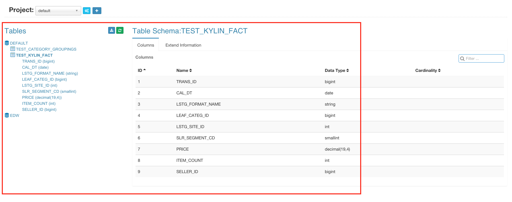
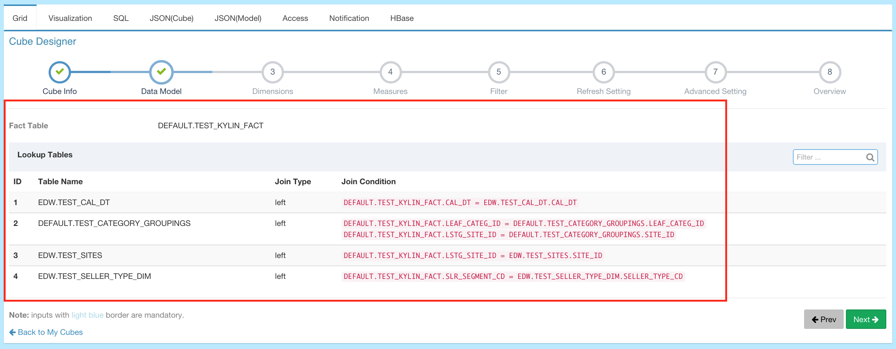
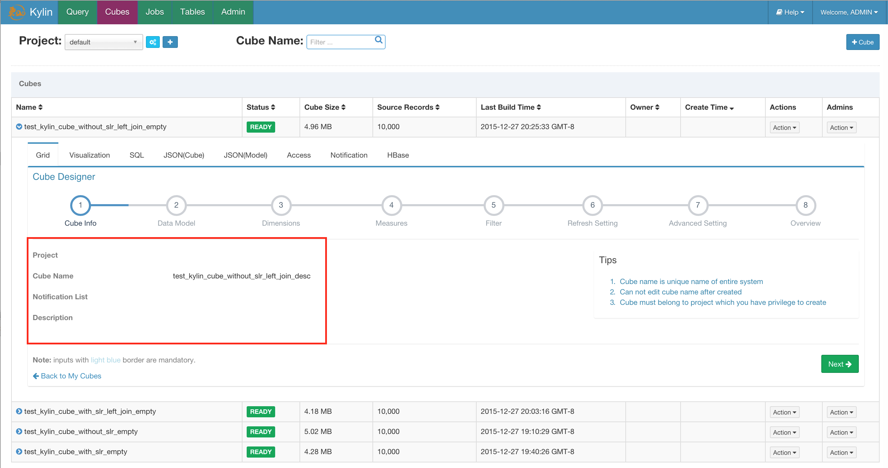
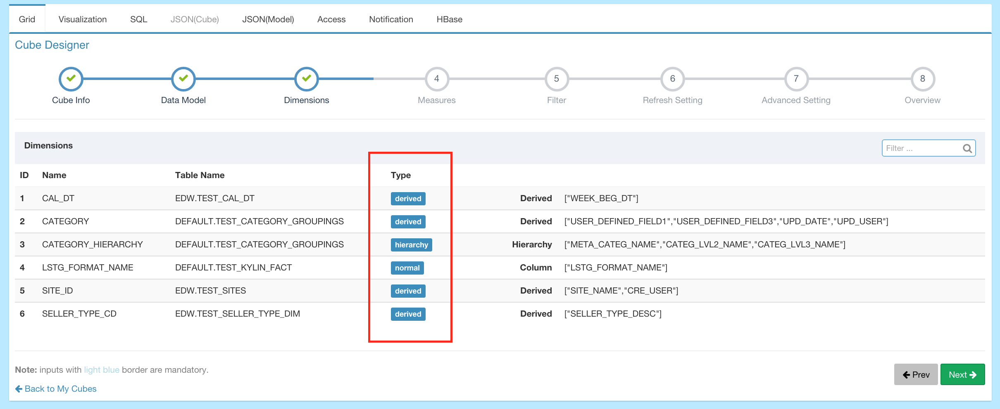
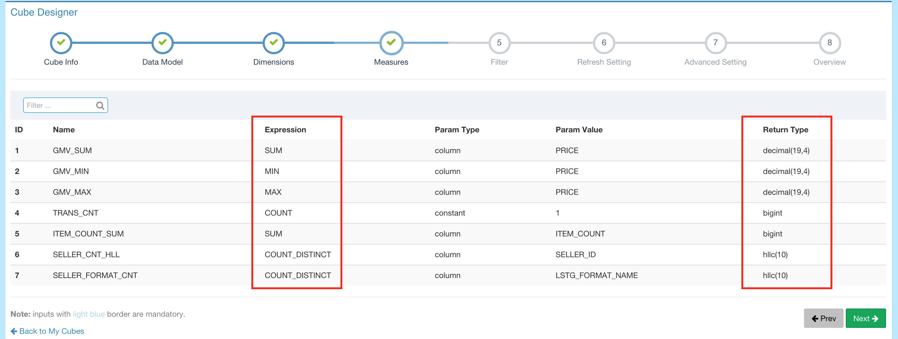
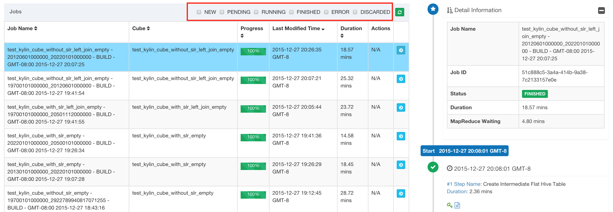

 
Here are some basic technical concepts used in Apache Kylin, please check them for your reference.
For terminology in domain, please refer to: [Terminology](terminology.html)

## CUBE
* __Table__ - This is the definition of hive tables as source of cubes, which must be synced before building cubes.

* __Data Model__ - This describes a [STAR SCHEMA](https://en.wikipedia.org/wiki/Star_schema) data model, which defines fact/lookup tables and filter conditions.

* __Cube Descriptor__ - This describes the definition and settings for a cube instance, defining which data model to use, what dimensions and measures to have, how to partition into segments and how to handle auto-merge, etc.

* __Cube Instance__ - This is the instance of cube built from one cube descriptor, and consists of one or more cube segments according to partition settings.

* __Partition__ - User can define a DATE/STRING column as partition column on the cube descriptor to separate one cube into several segments with different date periods.

* __Cube Segment__ - This is the actual carrier of cube data, and it maps to an HTable in HBase. One building job creates one new segment for the cube instance. Once data changes on specified date period, we can refresh related segments to avoid rebuilding the whole cube.

* __Aggregation Group__ - Each aggregation group is a subset of dimensions, and cuboid are built with combinations inside. It aims at pruning for optimization.

## DIMENSION & MEASURE
* __Mandatory__ - This dimension type is used for cuboid pruning, if a dimension is specified as “mandatory”, then those combinations without such dimension are pruned.
* __Hierarchy__ - This dimension type is used for cuboid pruning, if dimensions A,B,C form a “hierarchy” relation, then only combinations with A, AB or ABC shall be remained. 
* __Derived__ - In lookup tables, some dimensions could be generated from their PK, so there are specific mappings between them and the FK from the fact table. So those dimensions are DERIVED, and they don't participate in cuboid generation.

* __Count Distinct(HyperLogLog)__ - Immediate COUNT DISTINCT is hard to calculate, an approximate algorithm - [HyperLogLog](https://en.wikipedia.org/wiki/HyperLogLog) is introduced, and it keeps the error rate in a low level. 
* __Count Distinct(Precise)__ - Precise COUNT DISTINCT will be pre-calculated based on RoaringBitmap. Currently, only int and bigint are supported.
* __Top N__ - For example, with this measure type, user can easily get specified numbers of top sellers/buyers, etc. 

## CUBE ACTIONS
* __BUILD__ - Given an interval of partition column, this action is to build a new cube segment.
* __REFRESH__ - This action will rebuild the cube segment in some partition periods, which is used in case of source table increasing.
* __MERGE__ - This action will merge multiple continuous cube segments into a single one. This can be automated with the auto-merge setting in cube descriptor.
* __PURGE__ - Clear segments under a cube instance. This will only update the metadata, and won't delete the cube data from HBase.

## JOB STATUS
* __NEW__ - This denotes that one job has been just created.
* __PENDING__ - This denotes that one job is paused by job scheduler and is waiting for resources.
* __RUNNING__ - This denotes that one job is running in progress.
* __FINISHED__ - This denotes that one job is finished successfully.
* __ERROR__ - This denotes that one job is aborted with errors.
* __DISCARDED__ - This denotes that one job is cancelled by end users.

## JOB ACTION
* __RESUME__ - Once a job is in ERROR status, this action will try to restore it from the latest successful point.
* __DISCARD__ - No matter what the status of a job is, users can end it and release resources with the DISCARD action.

