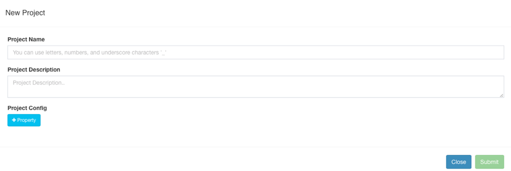
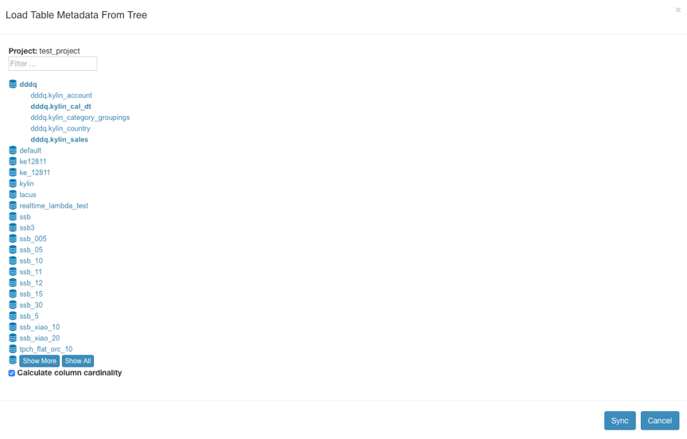
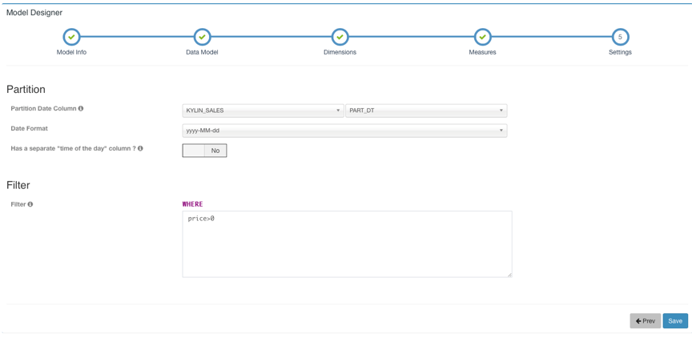
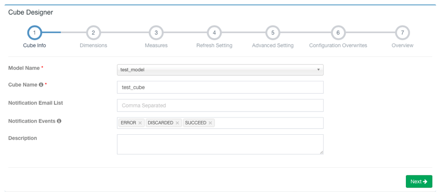
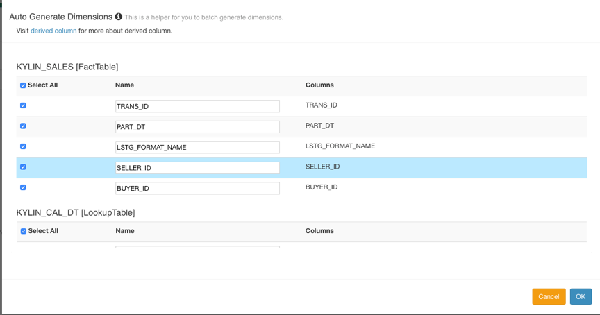
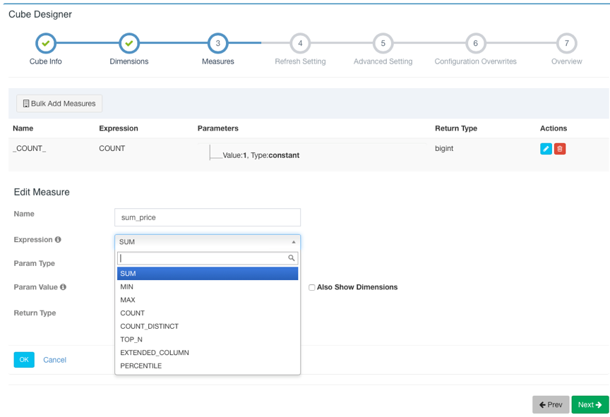
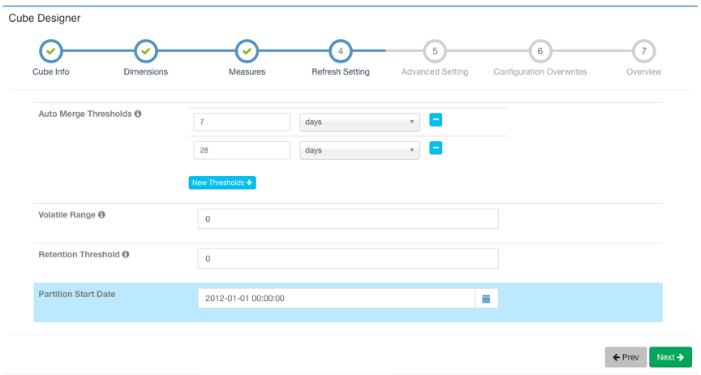
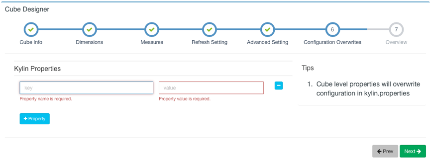
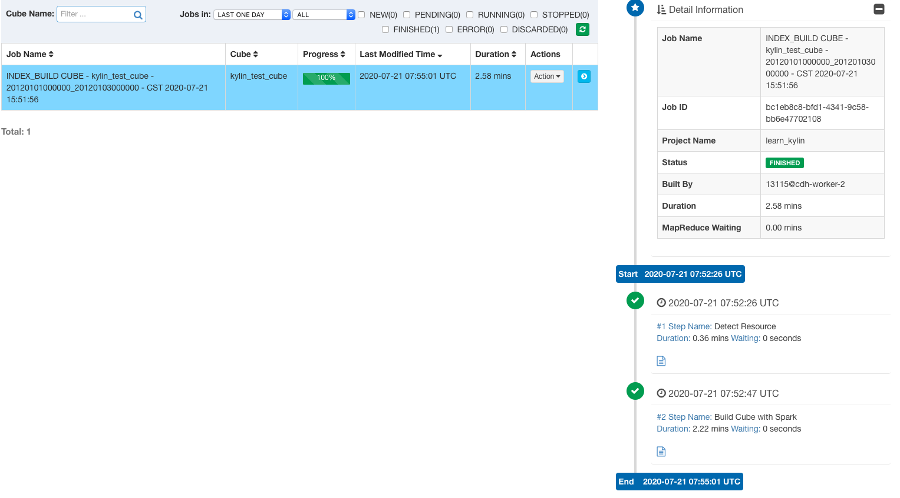
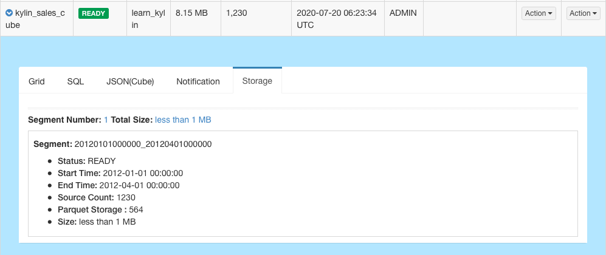

This guide aims to provide novice Kylin users with a complete process guide from download and installation to a sub-second query experience. 

Users can follow these steps to get an initial understanding of how to use Kylin, master the basic skills of Kylin and then use Kylin to design models and speed up queries based on their own business scenarios.

### Install and Use Kylin Based on a Hadoop Environment

Users who already have a stable Hadoop environment can download Kylin’s binary package and deploy it on their Hadoop cluster. Before installation, check the environment according to the following requirements.

#### Environmental Inspection

(1) Pre-Conditions: Kylin relies on a Hadoop cluster to process large data sets. You need to prepare a Hadoop cluster configured with HDFS, YARN, MapReduce, Hive, Zookeeper and other services for Kylin to run.

Kylin can be started on any node of a Hadoop cluster. For your convenience, you can run Kylin on the master node, but for better stability, we recommend that you deploy Kylin on a clean Hadoop client node. The Hive, HDFS and other command lines have been installed on the node and the client configuration (such as core-site.xml, hive-site.xml and others) have been properly configured and they can automatically synchronize with other nodes.

The Linux account running Kylin must have access to the Hadoop cluster, including permissions to create/write HDFS folders, Hive tables.

 

(2) Hardware Requirements: The server running Kylin is recommended to have a minimum configuration of 4 core CPU, 16 GB memory and 100 GB disk.

 

(3) Operating System Requirements: CentOS 6.5+ or Ubuntu 16.0.4+

 

(4) Software Requirements: Hadoop 2.7+, 3.0-3.1; Hive 0.13+, 1.2.1+; Spark 2.4.6; JDK: 1.8+

 

It is recommended to use an integrated Hadoop environment for Kylin installation and testing, such as Hortonworks HDP or Cloudera CDH. Before Kylin was released, Hortonworks HDP 2.4, Cloudera CDH 5.7 and 6.0, AWS EMR 5.31 and 6.0, and Azure HDInsight 4.0 passed the test.

#### Install and Use
When your environment meets the above prerequisites, you can install and start using Kylin.

#### Step1. Download the Kylin Archive
Download a kylin4.0 binary package from [Apache Kylin Download Site](https://kylin.apache.org/download/). 

```
cd /usr/local/
wget http://apache.website-solution.net/kylin/apache-kylin-4.0.0/apache-kylin-4.0.0-bin.tar.gz
```

#### Step2. Extract Kylin
Extract the downloaded Kylin archive and configure the environment variable KYLIN_HOME to point to the extracted directory:

```
tar -zxvf  apache-kylin-4.0.0-bin.tar.gz
cd apache-kylin-4.0.0-bin
export KYLIN_HOME=`pwd`
```

#### Step3. Download Spark
Kylin 4.0 uses spark as query engine and build engine, you need to set SPARK_HOME:

```
export SPARK_HOME=/path/to/spark
```

If you don’t have a Spark environment already downloaded, you can also download Spark using Kylin’s own script:

```
$KYLIN_HOME/bin/download-spark.sh
```

The script will place the decompressed Spark in the `$KYLIN_HOME` directory. If SPARK_HOME is not set in the system, the Spark in the `$KYLIN_HOME` directory will be found automatically when Kylin is started.

#### Step4. Configure MySQL metastore

Kylin 4.0 uses MySQL as metadata storage, make the following configuration in `kylin.properties`:

```$xslt
kylin.metadata.url=kylin_metadata@jdbc,driverClassName=com.mysql.jdbc.Driver,url=jdbc:mysql//localhost:3306/kylin_test,username=,password=
kylin.env.zookeeper-connect-string=ip:2181
```

You need to change the Mysql user name and password, as well as the database and table where the metadata is stored.
Please refer to [Configure Mysql as Metastore](/docs/tutorial/mysql_metastore.html) learn about the detailed configuration of MySQL as a Metastore.

#### Step5. Environmental Inspection
Kylin runs on a Hadoop cluster and has certain requirements for the version, access permissions and CLASSPATH of each component. 
To avoid encountering various environmental problems, you can run the `$KYLIN_HOME/bin/check-env.sh` script to perform an environment check to see if there are any problems. 
The script will print out detailed error messages if any errors are identified. If there is no error message, your environment is suitable for Kylin operation.

#### Step6. Start Kylin
Run 

```
$KYLIN_HOME/bin/kylin.sh
```

Start script to start Kylin. If the startup is successful, the following will be output at the end of the command line:

```
A new Kylin instance is started by root. To stop it, run 'kylin.sh stop'
Check the log at /usr/local/apache-kylin-4.0.0-bin/logs/kylin.log
Web UI is at http://<hostname>:7070/kylin
```

The default port started by Kylin is 7070. You can use `$KYLIN_HOME/bin/kylin-port-replace-util.sh` set number to modify the port. The modified port is 7070 + number.

#### Step7. Visit Kylin
After Kylin starts, you can access it through your browser: `http://<hostname>:port/kylin` , where `<hostname>` is the specific machine name, IP address or domain name, port is the Kylin port and the default is 7070. 
The initial username and password are ADMIN/KYLIN. After the server starts, you can get the runtime log by looking at `$KYLIN_HOME/logs/kylin.log`.

#### Step8. Create Sample Cube
Kylin provides a script to create a sample cube for users to quickly experience Kylin. Run from the command line:

```
$KYLIN_HOME/bin/sample.sh
```

After completing, log in to Kylin, click System -> Configuration -> Reload Metadata to reload the metadata.

After the metadata is reloaded, you can see a project named learn_kylin in Project in the upper left corner. 
This contains kylin_sales_cube and kylin_streaming_cube, which are a batch cube and a streaming cube, respectively. However, kylin 4.0 does not support streaming cube yet.
You can build the kylin_sales_cube directly and you can query it after the build is completed. 

Of course, you can also try to create your own cube based on the following tutorial.

#### Step9. Create Project 
After logging in to Kylin, click the + in the upper left corner to create a Project.



#### Step10. Load Hive Table
Click `Model -> the Data Source -> the Load the From the Table Tree`. 
Kylin reads the Hive data source table and displays it in a tree. You can choose the tables you would like to add to models and then click Sync. The selected tables will then be loaded into Kylin.



They then appear in the Tables directory of the data source.

In addition, kylin 4.0 also supports CSV file as data source. You can also click `model -> data source -> Load CSV file as table` to load the CSV data source.

In this example, Hive data source is still used for explanation and demonstration.

#### Step11. Create the Model
Click Model -> New -> New Model:


Enter the Model Name and click Next, then select Fact Table and Lookup Table. You need to set the JOIN condition with the fact table when adding Lookup Table.


Then click Next to select Dimension:


Next, Select Measure:


The next step is to set the time partition column and filter conditions. The time partition column is used to select the time range during incremental construction. If no time partition column is set, it means that the cubes under this model are all built. The filter condition is used for the where condition when flattening the table.



Then, click Save to save the model.

#### Step12. Create Cube

Model -> New -> New Cube:



Click Next to add Dimension. The dimensions of the Lookup Table can be set to Normal or Derived. The default setting is derived dimension. Derived dimension means that the column can be derived from the primary key of the dimension table. In fact, only the primary key column will be calculated by the cube.



Click Next and click + Measure to add a pre-calculated measure.

Kylin creates a Count (1) metric by default. Kylin supports metrics: SUM, MIN, MAX, COUNT, COUNT_DISTINCT, TOP_N and PERCENTILE.

Please select the appropriate return type for COUNT_DISTINCT and TOP_N, which is related to the size of the cube. 
Click OK after the addition is complete and the measure will be displayed in the Measures list.



After adding all of the measures, click Next to proceed. This page is about the settings for cube data refresh. 
Here you can set the threshold for automatic merge (Auto Merge Thresholds), the minimum time for data retention (Retention Threshold) and the start time of the first segment.



Click Next to continue going through the Advanced Settings. 
Here you can set the aggregation group, RowKeys, Mandatory Cuboids, Cube Engine, etc.
 
For more information about Advanced Settings, you can refer to Step 5 on the [create_cube](/docs/tutorial/create_cube.html), which details the settings for additional options. 

For more dimensional optimization, you can read: [aggregation-group](/blog/2016/02/18/new-aggregation-group/).


If you are not familiar with Advanced Settings, you can keep the default settings first. Click Next to jump to the Kylin Properties page. Here you can override the cube-level Kylin configuration items and define the properties to be covered. 
For configuration items, please refer to: [configuration](https://cwiki.apache.org/confluence/display/KYLIN/Configuration+Kylin+4.X).



After the configuration is complete, click the Next button to the next page. 
Here you can preview the basic information of the cube you are creating and you can return to the previous steps to modify it. 
If you don’t need to make any changes, you can click the Save button to complete the cube creation. 
After that, this cube will appear in your cube list.


#### Step13. Build Cube

The cube created in the previous step has definitions but no calculated data. Its status is “DISABLED” and it cannot be queried. If you want the cube to have data, you need to build it. Cubes are usually built in one of two ways: full builds or incremental builds.

Click the Action under the Actions column of the cube to be expanded. Select Build. 

If the time partition column is not set in the model to which the cube belongs, the default is to build in full.

Click Submit to submit the build task directly. If a time partition column is set, the following page will appear, where you will need to select the start and end time for building the data.


After setting the start and end time, click Submit to submit the build task. 
You can then observe the status of the build task on the Monitor page. 
Kylin displays the running status of each step on the page, the output log and MapReduce tasks. 
You can view more detailed log information in `${KYLIN_HOME}/logs/kylin.log`.



After the job is built, the status of the cube will change to READY and you can see the segment information.



#### Step14. Query Cube
After the cube is built, you can see the table of the built cube and query it under the Tables list on the Insight page. 
After the query hits the cube, it returns the pre-calculated results stored in HDFS.


Congratulations, you have already acquired the basic skills for using Kylin and you can now discover and explore more and more powerful functions.


 
