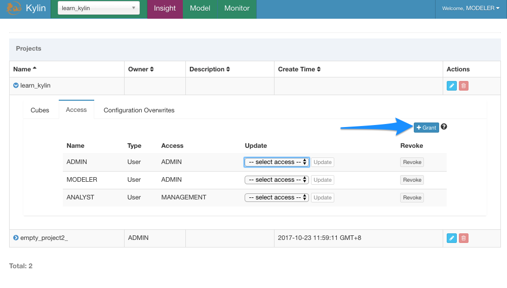
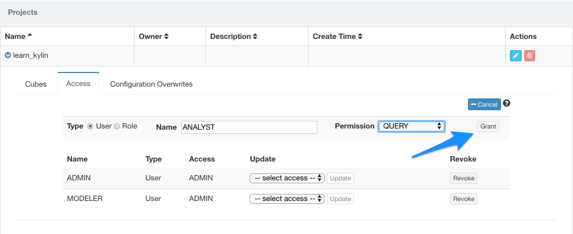
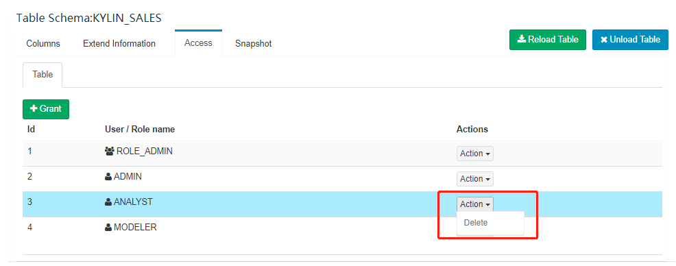

## Project Level ACL
Whether a user can access a project and use some functionalities within the project is determined by project-level access control, there are four types of access permission role set at the project-level in Apache Kylin. They are *ADMIN*, *MANAGEMENT*, *OPERATION* and *QUERY*. Each role defines a list of functionality user may perform in Apache Kylin.

- *QUERY*: designed to be used by analysts who only need access permission to query tables/cubes in the project.
- *OPERATION*: designed to be used by operation team in a corporate/organization who need permission to maintain the Cube. OPERATION access permission includes QUERY.
- *MANAGEMENT*: designed to be used by Modeler who is fully knowledgeable of business meaning of the data/model, Modeler will be in charge of Model and Cube design. MANAGEMENT access permission includes OPERATION, and QUERY.
- *ADMIN*: Designed to fully manage the project. ADMIN access permission includes MANAGEMENT, OPERATION and QUERY.

Access permissions are independent between different projects.

### How Access Permission is Determined

Once project-level access permission has been set for a user, access permission on data source, model and Cube will be inherited based on the access permission role defined on project-level. For detailed functionalities, each access permission role can have access to, see table below.

|                                          | System Admin | Project Admin | Management | Operation | Query |
| ---------------------------------------- | ------------ | ------------- | ---------- | --------- | ----- |
| Create/delete project                    | Yes          | No            | No         | No        | No    |
| Edit project                             | Yes          | Yes           | No         | No        | No    |
| Add/edit/delete project access permission | Yes          | Yes           | No         | No        | No    |
| Check model page                         | Yes          | Yes           | Yes        | Yes       | Yes   |
| Check data source page                   | Yes          | Yes           | Yes        | No        | No    |
| Load, unload table, reload table         | Yes          | Yes           | No         | No        | No    |
| View model in read only mode             | Yes          | Yes           | Yes        | Yes       | Yes   |
| Add, edit, clone, drop model             | Yes          | Yes           | Yes        | No        | No    |
| Check cube detail definition             | Yes          | Yes           | Yes        | Yes       | Yes   |
| Add, disable/enable, clone cube, edit, drop cube, purge cube | Yes          | Yes           | Yes        | No        | No    |
| Build, refresh, merge cube               | Yes          | Yes           | Yes        | Yes       | No    |
| Edit, view cube json                     | Yes          | Yes           | Yes        | No        | No    |
| Check insight page                       | Yes          | Yes           | Yes        | Yes       | Yes   |
| View table in insight page               | Yes          | Yes           | Yes        | Yes       | Yes   |
| Check monitor page                       | Yes          | Yes           | Yes        | Yes       | No    |
| Check system page                        | Yes          | No            | No         | No        | No    |
| Reload metadata, disable cache, set config, diagnosis | Yes          | No            | No         | No        | No    |

Additionally, when Query Pushdown is enabled, QUERY access permission on a project allows users to issue push down queries on all tables in the project even though no cube could serve them. It's impossible if a user is not yet granted QUERY permission at project-level.

### Manage Access Permission at Project-level

1. Click the small gear shape icon on the top-left corner of Model page. You will be redirected to project page

   

2. In project page, expand a project and choose Access.
3. Click `Grant`to grant permission to user.

	

4. Fill in name of the user or role, choose permission and then click `Grant` to grant permission.

5. You can also revoke and update permission on this page.

   

   Please note that in order to grant permission to default user (MODELER and ANALYST), these users need to login as least once. 
   ​

## Table Level ACL
Whether a user can access a table is determined by table-level access control, this function is on by default. Set `kylin.query.security.table-acl-enabled` to false to disable the table-level access control.
Access permissions are independent between different projects.
Once table-level access permission has been set for a user, you can see it on the page.

### Manage Access Permission at Table-level

1. Click the Data Source tab of Model page.
2. Expand a database, choose the table and click Access tab.
3. Click `Grant`to grant permission to user.

	

4. Choose the type (user or role), choose User / Role name and then click `Submit` to grant permission.

5. You can also delete permission on this page.

   