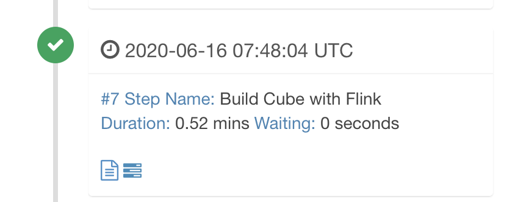

Kylin v3.1 introduces the Flink cube engine, it uses Apache Flink to replace MapReduce in the build cube step; You can check [KYLIN-3758](https://issues.apache.org/jira/browse/KYLIN-3758). The current document uses the sample cube to demo how to try the new engine.


## Preparation
To finish this tutorial, you need a Hadoop environment which has Kylin v3.1.0 or above installed. Here we will use Cloudera CDH 5.7 environment, the Hadoop components as well as Hive/HBase has already been started. 

## Install Kylin v3.1.0 or above

Download the Kylin binary for CDH 5.7+ from Kylin's download page, and then uncompress the tar ball into */usr/local/* folder:

```

wget http://www-us.apache.org/dist/kylin/apache-kylin-3.1.0/apache-kylin-3.1.0-bin-cdh57.tar.gz -P /tmp

tar -zxvf /tmp/apache-kylin-3.1.0-bin-cdh57.tar.gz -C /usr/local/

export KYLIN_HOME=/usr/local/apache-kylin-3.1.0-bin-cdh57
```

## Prepare "kylin.env.hadoop-conf-dir"

To run Flink on Yarn, need specify **HADOOP_CONF_DIR** environment variable, which is the directory that contains the (client side) configuration files for Hadoop. In many Hadoop distributions the directory is "/etc/hadoop/conf"; Kylin can automatically detect this folder from Hadoop configuration, so by default you don't need to set this property. If your configuration files are not in default folder, please set this property explicitly.

## Check Flink configuration

Point FLINK_HOME to your flink installation path:

```$xslt
export FLINK_HOME=/path/to/flink
``` 

or run the script to download it:

```$xslt
$KYLIN_HOME/bin/download-flink.sh
```

all the Flink configurations can be managed in $KYLIN_HOME/conf/kylin.properties with prefix *"kylin.engine.flink-conf."*. These properties will be extracted and applied when runs submit Flink job.
Before you run Flink cubing, suggest take a look on these configurations and do customization according to your cluster. Below is the recommended configurations:

```
### Flink conf (default is in $FLINK_HOME/conf/flink-conf.yaml)
kylin.engine.flink-conf.jobmanager.heap.size=2G
kylin.engine.flink-conf.taskmanager.heap.size=4G
kylin.engine.flink-conf.taskmanager.numberOfTaskSlots=1
kylin.engine.flink-conf.taskmanager.memory.preallocate=false
kylin.engine.flink-conf.job.parallelism=1
kylin.engine.flink-conf.program.enableObjectReuse=false
kylin.engine.flink-conf.yarn.queue=
kylin.engine.flink-conf.yarn.nodelabel=

```

All the "kylin.engine.flink-conf.*" parameters can be overwritten at Cube or Project level, this gives more flexibility to the user.

## Create and modify sample cube

Run the sample.sh to create the sample cube, and then start Kylin server:

```

$KYLIN_HOME/bin/sample.sh
$KYLIN_HOME/bin/kylin.sh start

```

After Kylin is started, access Kylin web, edit the "kylin_sales" cube, in the "Advanced Setting" page, change the "Cube Engine" from "MapReduce" to "Flink":


   

Click "Next" and "Save" to save the cube.


## Build Cube with Flink

By default, only the cube by layer in step 7 is built using Flink engine. 

Click "Build", select current date as the build end date. Kylin generates a build job in the "Monitor" page. The job engine starts to execute the steps in sequence. 


   


   

When Kylin executes this step, you can monitor the status in Yarn resource manager. 


   


After all steps be successfully executed, the Cube becomes "Ready" and you can query it as normal.


## Optional

As we all know, the cubing job includes several steps and the steps 'extract fact table distinct value' and 'Convert Cuboid Data to HFile' can also be built by flink. The configurations are as follows.

```
kylin.engine.flink-fact-distinct=true
kylin.engine.flink-cube-hfile=true
```


## Troubleshooting

When getting error, you should check "logs/kylin.log" firstly. There has the full Flink command that Kylin executes, e.g:

```
2020-06-16 15:48:05,752 INFO  [Scheduler 2113190395 Job 478f9f70-8444-6831-6817-22869f0ead2a-308] flink.FlinkExecutable:225 : cmd: export HADOOP_CONF_DIR=/etc/hadoop/conf && export HADOOP_CLASSPATH=/etc/hadoop && /root/apache-kylin-3.1.0-SNAPSHOT-bin-master/flink/bin/flink run -m yarn-cluster  -ytm 4G -yjm 2G -yD taskmanager.memory.preallocate false -ys 1 -c org.apache.kylin.common.util.FlinkEntry -p 1 /root/apache-kylin-3.1.0-SNAPSHOT-bin/lib/kylin-job-3.1.0-SNAPSHOT.jar -className org.apache.kylin.engine.flink.FlinkCubingByLayer -hiveTable default.kylin_intermediate_kylin_sales_cube_flink_75ffb8ff_b27c_c86b_70f2_832a4f18f5cf -output hdfs://cdh-master:8020/kylin/yaqian/kylin_zyq/kylin-478f9f70-8444-6831-6817-22869f0ead2a/kylin_sales_cube_flink/cuboid/ -input hdfs://cdh-master:8020/kylin/yaqian/kylin_zyq/kylin-478f9f70-8444-6831-6817-22869f0ead2a/kylin_intermediate_kylin_sales_cube_flink_75ffb8ff_b27c_c86b_70f2_832a4f18f5cf -enableObjectReuse false -segmentId 75ffb8ff-b27c-c86b-70f2-832a4f18f5cf -metaUrl kylin_zyq@hdfs,path=hdfs://cdh-master:8020/kylin/yaqian/kylin_zyq/kylin-478f9f70-8444-6831-6817-22869f0ead2a/kylin_sales_cube_flink/metadata -cubename kylin_sales_cube_flink

```

You can copy the cmd to execute manually in shell and then tunning the parameters quickly; During the execution, you can access Yarn resource manager to check more. If the job has already finished, you can check the log of flink. 

## Go further

If you're a Kylin administrator but new to Flink, suggest you go through [Flink documents](https://ci.apache.org/projects/flink/flink-docs-release-1.9/), and don't forget to update the configurations accordingly. 
If you have any question, comment, or bug fix, welcome to discuss in dev@kylin.apache.org.
