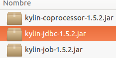
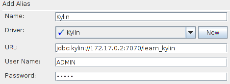
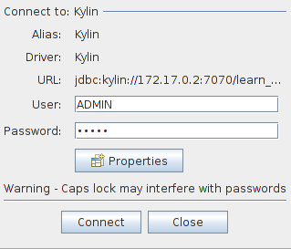
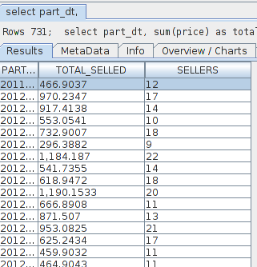
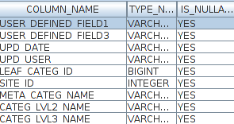
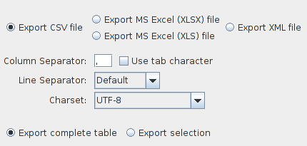
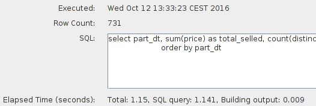

### Introduction

[SQuirreL SQL](http://www.squirrelsql.org/) is a multi platform Universal SQL Client (GNU License). You can use it to access HBase + Phoenix and Hive. This document introduces how to connect to Kylin from SQuirreL.

### Used Software

* [Kylin v1.6.0](/download/) & ODBC 1.6
* [SquirreL SQL v3.7.1](http://www.squirrelsql.org/)

## Pre-requisites

* Find the Kylin JDBC driver jar
  From Kylin Download, Choose Binary and the **correct version of Kylin and HBase**
	Download & Unpack:  in **./lib**: 
  


* Need an instance of Kylin, with a Cube; the [Sample Cube](kylin_sample.html) is enough.

  


* [Dowload and install SquirreL](http://www.squirrelsql.org/#installation)

## Add Kylin JDBC Driver

On left menu:  >  >   > 

And locate the JAR: 

Configure this parameters:

* Put a name: 
* Example URL 

  jdbc:kylin://172.17.0.2:7070/learn_kylin
* Put Class Name: 
	Tip:  If auto complete not work, type:  org.apache.kylin.jdbc.Driver 
	
Check the Driver List: 

## Add Aliases

On left menu:   >  : (Login pass by default: ADMIN / KYLIN)

  


And automatically launch connection:

  


## Connect and Execute

The startup window when connected:

  


Choose Tab: and write a query  (whe use Kylin’s example cube):

  


```
select part_dt, sum(price) as total_sold, count(distinct seller_id) as sellers 
from kylin_sales group by part_dt 
order by part_dt
```

Execute With:  

  


And it’s works!

## Tips:

SquirreL isn’t the most stable SQL Client, but it is very flexible and get a lot of info; It can be used for PoC and checking connectivity issues.

List of tables: 

  


List of columns of table:

  


List of column of Querie:

  


Export the result of queries:

  


 Info about time query execution:

  
