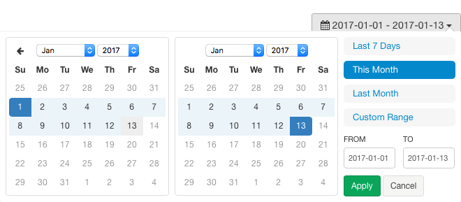
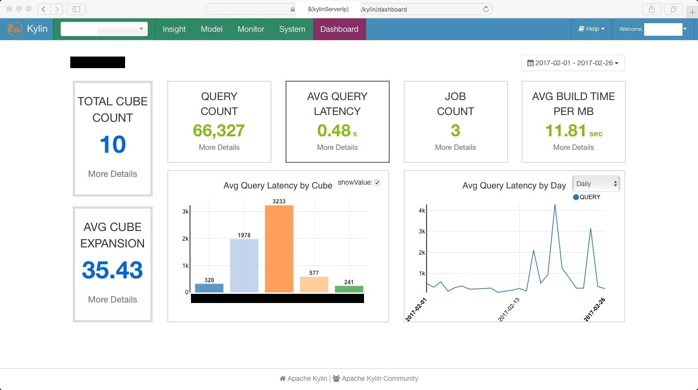
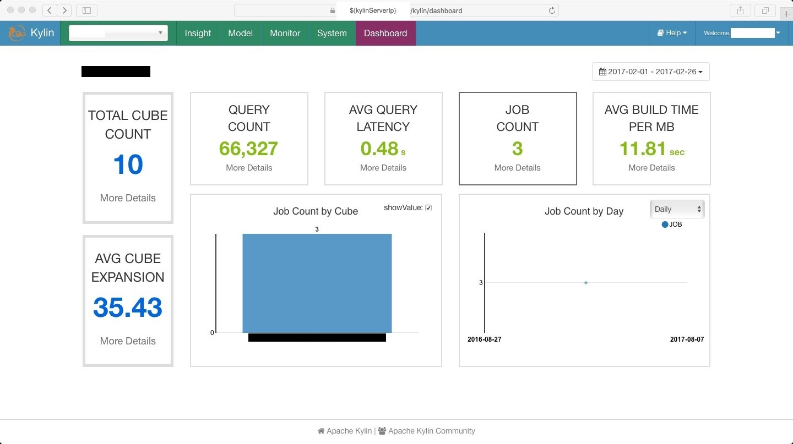
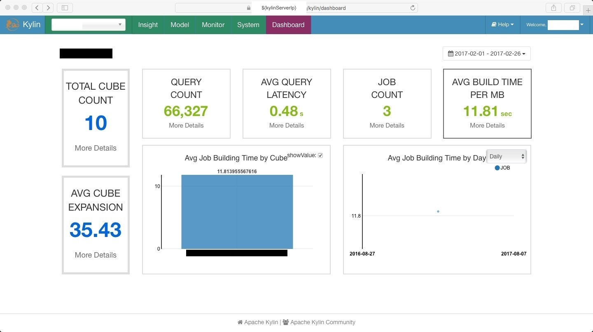

> Available since Apache Kylin v2.3.0

# Dashboard

As a project owner, do you want to know your Cube usage metrics? Do you want to know how many queries are against your Cube every day? What is the AVG query latency? Do you want to know the AVG Cube build time per GB source data, which is very helpful to foresee the time cost of a coming Cube build job? You can find all information from Kylin Dashboard. 

Kylin Dashboard shows useful Cube usage statistics, which are very important to users.

## Prerequisites

To enable Dashboard on WebUI, you need to ensure these are all set:
* Set **kylin.web.dashboard-enabled=true** in **kylin.properties**.
* Setup system Cubes according to [tutorial](setup_systemcube.html).

## How to use it

#### Step 1:

​	Click the '**Dashboard**' button on the navigation bar.

​	There are 9 boxes on this page which you can operate.

​	The boxes represent different attributes, including '**Time Period**','**Total Cube Count**', '**Avg Cube Expansion**', '**Query Count**', '**Average Query Latency**', '**Job Count**', '**Average Build Time per MB**', '**Data grouped by Project**' and '**Data grouped by Time**'. 

#### Step 2:

You should now click on the calender to modify the '**Time Period**'.

- '**Time period**' is set default to **'Last 7 Days**'.

- There are **2** ways to modify the time period, one is *using standard time period*s and the other is *customizing your time period*.

  1. If you want to *use standard time periods*, you can click on '**Last 7 Days**' to choose data only from last 7 days, or click on '**This Month**' to choose data only from this month, or click on '**Last Month**' to choose data only from last month. 

  2. If you want to *customize your time period*, you can click on '**Custom Range**'.

     There are **2** ways to customize the time period, one is *typing dates in the textfield* and the other is *selecting dates in the calender*.

     1. If you want to *type dates in the textfield*, please make sure that both dates are valid.
     2. If you want to *select dates in the calender*, please make sure that you have clicked on two specific dates.

- After you have modified the time period, click '**Apply**' to apply the changes, click '**Cancel**' to give up the changes.

#### Step 3:

Now the data analysis will be changed and shown on the same page. (Important information has been pixelated.)

- Numbers in '**Total Cube Count**' and '**Avg Cube Expansion**' are in **Blue**.

  You can click the '**More Details**' in these two boxes and you will be led to the '**Model**' page. 

- Numbers in '**Query Count**', '**Average Query Latency**', '**Job Count**' and '**Average Build Time per MB**' are in **Green**.

  You can click on these four rectangles to get detail information about the data you selected. The detail information will then be shown as diagrams and displayed in '**Data grouped by Project**' and '**Data grouped by Time**' boxes.

  1. '**Query Count**' and '**Average Query Latency**'

     You can click on '**Query Count**' to get detail infomation. 

     

     You can click on '**Average Query Latency**' to get detail infomation. 

     

     You can click the '**More Details**' in these two boxes and you will be led to the '**Insight**' page. 

  2. '**Job Count**' and '**Average Build Time per MB**'

     You can click on '**Job Count**' to get detail infomation. 

     

     You can click on '**Average Build Time per MB**' to get detail information. 

     

     You can click the '**More Details**' in these two boxes and you will be led to the '**Monitor**' page. It is common to see the browser showing 'Please wait...'.

#### Step 4:

**Advanced Operations**

'**Data grouped by Project**' and '**Data grouped by Time**' displayed data in the form of diagram.

There is a radio button called '**showValue**' in '**Data grouped by Project**', you can choose to show number in the diagram.

There is a radio drop-down menu in '**Data grouped by Time**', you can choose to show the diagram in different timelines.
