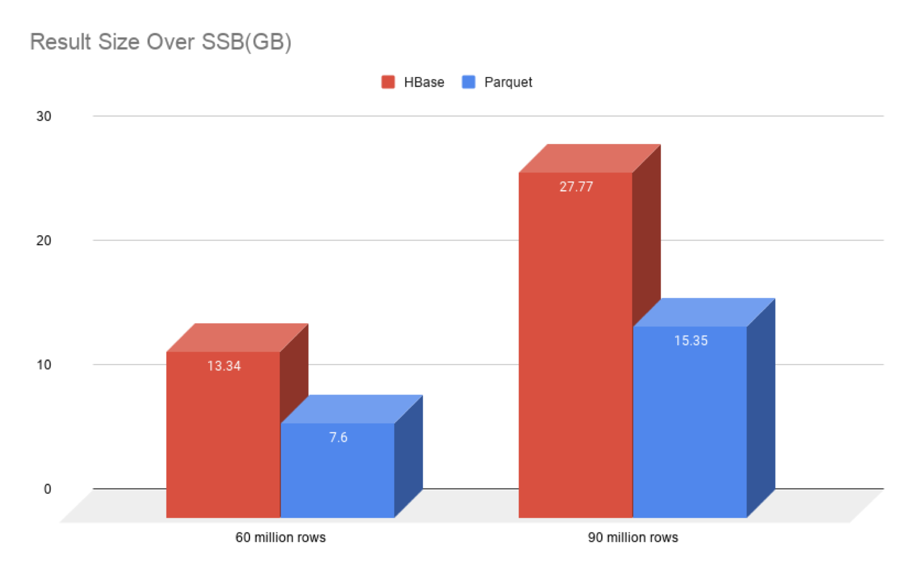
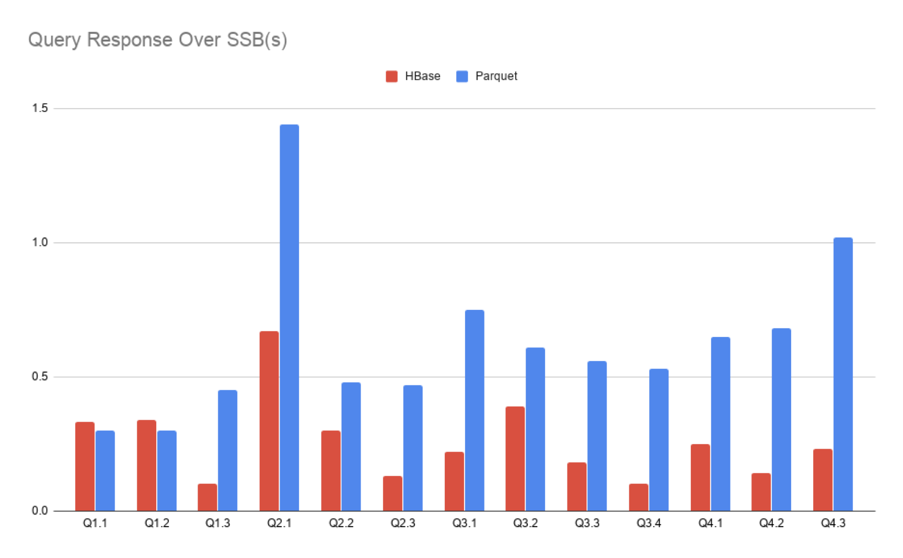
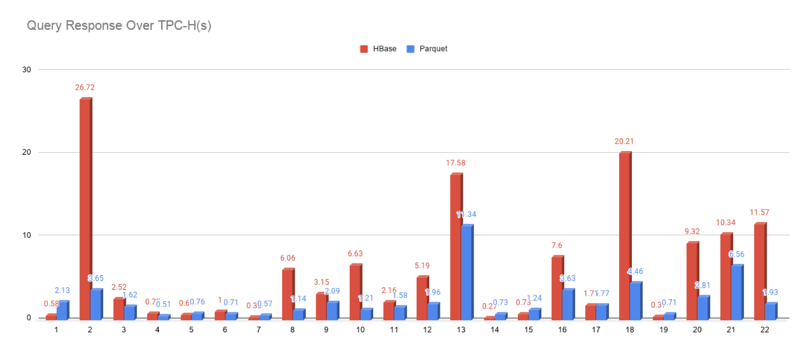

Welcome to Apache Kylin™: Analytical Data Warehouse for Big Data
------------  

Apache Kylin™ is an open source Distributed Analytical Data Warehouse for big data; It was designed to provide SQL interface and multi-dimensional analysis (OLAP) on Hadoop supporting extremely large datasets.

Apache kylin 4.0 is a major version after Apache kylin 3.x. Kylin4 uses a new spark build engine and parquet as storage, and uses spark as query engine.

Kylin 4.0.0-alpha, the first version of Apache kylin 4.0, was released in July 2020, and then kylin 4.0.0-beta and official version were released.

In order to facilitate users to have a more comprehensive and deeper understanding of kylin4.x, this document will focus on a comprehensive overview of kylin4.x from the perspective of the similarities and differences between kylin4.x and previous versions. 

The article includes the following parts:

- Why replace HBase with Parquet
- How to store pre-calculation results in kylin 4.0
- Build engine of Kylin 4.0
- Query engine of kylin 4.0
- Feature comparison between kylin 4.0 and kylin 3.1
- Kylin 4.0 performance
- Kylin 4.0 query and build tuning
- Kylin 4.0 use case

## Why replace HBase with Parquet
In versions 3.x and before, Kylin has been using HBase as a storage engine to save the precomputing results generated after cube builds. HBase, as the database of HDFS, has been excellent in query performance, but it still has the following disadvantages:

1. HBase is not real columnar storage;
2. HBase has no secondary index; Rowkey is the only index;
3. HBase has no encoding, Kylin has to do the encoding by itself;
4. HBase does not fit for cloud deployment and auto-scaling;
5. HBase has different API versions  and has compatible issues (e.g, 0.98, 1.0, 1.1, 2.0);
6. HBase has different vendor releases and has compatible issues (e.g, Cloudera's is not compatible with others);

In view of the above problems, Kylin community proposed to replace HBase with Apache parquet + spark, for the following reasons:

1. parquet is an open source and mature and stable column storage format;
2. Parquet is more cloud-friendly, can work with most FS including HDFS, S3, Azure Blob store, Ali OSS, etc;
3. parquet can be well integrated with Hadoop, hive, spark, impala, etc;
4. parquet supports custom index.

## How to store pre calculation results in kylin 4.0
In kylin4.x, the pre calculation results are stored in the file system in parquet format. The file storage structure is very important for I/O optimization. If the storage directory structure is designed in advance, the data files can be filtered through the directory or file name during query to avoid unnecessary file scan.

The directory structure of parquet file stored in the file system is as follows:
- cube_name
  - SegmentA
    - Cuboid-111
      - part-0000-XXX.snappy.parquet
      - part-0001-XXX.snappy.parquet
      - ...
    - Cuboid-222
      - part-0000-XXX.snappy.parquet
      - part-0001-XXX.snappy.parquet
      - ...
  - SegmentB
      - Cuboid-111
        - part-0000-XXX.snappy.parquet
        - part-0001-XXX.snappy.parquet
        - ...
      - Cuboid-222
        - part-0000-XXX.snappy.parquet
        - part-0001-XXX.snappy.parquet
        - ...               

It can be seen that, using parquet storage can add and delete cuboid easily without affecting other data. With this feature, kylin4 realizes the feature of supporting users to add and delete cuboid manually. Please refer to: [how to update cuboid list for a cube]（ https://cwiki.apache.org/confluence/display/KYLIN/How+to+update+cuboid+list+for+a+cube )

## Build engine of Kylin 4.0
In kylin4, spark engine is the only build engine. Compared with the build engine in previous versions, it has the following characteristics:

1. Building kylin4 simplifies many steps. For example, in cube build job, kylin4 only needs two steps: resource detection and cubing;
2. Since parquet encodes the stored data, the process of dimension dictionary and dimension column encoding is no longer needed in kylin4;
3. Kylin4 implements a new global dictionary. For more details, please refer to [kylin4 global dictionary](https://cwiki.apache.org/confluence/display/KYLIN/Global+Dictionary+on+Spark);
4. Kylin4 will automatically adjust parameters of spark according to cluster resources and build job;
5. Kylin4 can improve the build performance.

Users can manually modify the build the relevant spark configuration through the configuration item beginning with `kylin.build.spark-conf`. The manually modified spark configuration item will no longer participate in automatic parameter adjustment.

## Query engine of kylin 4.0

`Sparder (spardercontext)`, the query engine of Kylin4, is a new distributed query engine implemented by the back end of spark application. Compared with the original query engine, sparder has the following advantages:
1. Distributed query engine，avoid single-point-of-failure;
2. Unified calculation engine for building and querying;
3. There is a substantial increase in complex query performance;
4. Can benefit from spark new features and ecology.

In kylin4, sparder exists as a long-running spark application. Sparder will obtain the horn resource according to the spark parameter configured in the configuration item beginning with `kylin.query.spark-conf`. If the configured resource parameter is too large, the build engine may be affected, and even sparder cannot be started successfully. If sparder is not started successfully, all query tasks will fail, Users can check the sparder status in the system page of kylin webui.
By default, the spark parameter used for query will be set smaller. In the production environment, you can increase these parameters appropriately to improve query performance.
`Kylin.query.auto-sparder-context` parameter is used to control whether to start sparder when kylin is started. The default value is `false`, that is, sparder will be started only when the first SQL is executed by default. For this reason, it will take a long time to execute the first SQL.
If you don't want the query speed of the first SQL to be lower than expected, you can set `kylin.query.auto-sparder-context` to `true`, and sparder will start with kylin.

## Feature comparison between kylin 4.0 and kylin 3.1

| Feature                | Kylin 3.1.0                                  | Kylin 4.0                                      |
| ---------------------  | :------------------------------------------- | :----------------------------------------------|
| Storage                | HBase                                        | Parquet                                        |
| BuildEngine            | MapReduce/Spark/Flink                        | New Spark Engine                               |
| Metastore              | HBase(Default)/Mysql                         | Mysql(Default)                                 |
| DataSource             | Kafka/Hive/JDBC                              | Hive/CSV                                       |
| Global Dictionary      | Two implementation                           | New implementation                             |
| Cube Optimization Tool | Cube Planner                                 | Cube Planner phase1 and Optimize cube manually |
| Self-monitoring        | System cube and Dashboard                    | System cube and Dashboard                      |
| PushDown Engine        | Hive/JDBC                                    | Spark SQL                                      |
| Hadoop platform        | HDP2/HDP3/CDH5/CDH6/EMR5                     | HDP2/CDH5/CDH6/EMR5/EMR6/HDI                   |
| Deployment mode        | Single node/Cluster/Read and write separation| Single node/Cluster/Read and write separation  |

## Kylin 4.0 performance
In order to test the performance of kylin 4.0, we benchmark SSB dataset and TPC-H dataset respectively, and compare with kylin 3.1.0. The test environment is a 4-node CDH cluster, and the yarn queue is used to allocate 400G memory and 128 CPU cores.
The results of performance test are as follows:

- Comparison of build duration and result size（SSB）

  

The test results can reflect the following two points:
- The build speed of kylin4 is significantly higher than that of kylin3.1.0 spark engine;
- Compared with HBase, the parquet file size of kylin4 is significantly reduced;

- Comparison of query response(SSB and TPC-H)

From the comparison of query results, it can be seen that kylin3 and kylin4 are the same for ***simple query***, kylin4 is slightly insufficient; However, kylin4 has obvious advantages over kylin3 for ***complex query***.
Moreover, there is still a lot of room to optimize the performance of ***simple query*** in kylin4. In the practice of Youzan using kylin4, the performance of ***simple query*** can be optimized to less than 1 second.

## How to upgrade
Please check: [How to migrate metadata to Kylin4](https://cwiki.apache.org/confluence/display/KYLIN/How+to+migrate+metadata+to+Kylin+4)

## Kylin 4.0 query and build tuning
For kylin4 tuning, please refer to: [How to improve cube building and query performance](/docs/howto/howto_optimize_build_and_query.html)

## Kylin 4.0 use case
[Why did Youzan choose Kylin4](/blog/2021/06/17/Why-did-Youzan-choose-Kylin4)

Reference link:
[Kylin Improvement Proposal 1: Parquet Storage](https://cwiki.apache.org/confluence/display/KYLIN/KIP-1%3A+Parquet+storage)
